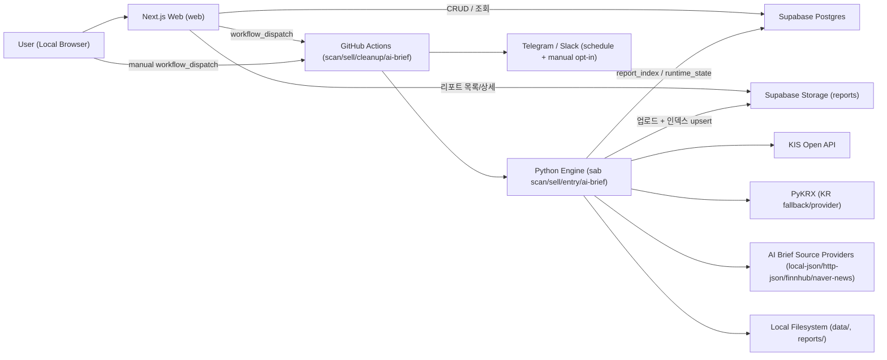

# 아키텍처 개요 — Swing Trading Report

상태: Accepted (v1.1 기준)  
대상: 로컬 단일 사용자 운영 + GitHub Actions 자동 실행

## 문서 상태

### 현재 제공

- `scan`/`sell`/`entry` 파이프라인, 로컬/수동/scheduled workflow `ai-brief`, AI Brief source payload 수집/평가/live 비교, AI Brief recommendation artifact 평가, 웹 Reports/Holdings/Run/Metrics, schedule/opt-in 알림 경로를 현재 아키텍처 기준으로 설명합니다.
- `report_index`와 `runtime_state`, Supabase Storage, GitHub Actions `scan`/`sell`/`cleanup`/`ai-brief` 연결이 현재 제공 범위입니다.

### 실험

- 별도 experimental runtime topology는 두지 않습니다. 구현되지 않은 운영 흐름은 backlog로 분리합니다.

### 백로그

- 웹 `Run` 탭과 GitHub Actions workflow에 `entry` 실행 경로 추가
- branch protection stage1/stage2 적용은 별도 governance backlog

### 폐기 후보

- `ADR-0006` 시절 가정(Storage listing 직접 조회, 인증 미도입)으로 되돌리는 방향은 채택하지 않습니다.

## 1. 시스템 목적

- Python 엔진(`sab`)으로 KR/US 종목을 평가해 `buy`/`sell`/`entry` JSON 리포트를 생성하고, entry 결과를 로컬 `ai-brief` JSON으로 요약합니다.
- Next.js 웹(`web`)은 리포트 열람, 운영 메트릭 대시보드, 보유 종목 CRUD, 워크플로우 실행 트리거를 제공합니다.
- Supabase는 보유 종목(Postgres), 리포트(Storage), 런타임 상태(Postgres, 기본값)를 저장하는 단일 백엔드입니다.
- GitHub Actions는 스케줄/수동 실행 시 파이프라인(`scan`/`sell`/`cleanup`/`ai-brief`)을 담당합니다.

## 2. 시스템 컨텍스트

## 3. 런타임 컴포넌트

| 컴포넌트 | 역할 | 주요 코드 |
|---|---|---|
| CLI 엔트리 | `scan`/`sell`/`entry`/`ai-brief` 서브커맨드 라우팅 | `sab/__main__.py` |
| Scan 오케스트레이션 | 티커 로드, 스크리너, 시세 수집, 매수 평가, 리포트 생성 | `sab/scan.py` |
| Sell 오케스트레이션 | 보유종목 기준 시세 수집, 매도/점검 평가, 리포트 생성 | `sab/sell.py` |
| AI Brief 오케스트레이션 | entry 리포트 소비, `ENTER` 후보 preselection, `local-json`/`http-json`/`finnhub`/`naver-news` source context, `fake`/`openai` 모델 provider 요약, 리포트 생성/업로드 | `sab/ai_brief.py`, `sab/ai_brief_sources.py` |
| AI Brief source 수집 보조 | RSS/Atom/RDF 로컬 파일 또는 live HTTPS feed URL을 `http-json`/`local-json` 호환 `sources[]` payload로 변환 | `sab/ai_brief_source_collectors.py`, `scripts/collect_ai_brief_sources.py` |
| AI Brief source 품질 평가/비교 | 수집한 `http-json` 호환 source payload는 네트워크/secret 없이 기존 source 정규화 규칙으로 평가/비교하고, live provider capture는 provider 호출 후 저장된 payload를 같은 evaluator로 비교 | `sab/ai_brief_source_eval.py`, `sab/ai_brief_source_live_compare.py`, `scripts/eval_ai_brief_sources.py`, `scripts/compare_ai_brief_live_sources.py` |
| AI Brief recommendation 품질 평가 | 생성된 `*.ai-brief.json`을 네트워크/secret 없이 entry 후보 기준으로 검증하고 source-backed ratio/confidence 안전성을 평가 | `sab/ai_brief_eval.py`, `scripts/eval_ai_brief_recommendations.py` |
| 데이터 파이프라인 | KIS/PyKRX 초기화, 캐시 조회, 폴백/재시도 | `sab/market_data_pipeline.py`, `sab/data/kis_client.py` |
| 시그널 엔진 | EMA/RSI/ATR 기반 평가 로직 | `sab/signals/*` |
| 리포트 계층 | 로컬 JSON 원자적 저장 + Supabase 업로드/인덱싱 + 알림 텍스트 렌더링 | `sab/report/markdown.py`, `sab/report/sell_report.py`, `sab/report/entry_report.py`, `sab/report/ai_brief_report.py`, `sab/report/notification_text.py`, `sab/report/supabase_storage.py` |
| 웹 API 경계 | 페이지 접근 제어(미들웨어) + API 가드 단일 진입점(route helper) | `web/middleware.ts`, `web/src/lib/admin-api-guard.ts`, `web/src/app/api/**/route.ts` |
| Supabase 어댑터 | holdings/report_index/runtime_state/storage 접근 + holdings add-buy/YAML replace-all RPC 브리지 | `web/src/lib/supabase-admin.ts` |
| 운영 메트릭 로더 | `report_index.summary` 기반 최근 30-run 운영 건강도 집계 + 패널별 장애 격리 | `web/src/lib/metrics-data.ts`, `web/src/app/(console)/metrics/page.tsx` |
| 실행 트리거 | GitHub workflow_dispatch 호출 | `web/src/lib/github-actions.ts` |
| 티커 디렉토리(웹) | buy 리포트 기반 티커/회사명 캐시 + 검색/최근 후보 제공(증분 갱신) | `web/src/lib/ticker-directory.ts`, `docs/holdings-ticker-lookup.md`, ADR-0008 |
| 배치 워크플로우 | scan/sell 실행, 업로드, 알림, cleanup, 수동/scheduled AI brief artifact 생성과 알림 발송 | `.github/workflows/scan.yml`, `.github/workflows/sell.yml`, `.github/workflows/cleanup.yml`, `.github/workflows/ai-brief.yml` |

## 4. 핵심 플로우

### 4.1 `scan` 플로우

1. `load_config()`로 설정 로드 후 티커 소스를 결합합니다(워치리스트 + 선택적 스크리너).
2. 데이터 제공자(`kis` 또는 `pykrx`)를 초기화하고 환율/휴일 메타를 준비합니다.
3. adjusted 캔들 데이터는 캐시를 먼저 로드해 초기값으로 사용한 뒤, 선택한 provider 경로(`kis` 또는 `pykrx`)로 최신 조회를 시도합니다.
4. `kis` 경로에서는 호출 실패 시 캐시 유지 또는 KR 종목에 한해 PyKRX 폴백을 적용합니다.
5. 선택적으로(`strategy.use_market_regime_filter=true`) 시장별 benchmark 종가가 SMA200 위인지 먼저 확인하고, 레짐이 약세인 시장의 ticker는 평가 전에 제외합니다. benchmark를 못 구하면 해당 시장의 레짐 필터만 비활성화하고 경고로 계속 진행합니다.
6. 시그널 평가 후 후보 티커에 대해서만 raw 캔들을 배치 warmup하고, cache hit 기반으로 `entry_reference_close_raw_value`를 보강한 뒤 후보를 점수순 정렬하고 통화/시장 상태 표시를 덧붙입니다.
7. `reports/YYYY-MM-DD(.n).buy.json`을 원자적으로 기록합니다.
8. 업로드 조건 충족 시(SA: GitHub Actions에서는 필수, 로컬에서는 `SAB_UPLOAD_REPORTS=true`일 때) Supabase Storage 업로드 + `report_index` upsert를 수행합니다. GitHub Actions에서는 인덱스 upsert 실패를 경고로 무시하지 않고 즉시 실패 처리합니다.
9. `scan`/`entry`는 holdings 파일을 읽지 않습니다.

### 4.2 `sell` 플로우

1. 보유 종목을 로드해 런타임을 구성합니다(로컬 기본: `holdings.yaml`).
   - `quantity > 0`인 활성 보유분만 sell 평가 대상으로 사용합니다.
2. KIS/PyKRX로 캔들 데이터를 수집하고 매도/점검 규칙을 평가합니다.
3. `reports/YYYY-MM-DD(.n).sell.json`을 생성하고, 필요 시 Supabase에 업로드합니다.
4. GitHub Actions `sell.yml` 실행 시에는 사전 단계에서 Supabase `holdings`를 읽어 `holdings.generated.yaml`을 만들고 `--holdings` 인자로 주입합니다.

### 4.3 `entry` 플로우

1. 입력 buy 리포트를 읽고 후보(`candidates[]`)를 시장별로 정규화합니다.
2. 현재 세션 가격 스냅샷을 조회해 종목 단위 `ENTER|REVIEW|SKIP` 액션과 `gap_pct`를 계산합니다.
3. holdings를 읽어 활성 보유 수(`quantity > 0`)와 시장별 보유 수를 집계한 뒤, 설정된 포트폴리오 상한이 있으면 최종 `ENTER` 후보에만 포트폴리오 가드를 적용합니다.
4. `reports/YYYY-MM-DD(.n).entry.json`을 생성합니다.
5. 로컬에서는 `SAB_UPLOAD_REPORTS=true` 또는 명시적 `sab entry --upload`일 때, GitHub Actions에서는 필수로 Supabase Storage 업로드 + `report_index` upsert를 수행합니다.

### 4.3.1 `ai-brief` 로컬/수동/scheduled workflow 플로우

1. `sab ai-brief --entry-report <path>`가 entry 리포트의 `entries[]`를 읽습니다.
2. `entries[].action == "ENTER"` 행만 AI 평가 후보로 사용하고, `REVIEW`/`SKIP` 행은 `excluded_candidates[]`로 기록합니다.
3. provider 호출 전 후보는 entry report 순서를 보존해 최대 5개로 제한하며, 초과 `ENTER` 행은 `cap_excluded_candidates[]`로 기록합니다.
4. source provider는 `none`, `local-json`, `http-json`, `finnhub`, `naver-news`를 지원합니다.
   - `local-json`은 로컬 source report의 `sources[]`를 preselected `ENTER` 후보에만 붙입니다.
   - `http-json`은 외부 source API에 `schema`, `tickers`, `max_sources_per_ticker`, `freshness_hours`를 POST하고, 응답의 `sources[]`를 같은 계약으로 정규화해 preselected 후보에만 붙입니다.
   - `finnhub`은 `FINNHUB_API_KEY`로 Finnhub Company News를 티커별 1회 조회하는 US-only provider입니다. `AAPL.NAS`는 `AAPL`, `BRK.B.NYS`는 `BRK.B`로 변환하고, KR ticker는 요청하지 않은 채 `source_issues[]` WARN으로 남깁니다.
   - `naver-news`는 `NAVER_CLIENT_ID`/`NAVER_CLIENT_SECRET`로 Naver Search API 뉴스 endpoint(`https://openapi.naver.com/v1/search/news.json`)를 티커별 1회 조회하는 KR-only provider입니다. buy report 회사명을 검색어로 우선 사용하고, 없으면 6자리 ticker를 사용하며, `display=10`, `start=1`, `sort=date`로 요청합니다. US ticker는 요청하지 않은 채 `source_issues[]` WARN으로 남깁니다.
   - `local-json`/`http-json`/`finnhub`/`naver-news` source row URL은 HTTP(S), hostname, freshness/future-time, cap 검증을 통과해야 합니다. `local-json`과 source eval은 offline 계약을 지키기 위해 DNS 조회 없이 literal local/private IP와 localhost를 거부하고, live/http 경로(`http-json`, `finnhub`, `naver-news`)의 응답 row는 DNS 검증까지 적용해 local/private host를 거부합니다.
   - source row의 ticker가 후보 집합에 없거나 source가 stale/미래 시간/invalid URL이면 source issue로 기록하고 모델 입력에서 제외합니다.
   - `scripts/collect_ai_brief_sources.py`는 RSS/Atom/RDF 로컬 파일 또는 live HTTPS feed URL을 `sab.ai_brief_sources.v1` payload로 변환하는 외부 source API 보조 경로입니다. 로컬 feed 파일은 offline으로 item URL의 literal local/private IP와 localhost만 거부하고, live URL은 HTTPS, userinfo 금지, DNS 기반 local/private host 차단, redirect 거부, 1MB body 제한을 적용합니다. HTTP/timeout/invalid feed는 ticker별 WARN issue로 격리합니다.
   - 수집한 `http-json` 호환 payload는 `scripts/eval_ai_brief_sources.py`로 오프라인 평가하거나, 여러 captured payload를 같은 entry 후보 기준으로 비교할 수 있습니다. `scripts/compare_ai_brief_live_sources.py`는 `http-json`/`finnhub`/`naver-news` live provider 결과를 먼저 source payload로 저장한 뒤 같은 evaluator 비교를 실행합니다. provider 실패는 해당 payload의 top-level `ERROR` issue로 격리되어 비교 결과에서 FAIL로 표시됩니다. Scheduled source provider는 `AI_BRIEF_SOURCE_PROVIDER` repository variable이 있으면 그 값을 쓰고, 없으면 `AI_BRIEF_SOURCE_API_URL` 존재 시 `http-json`, 둘 다 없으면 `none`을 사용합니다.
   - 생성된 `*.ai-brief.json`은 `scripts/eval_ai_brief_recommendations.py`로 eligible/excluded/cap-excluded entry alignment, summary count consistency, rank continuity, source-backed ratio, confidence safety를 오프라인 평가할 수 있습니다.
5. 모델 provider는 `fake`와 `openai`를 지원합니다.
   - `fake`는 외부 뉴스/API를 호출하지 않는 deterministic contract exerciser입니다.
   - `openai`는 Responses API structured output을 사용하며 timeout/요청 실패/모델 출력 계약 실패 시 추천 없이 `system_issues[]`를 남긴 artifact를 생성합니다.
   - OpenAI 출력 sources는 candidate에 주입된 source URL만 cite할 수 있고, 소스 없는 추천은 ticker별 `source_issues[]`를 요구합니다.
6. 최종 추천은 최대 3개이며, `reports/YYYY-MM-DD(.n).ai-brief.json`을 로컬 파일 락 + 원자적 쓰기로 생성합니다.
7. `notification_text`는 생성된 artifact를 Telegram 본문/Slack key-value 요약 텍스트로 렌더링할 수 있습니다.
8. mixed KR/US entry 리포트는 `--market KR|US`를 요구하고, 출력 artifact는 단일 시장만 다룹니다.
9. 로컬에서는 `SAB_UPLOAD_REPORTS=true` 또는 명시적 `sab ai-brief --upload`일 때, GitHub Actions에서는 필수로 Supabase Storage 업로드 + `report_index` upsert를 수행합니다.
10. `.github/workflows/ai-brief.yml`은 수동 `workflow_dispatch`와 KR/US 장전 schedule을 지원합니다. 단일 시장 `scan` → Supabase holdings snapshot → `entry --upload` → `ai-brief --upload`을 실행하고 buy/entry/ai-brief JSON과 알림 preview 텍스트를 Actions artifact로 업로드합니다.
11. scheduled 실행은 KR `30 22 * * 0-4` UTC, US `30 12 * * 1-5` UTC에서 시작하고, 장일+`PRE_OPEN` 런타임 가드가 통과할 때만 dependency install 이후 scan/entry/ai-brief/알림 단계를 진행합니다.
12. scheduled 실행 기본값은 `provider=kis`, `universe=both`, `entry_mode=PRE_OPEN`, `model_provider=openai`, `send_notifications=true`입니다. `AI_BRIEF_SOURCE_PROVIDER` repository variable이 설정되어 있으면 scheduled 실행은 해당 source provider를 사용하고, 값이 없으면서 `AI_BRIEF_SOURCE_API_URL` 변수가 있으면 `http-json`, 둘 다 없으면 `none`을 사용합니다. `finnhub` scheduled 실행은 `FINNHUB_API_KEY` secret이 필요하며 v1은 US ticker만 source request 대상으로 삼습니다. `naver-news` scheduled 실행은 `NAVER_CLIENT_ID`/`NAVER_CLIENT_SECRET` secrets가 필요하며 v1은 KR ticker만 source request 대상으로 삼습니다. 수동 실행은 `send_notifications=false`가 기본이며, `true`를 명시했을 때만 Telegram/Slack preview 텍스트를 실제로 발송합니다.

### 4.4 웹 리포트 조회 플로우

1. `/api/reports`는 `report_index`에서 목록을 조회합니다.
2. `/api/reports/detail`은 storage key를 검증 후 Storage 원본 JSON을 반환합니다.
3. 서버(`web/src/lib/reports-data.ts`)는 in-memory TTL/LRU 캐시를 사용합니다.
   - 목록: `type/q/limit/searchWindow` 키 기준 단기 TTL(검색 없음 5초, 검색 10초)
   - 상세: `report_key` 기준 장기 TTL(1시간)
4. 클라이언트(`ReportsClient`)는 목록/상세 요청에 in-flight dedupe + 세션 메모리 캐시를 적용합니다.
5. ticker 검색(`q`) 시에는 `report_index`만 페이지 단위로 순회하고, `tickers_hydrated=false` 항목은 결과에서 제외하며 경고를 반환합니다.
6. 검색 중 일부 페이지 조회 실패가 발생하면 이미 수집된 부분 결과를 반환하고 경고를 함께 제공합니다.
7. Report Detail의 buy 후보 근거 표시는 `candidates[].reasons[]`(구조화 근거)를 우선 사용하고, 누락 시 `score_notes`/`pattern_reasons`/`entry_state_reason` 문자열 필드로 폴백합니다.
8. entry 상세는 `entries[]` 전용 표와 `source_buy_report`, `signal_eval_date`, `entry_session_date`(또는 시장별 date map) 메타를 함께 렌더링합니다.
9. AI Brief 상세는 `recommendations[]`, `source_issues[]`, `system_issues[]`, `source_entry_report`, `model_provider/model_name` 메타를 함께 렌더링합니다.

### 4.7 웹 운영 메트릭 대시보드 플로우

1. `/metrics`는 `report_index`에서 `buy`, `sell`, `entry` 최근 30개 row를 타입별로 각각 조회합니다.
2. 집계는 Storage 원본을 다시 읽지 않고 `report_index.summary`만 사용합니다.
3. `buy.summary`는 후보 수 외에 `data_coverage_ratio`, `provider_fallback_ratio`, `rs_benchmark_unavailable_ratio`를 함께 기록합니다.
   각 ratio는 요청 티커 수를 분모로 쓰며, 분모가 0이면 `null`입니다.
4. `sell.summary`는 `data_coverage_ratio`, `provider_fallback_ratio`를 함께 기록합니다.
5. `entry.summary`는 기존 `missing_entry_price_ratio`, `system_issue_count`를 그대로 사용합니다.
6. 오래된 리포트처럼 새 summary 키가 없는 경우 UI는 이를 `0`이 아니라 `N/A`로 표시합니다.
7. 한 타입 조회 실패는 해당 패널만 에러 상태로 렌더링하고, 다른 패널은 계속 표시합니다.

### 4.5 웹 보유종목 CRUD 플로우

1. `/api/holdings`가 cursor 기반 페이지네이션으로 목록을 제공합니다.
2. `/api/holdings` `POST`, `/api/holdings/[ticker]` `PATCH`/`DELETE`로 PostgREST를 통해 `holdings`를 수정합니다.
3. `/api/holdings/[ticker]/add-buy` `POST`는 Supabase RPC(`holdings_add_buy_v1`)를 호출해 추가매수(수량/평단/진입일/통화)를 원자적으로 갱신합니다.
   - `Idempotency-Key`(UUID) 헤더를 필수로 받아 중복 요청 시 기존 결과를 반환합니다(멱등 처리).
   - 동일 키에 서로 다른 payload가 들어오면 `409` 충돌로 차단하며, 멱등 이벤트 로그는 별도 cleanup 함수/스케줄 작업으로 90일 경과 항목(`processed=true` 기준 + 장기 미처리 항목)을 정리합니다.
4. `/api/holdings/yaml` `GET`은 전체 holdings snapshot을 `holdings.yaml`로 export하고, `POST`는 YAML 파싱/검증 후 dry-run 또는 apply를 수행합니다.
   - import apply는 Supabase RPC(`replace_holdings_v1`)로 원자적 replace-all을 수행합니다.
   - export는 `quantity=0` row를 포함한 전체 snapshot을 내보내고, import는 파일에 없는 ticker를 삭제합니다.
5. (구현, ADR-0008) Holdings 입력 UX는 “회사명/별칭 검색”과 “최근 buy 후보”로 ticker 입력을 보조합니다.
   - 검색/후보 데이터는 buy 리포트(`candidates[].{ticker,name}`)에서 파생한 “티커 디렉토리(캐시)”를 사용합니다.
   - 캐시는 Supabase `runtime_state`에 저장되며 stale 시 증분 갱신합니다.

### 4.6 웹 실행 트리거 플로우

1. `/api/run`은 Zod 스키마와 provider-universe 정책(`pykrx`는 `KR`만 허용)을 검증합니다.
2. GitHub Actions `scan.yml`/`sell.yml`에 `workflow_dispatch`를 발행합니다.
3. ref는 고정 `main`입니다.

## 5. 데이터 저장소

### 5.1 로컬 파일

- `data/`
  - KIS 토큰 캐시(`kis_token_*`)
  - 종목 캔들 캐시(`candles_*`, `candles_overseas_*`)
  - 기타 런타임 캐시
- `reports/`
  - `YYYY-MM-DD(.n).buy.json`
  - `YYYY-MM-DD(.n).sell.json`
  - `YYYY-MM-DD(.n).entry.json`
  - `YYYY-MM-DD(.n).ai-brief.json`

### 5.2 Supabase Storage

- 버킷: `reports` (private, JSON MIME 제한)
- 키 규칙: `YYYY/MM/YYYY-MM-DD(.n).{buy|sell|entry|ai-brief}.json`

### 5.3 Supabase Postgres

- `holdings`: 보유 종목 단일 소스(웹 CRUD 대상)
  - 앱과 동일한 ticker 계약을 DB 제약으로 강제합니다(`KR 6자리` 또는 명시 거래소 suffix `.NAS/.NYS/.AMS`).
  - 모호한 `.US` suffix는 DB에서도 허용하지 않으며, 기존 row는 migration 시 수동 정리 대상으로 남깁니다.
- `report_index`: 리포트 목록 조회 최적화 인덱스(날짜/타입/중복 인덱스 + summary/tickers, `buy|sell|entry|ai-brief`)
  - `summary`는 Reports 목록 요약과 `/metrics` 운영 대시보드의 단일 집계 소스입니다.
  - `buy.summary`: `candidate_count`, `system_issue_count`, `data_requested/covered/missing_count`, `data_coverage_ratio`, `provider_fallback_count/ratio`, `rs_benchmark_requested/unavailable_count`, `rs_benchmark_unavailable_ratio`
  - `sell.summary`: `evaluated_count`, `issue_count`, `data_requested/covered/missing_count`, `data_coverage_ratio`, `provider_fallback_count/ratio`
  - `entry.summary`: `entry_count`, `system_issue_count`, `missing_entry_price_count`, `missing_entry_price_ratio`
  - `ai-brief.summary`: `entry_count`, `preselected_count`, `recommendation_count`, `source_issue_count`, `system_issue_count`
- `runtime_state`: 로그인 시도 제한 상태 등 단기 런타임 상태(기본 저장소)
- 예외: `SAB_RUNTIME_STATE_STORE=memory` 또는 테스트 환경(`NODE_ENV=test`)에서는 메모리 저장소를 사용합니다.
- 장애 정책: `SAB_LOGIN_THROTTLE_FAIL_MODE=strict`(기본)에서는 Supabase 장애 시 즉시 실패하고, `degrade`에서만 메모리 스로틀로 폴백합니다.

## 6. 보안 경계

- 관리자 인증
  - 로그인 시 `SAB_BASIC_AUTH_USER/PASS` 검증
  - `SAB_SESSION_SECRET` 기반 HMAC 서명 세션 쿠키(`sab_admin_session`) 발급/검증
- 요청 무결성
  - 보호 API 라우트는 `enforceAdminApiGuard()` 단일 진입점에서 인증 + `same-origin` + 로컬 요청 검증(`host`, `x-forwarded-host`, unsafe의 `origin/referer` 또는 `sec-fetch-site=same-origin`)을 수행
  - 공개 API(`/api/auth/login`, `/api/auth/logout`)는 라우트 내부에서 `same-origin` + 로컬 요청 검증을 수행
  - `middleware.ts`는 페이지 라우트 접근 제어/리다이렉트 전용으로 유지
  - 로컬 요청 강제(`localhost/127.0.0.1/::1`, `SAB_ENFORCE_LOCAL_REQUEST=0` 또는 `NODE_ENV=test`에서 완화)
  - 시작 가드는 `SAB_ENFORCE_LOCAL_REQUEST=0` 상태의 non-loopback bind를 거부하지만, 이 가드는 원격 노출에 대한 완전한 보안 경계가 아니라 로컬 운영 가정의 fail-fast 보조 장치입니다.
- 비밀키 보호
  - Supabase/GitHub 키는 서버 코드(`server-only`)에서만 사용
  - publishable key(`sb_publishable_*`)는 서버 경로에서 거부
- DB 접근 제어
  - `holdings`, `report_index`, `runtime_state`는 RLS 강제 + `anon`/`authenticated` 권한 제거

## 7. 신뢰성/복구 설계

- 설정/입력 Fail-Closed
  - YAML 파싱 실패, 잘못된 루트 타입, 필수 설정 누락 시 즉시 실패
  - `kis.app_key`/`kis.app_secret`를 YAML에 저장하면 보안 정책 위반으로 실패
  - `GITHUB_ACTIONS=true`(또는 `CI=true`)에서는 strict config parsing을 강제 적용하며, 숫자/enum 오입력은 기본값으로 회귀하지 않고 즉시 실패
  - 로컬 운영에서도 `SAB_CONFIG_STRICT=true`를 설정하면 동일한 strict parsing 정책을 강제
- 데이터 수집 내구성
  - KIS 재시도/백오프/토큰 재발급 처리
  - KR 심볼은 KIS 실패 시 PyKRX 폴백 가능(US는 폴백 없음)
  - 캐시가 있으면 API 실패 시 캐시 데이터로 계속 진행
  - 캔들 캐시는 저장 전/재사용 전 `date/open/high/low/close/volume` finite 검증을 거쳐 오염 row를 제거합니다.
  - `holidays_us.json`은 파일 `mtime` 기준 12시간 TTL 내에는 재호출하지 않고 재사용합니다.
  - 부분 수집 누락 시 coverage(`수집성공/평가대상`)가 `0.70` 이상이면 경고로 계속 진행, `0.70` 미만이면 실패 처리
- 산출물 안정성
  - 리포트는 파일 락 + 원자적 쓰기로 기록
  - 중복 파일명은 suffix(`-1`, `-2`, ...)로 충돌 회피
  - Supabase 업로드도 duplicate index를 순차 탐색해 충돌 회피
  - GitHub Actions 실행에서는 Storage 업로드 또는 `report_index` upsert 실패 시 run을 실패 처리(fail-closed)
- 운영 자동화
  - `cleanup.yml`이 보관기간 초과 리포트를 정리
  - schedule 실행에서만 알림(텔레그램/슬랙) 전송

## 8. 설정 계층

- 현재 구현 기준
  - CLI 오버라이드: 일부 필드(`provider`, `limit`, `watchlist`, `universe`, `screener-limit`)
    - `limit`은 워치리스트/스크리너 병합 이후 최종 평가 ticker cap으로 적용
  - 환경변수/`.env` 우선
  - `config.yaml` 기본값
- 운영 정책
  - 시크릿은 `.env`/환경변수로 관리
  - `config.yaml`은 비시크릿 기본값 중심

## 9. 제약과 트레이드오프

- 단일 사용자/로컬 중심 설계이며 멀티유저 권한 모델은 범위 밖입니다.
- Python 엔진은 직접 Supabase `holdings`를 읽지 않고, 워크플로우 단계에서 파일 입력으로 브리지합니다.
  - `scan`은 holdings 비의존 경로를 유지합니다.
  - `entry`는 포트폴리오 가드 적용을 위해 holdings 파일 입력을 읽을 수 있지만, 종목 신호 계산은 buy report 기준을 유지합니다.
  - `sell`은 holdings 파일 입력을 요구합니다.
- `workflow_dispatch` 실행 ref를 `main`에 고정해 운영 단순성을 우선합니다.
- Entry 파이프라인(`entry`)은 로컬 JSON 리포트(`*.entry.json`)를 생성하고, Storage/`report_index`/웹 Reports UI와 연동됩니다.
  - 단, 웹 `Run` 탭과 GitHub Actions workflow는 여전히 `scan`/`sell`만 지원합니다.
  - buy report candidate는 adjusted 신호 필드와 함께 동일 `eval_date`의 raw entry reference close를 포함하며, 이 raw 기준가는 `scan`의 후보 전용 배치 warmup으로 준비됩니다.
  - `entry`는 이 raw reference와 실시간/raw snapshot만 비교한 뒤, 필요 시 포트폴리오 가드를 후속 적용합니다.
  - mixed KR/US buy report는 시장별로 분리 평가하며, entry artifact는 `market="MIXED"`와 시장별 날짜 메타(`signal_eval_date_by_market`, `entry_session_date_by_market`)를 함께 기록합니다.
- AI Brief 파이프라인(`ai-brief`)은 entry artifact의 후속 로컬 소비자입니다.
  - 후보를 새로 발굴하지 않고 entry의 `ENTER` 행만 추천 후보로 사용합니다.
  - `fake` provider는 외부 기사/모델 판단을 포함하지 않습니다.
  - `openai` provider는 OpenAI Responses API로 모델 판단을 수행하지만, 후보 ticker를 추가하거나 `REVIEW`/`SKIP` 행을 추천으로 승격할 수 없습니다.
  - `local-json` source provider는 로컬 source report를 모델 입력 context로 붙이지만, 후보 ticker를 추가할 수 없습니다.
  - `http-json` source provider는 외부 source API를 호출하지만, 반환 row도 동일한 ticker universe/freshness/future-time/HTTP(S) URL/local-private host/cap 검증을 통과해야 모델 입력에 들어갑니다.
  - `finnhub` source provider는 `FINNHUB_API_KEY`로 Finnhub Company News를 직접 조회하지만, US ticker만 요청하고 반환 row도 동일한 freshness/future-time/duplicate/cap/URL safety/DNS 검증을 통과해야 모델 입력에 들어갑니다.
  - `naver-news` source provider는 `NAVER_CLIENT_ID`/`NAVER_CLIENT_SECRET`로 Naver Search API 뉴스를 직접 조회하지만, KR ticker만 요청하고 반환 row도 동일한 freshness/future-time/duplicate/cap/URL safety/DNS 검증을 통과해야 모델 입력에 들어갑니다.
  - RSS/Atom/RDF 로컬 파일/live HTTPS feed 변환 도구, source eval 비교 모드, live provider comparison runner는 source API payload 제작/검증을 위한 보조 경로이며, runtime provider 종류를 늘리지 않습니다.
  - recommendation eval은 생성된 AI Brief artifact의 품질 게이트이며, runtime provider나 매매 신호를 추가하지 않습니다.
  - 모델 출력에 소스가 없으면 ticker별 source issue로 disclose해야 합니다.
  - 생성된 `*.ai-brief.json`은 Storage, `report_index`, 웹 Reports UI와 연동됩니다.
  - 로컬 `notification_text` builder와 `ai-brief.yml` preview 단계는 `ai-brief` artifact를 Telegram/Slack 텍스트로 렌더링하며, 수동 opt-in 또는 scheduled 기본값으로 실제 발송까지 수행할 수 있습니다.

## 10. 관련 문서

- 제품/요구사항: `docs/PRD.md`, `docs/spec-v1.1.md`, `docs/spec-v1.3.md`
- 운영: `docs/runbook.md`, `docs/kis-setup.md`
- ADR: `docs/adr/README.md`, `docs/adr/ADR-0007-v1.1-current-architecture-baseline.md`
- 전략/로직 설계(신호/리스크): `docs/STRATEGY.md`
