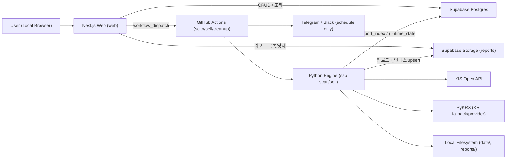

# 아키텍처 개요 — Swing Trading Report

상태: Accepted (v1.1 기준)  
대상: 로컬 단일 사용자 운영 + GitHub Actions 자동 실행

## 1. 시스템 목적

- Python 엔진(`sab`)으로 KR/US 종목을 평가해 `buy`/`sell` JSON 리포트를 생성합니다.
- Next.js 웹(`web`)은 리포트 열람, 보유 종목 CRUD, 워크플로우 실행 트리거를 제공합니다.
- Supabase는 보유 종목(Postgres), 리포트(Storage), 런타임 상태(Postgres, 기본값)를 저장하는 단일 백엔드입니다.
- GitHub Actions는 스케줄/수동 실행 시 파이프라인(`scan`/`sell`/`cleanup`)을 담당합니다.

## 2. 시스템 컨텍스트

## 3. 런타임 컴포넌트

| 컴포넌트 | 역할 | 주요 코드 |
|---|---|---|
| CLI 엔트리 | `scan`/`sell` 서브커맨드 라우팅 | `sab/__main__.py` |
| Scan 오케스트레이션 | 티커 로드, 스크리너, 시세 수집, 매수 평가, 리포트 생성 | `sab/scan.py` |
| Sell 오케스트레이션 | 보유종목 기준 시세 수집, 매도/점검 평가, 리포트 생성 | `sab/sell.py` |
| 데이터 파이프라인 | KIS/PyKRX 초기화, 캐시 조회, 폴백/재시도 | `sab/market_data_pipeline.py`, `sab/data/kis_client.py` |
| 시그널 엔진 | EMA/RSI/ATR 기반 평가 로직 | `sab/signals/*` |
| 리포트 계층 | 로컬 JSON 원자적 저장 + Supabase 업로드/인덱싱 | `sab/report/markdown.py`, `sab/report/sell_report.py`, `sab/report/supabase_storage.py` |
| 웹 API 경계 | 인증, same-origin, localhost 가드, API 라우트 | `web/middleware.ts`, `web/src/app/api/**/route.ts` |
| Supabase 어댑터 | holdings/report_index/runtime_state/storage 접근 | `web/src/lib/supabase-admin.ts` |
| 실행 트리거 | GitHub workflow_dispatch 호출 | `web/src/lib/github-actions.ts` |
| 배치 워크플로우 | scan/sell 실행, 업로드, 알림, cleanup | `.github/workflows/scan.yml`, `.github/workflows/sell.yml`, `.github/workflows/cleanup.yml` |

## 4. 핵심 플로우

### 4.1 `scan` 플로우

1. `load_config()`로 설정 로드 후 티커 소스를 결합합니다(워치리스트 + 선택적 스크리너).
2. 데이터 제공자(`kis` 또는 `pykrx`)를 초기화하고 환율/휴일 메타를 준비합니다.
3. 캔들 데이터는 캐시를 먼저 로드해 초기값으로 사용한 뒤, 선택한 provider 경로(`kis` 또는 `pykrx`)로 최신 조회를 시도합니다.
4. `kis` 경로에서는 호출 실패 시 캐시 유지 또는 KR 종목에 한해 PyKRX 폴백을 적용합니다.
5. 시그널 평가 후 후보를 점수순 정렬하고 통화/시장 상태 표시를 덧붙입니다.
6. `reports/YYYY-MM-DD(.n).buy.json`을 원자적으로 기록합니다.
7. 업로드 조건 충족 시(SA: GitHub Actions에서는 필수, 로컬에서는 `SAB_UPLOAD_REPORTS=true`일 때) Supabase Storage 업로드 + `report_index` upsert를 수행합니다. GitHub Actions에서는 인덱스 upsert 실패를 경고로 무시하지 않고 즉시 실패 처리합니다.

### 4.2 `sell` 플로우

1. 보유 종목을 로드해 런타임을 구성합니다.
2. KIS/PyKRX로 캔들 데이터를 수집하고 매도/점검 규칙을 평가합니다.
3. `reports/YYYY-MM-DD(.n).sell.json`을 생성하고, 필요 시 Supabase에 업로드합니다.
4. GitHub Actions `sell.yml` 실행 시에는 사전 단계에서 Supabase `holdings`를 읽어 `holdings.generated.yaml`을 만들고 `HOLDINGS_FILE`로 주입합니다.

### 4.3 웹 리포트 조회 플로우

1. `/api/reports`는 `report_index`에서 목록을 조회합니다.
2. ticker 검색(`q`) 시에는 `report_index`만 페이지 단위로 순회하고, `tickers_hydrated=false` 항목은 결과에서 제외하며 경고를 반환합니다.
3. 검색 중 일부 페이지 조회 실패가 발생하면 이미 수집된 부분 결과를 반환하고 경고를 함께 제공합니다.
4. `/api/reports/detail`은 storage key를 검증 후 Storage 원본 JSON을 반환합니다.

### 4.4 웹 보유종목 CRUD 플로우

1. `/api/holdings`가 cursor 기반 페이지네이션으로 목록을 제공합니다.
2. `/api/holdings` `POST`, `/api/holdings/[ticker]` `PATCH`/`DELETE`로 PostgREST를 통해 `holdings`를 수정합니다.

### 4.5 웹 실행 트리거 플로우

1. `/api/run`은 Zod 스키마와 provider-universe 정책(`pykrx`는 `KR`만 허용)을 검증합니다.
2. GitHub Actions `scan.yml`/`sell.yml`에 `workflow_dispatch`를 발행합니다.
3. ref는 고정 `main`입니다.

## 5. 데이터 저장소

### 5.1 로컬 파일

- `data/`
  - KIS 토큰 캐시(`kis_token_*`)
  - 종목 캔들 캐시(`candles_*`, `candles_overseas_*`)
  - 기타 런타임 캐시
- `reports/`
  - `YYYY-MM-DD(.n).buy.json`
  - `YYYY-MM-DD(.n).sell.json`

### 5.2 Supabase Storage

- 버킷: `reports` (private, JSON MIME 제한)
- 키 규칙: `YYYY/MM/YYYY-MM-DD(.n).{buy|sell}.json`

### 5.3 Supabase Postgres

- `holdings`: 보유 종목 단일 소스(웹 CRUD 대상)
- `report_index`: 리포트 목록 조회 최적화 인덱스(날짜/타입/중복 인덱스 + summary/tickers)
- `runtime_state`: 로그인 시도 제한 상태, 스토리지 키 캐시 등 단기 런타임 상태(기본 저장소)
- 예외: `SAB_RUNTIME_STATE_STORE=memory` 또는 테스트 환경(`NODE_ENV=test`)에서는 메모리 저장소를 사용합니다.

## 6. 보안 경계

- 관리자 인증
  - 로그인 시 `SAB_BASIC_AUTH_USER/PASS` 검증
  - `SAB_SESSION_SECRET` 기반 HMAC 서명 세션 쿠키(`sab_admin_session`) 발급/검증
- 요청 무결성
  - 미들웨어에서 API unsafe 메서드에 `same-origin` 선검증
  - 보호 API 라우트에서 메서드와 무관하게 `same-origin` + 로컬 요청 검증(`host`, `x-forwarded-host`, unsafe의 `origin/referer` 또는 `sec-fetch-site=same-origin`)을 재적용
  - 로컬 요청 강제(`localhost/127.0.0.1/::1`, `SAB_ENFORCE_LOCAL_REQUEST=0` 또는 `NODE_ENV=test`에서 완화)
- 비밀키 보호
  - Supabase/GitHub 키는 서버 코드(`server-only`)에서만 사용
  - publishable key(`sb_publishable_*`)는 서버 경로에서 거부
- DB 접근 제어
  - `holdings`, `report_index`, `runtime_state`는 RLS 강제 + `anon`/`authenticated` 권한 제거

## 7. 신뢰성/복구 설계

- 설정/입력 Fail-Closed
  - YAML 파싱 실패, 잘못된 루트 타입, 필수 설정 누락 시 즉시 실패
  - `kis.app_key`/`kis.app_secret`를 YAML에 저장하면 보안 정책 위반으로 실패
  - `GITHUB_ACTIONS=true`(또는 `CI=true`)에서는 strict config parsing을 강제 적용하며, 숫자/enum 오입력은 기본값으로 회귀하지 않고 즉시 실패
  - 로컬 운영에서도 `SAB_CONFIG_STRICT=true`를 설정하면 동일한 strict parsing 정책을 강제
- 데이터 수집 내구성
  - KIS 재시도/백오프/토큰 재발급 처리
  - KR 심볼은 KIS 실패 시 PyKRX 폴백 가능(US는 폴백 없음)
  - 캐시가 있으면 API 실패 시 캐시 데이터로 계속 진행
- 산출물 안정성
  - 리포트는 파일 락 + 원자적 쓰기로 기록
  - 중복 파일명은 suffix(`-1`, `-2`, ...)로 충돌 회피
  - Supabase 업로드도 duplicate index를 순차 탐색해 충돌 회피
  - GitHub Actions 실행에서는 Storage 업로드 또는 `report_index` upsert 실패 시 run을 실패 처리(fail-closed)
- 운영 자동화
  - `cleanup.yml`이 보관기간 초과 리포트를 정리
  - schedule 실행에서만 알림(텔레그램/슬랙) 전송

## 8. 설정 계층

- 현재 구현 기준
  - CLI 오버라이드: 일부 필드(`provider`, `limit`, `watchlist`, `universe`, `screener-limit`)
  - 환경변수/`.env` 우선
  - `config.yaml` 기본값
- 운영 정책
  - 시크릿은 `.env`/환경변수로 관리
  - `config.yaml`은 비시크릿 기본값 중심

## 9. 제약과 트레이드오프

- 단일 사용자/로컬 중심 설계이며 멀티유저 권한 모델은 범위 밖입니다.
- Python 엔진은 직접 Supabase `holdings`를 읽지 않고, 워크플로우 단계에서 파일 입력으로 브리지합니다.
- `workflow_dispatch` 실행 ref를 `main`에 고정해 운영 단순성을 우선합니다.
- Entry 파이프라인(`entry`)은 아직 구현 범위에 포함되지 않습니다.

## 10. 관련 문서

- 제품/요구사항: `docs/PRD.md`, `docs/spec-v1.1.md`
- 운영: `docs/runbook.md`, `docs/kis-setup.md`
- ADR: `docs/adr/README.md`
