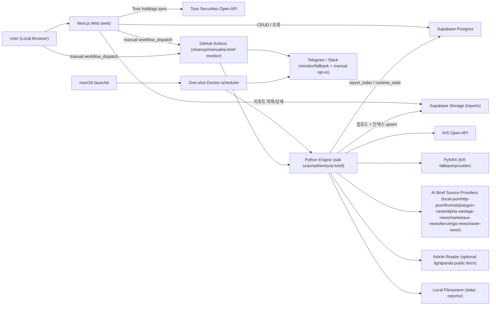

# 아키텍처 개요 — Swing Trading Report

상태: Accepted (v1.1 기준)  
대상: 로컬 단일 사용자 운영 + GitHub Actions CI/manual/monitor 자동화

## 문서 상태

### 현재 제공

- `scan`/`sell`/`entry`/`backtest` 파이프라인, 로컬/수동/scheduled workflow `ai-brief`, 로컬 Docker scheduled AI Brief primary, GitHub monitor/fallback, AI Brief source payload 수집/평가/live 비교, AI Brief recommendation artifact 평가, 웹 Reports/Holdings/Run/Metrics, schedule/opt-in 알림 경로를 현재 아키텍처 기준으로 설명합니다.
- `report_index`와 `runtime_state`, Supabase Storage, GitHub Actions cleanup/manual/AI Brief monitor/fallback, 로컬 one-shot Docker scheduled AI Brief 연결이 현재 제공 범위입니다. Scheduled sell은 GitHub schedule이 아니라 Toss freshness-gated local Sell AI Brief generation runner로 제공하며, scheduled scan은 marker-aware fallback 전까지 fail closed입니다.

### 실험

- 별도 experimental runtime topology는 두지 않습니다. 구현되지 않은 운영 흐름은 backlog로 분리합니다.

### 백로그

- 웹 `Run` 탭과 GitHub Actions workflow에 standalone `entry` 전용 실행 경로 추가
- branch protection stage1/stage2 적용은 별도 governance backlog

### 폐기 후보

- `ADR-0006` 시절 가정(Storage listing 직접 조회, 인증 미도입)으로 되돌리는 방향은 채택하지 않습니다.

## 관련 문서

- 운영 절차: [operations.md](operations.md)
- 배포/롤백: [deployment.md](deployment.md)
- 장애 대응: [troubleshooting.md](troubleshooting.md)
- API/CLI 계약: [api.md](api.md)
- 설정: [configuration.md](configuration.md), [config-reference.md](config-reference.md)

## 1. 시스템 목적

- Python 엔진(`sab`)으로 KR/US 종목을 평가해 `buy`/`sell`/`entry` JSON 리포트를 생성하고, 로컬 historical OHLCV로 `backtest` JSON 연구 리포트를 만들며, entry 결과를 로컬 `ai-brief` JSON으로 요약하고, fresh Toss holdings marker가 있을 때 scheduled Sell AI Brief를 생성합니다.
- Next.js 웹(`web`)은 리포트 열람, 운영 메트릭 대시보드, 보유 종목 CRUD, 워크플로우 실행 트리거를 제공합니다.
- Supabase는 보유 종목(Postgres), 리포트(Storage), 런타임 상태(Postgres, 기본값)를 저장하는 단일 백엔드입니다.
- GitHub Actions는 CI/audit/release, cleanup, manual dispatch, AI Brief monitor/fallback을 담당합니다. scheduled AI Brief는 로컬 Docker primary가 실행하고, scheduled scan은 marker-aware fallback 전까지 fail closed입니다. Scheduled Sell AI Brief는 로컬 generic wrapper가 Toss freshness marker를 확인한 뒤 sell report와 Sell AI Brief를 생성하고, 기존 prebuilt delivery runner는 artifact 전달/재조정 전용으로 남습니다.

## 2. 시스템 컨텍스트

## 3. 런타임 컴포넌트

| 컴포넌트 | 역할 | 주요 코드 |
|---|---|---|
| CLI 엔트리 | `scan`/`sell`/`entry`/`backtest`/`ai-brief`/`sell-ai-brief`/`ai-brief-scheduled`/`sell-ai-brief-generate-scheduled`/`sell-ai-brief-scheduled`/`ai-brief-latency-probe` 서브커맨드 라우팅 | `sab/__main__.py` |
| Scan 오케스트레이션 | 티커 로드, 스크리너, 시세 수집, 매수 평가, 리포트 생성 | `sab/scan.py`(엔트리), `sab/scan_screener.py`, `sab/scan_evaluation.py` |
| Sell 오케스트레이션 | 보유종목 기준 시세 수집, 매도/점검 평가, 리포트 생성 | `sab/sell.py`(엔트리), `sab/sell_evaluation.py`, `sab/sell_runtime.py` |
| Backtest 오케스트레이션 | 로컬 historical OHLCV를 날짜 prefix로 잘라 기존 buy/sell evaluator에 재주입하고 거래/성과 JSON 생성 | `sab/backtest.py`, `sab/report/backtest_report.py` |
| AI Brief 오케스트레이션 | entry 리포트 소비, 실행가능/차단·검토/watch/excluded 후보 분류, source provider chain context, opt-in article reader 검증, `fake`/`openai` 모델 provider 요약, 리포트 생성/업로드 | `sab/ai_brief.py`, `sab/ai_brief_candidates.py`, `sab/ai_brief_source_chain.py`, `sab/ai_brief_sources.py`, `sab/ai_brief_providers.py`, `sab/article_reader.py` |
| Scheduled AI Brief runner | market/session/role guard, runtime_state lock/marker, 로컬 one-shot scan→entry→ai-brief 실행, notification reconciliation, GitHub monitor/fallback 공통 entrypoint | `sab/scheduler/*`(시간 정책: `schedule_policy.py`), `docker-compose.scheduler.yml`, `scripts/launchd/*`, `.github/workflows/ai-brief.yml` |
| AI Brief source 수집 보조 | RSS/Atom/RDF 로컬 파일 또는 live HTTPS feed URL을 `http-json`/`local-json` 호환 `sources[]` payload로 변환 | `sab/ai_brief_source_collectors.py`, `scripts/collect_ai_brief_sources.py` |
| AI Brief source 품질 평가/비교 | 수집한 `http-json` 호환 source payload는 네트워크/secret 없이 기존 source 정규화 규칙으로 평가/비교하고, live provider capture는 provider 호출 후 저장된 payload를 같은 evaluator로 비교하며 provider별 `duration_ms`를 남김 | `sab/ai_brief_source_eval.py`, `sab/ai_brief_source_live_compare.py`, `scripts/eval_ai_brief_sources.py`, `scripts/compare_ai_brief_live_sources.py` |
| AI Brief 모델 latency probe | primary/fallback 모델 호출 수와 반복 횟수 계획을 출력하고 측정 row helper를 제공 | `sab/ai_brief_latency_probe.py` |
| AI Brief recommendation 품질 평가 | 생성된 `*.ai-brief.json`을 네트워크/secret 없이 entry 후보 기준으로 검증하고, rank 연속성/source-backed ratio/article tier coverage/confidence 안전성/summary count를 수동·scheduled 성공 경로의 fail-closed 품질 게이트로 평가 | `sab/ai_brief_eval.py`, `scripts/eval_ai_brief_recommendations.py` |
| Scheduled Sell AI Brief generation/delivery | Toss freshness marker를 확인한 뒤 sell report와 Sell AI Brief를 생성/평가/업로드하고, 기존 `*.sell-ai-brief.json` artifact 전달 runner로 upload/index-before-notify 및 notification reconciliation을 보장 | `sab/scheduler/sell_ai_brief_generation.py`, `sab/scheduler/sell_ai_brief_delivery.py`, `scripts/launchd/sab-scheduled-wrapper.sh` |
| 데이터 파이프라인 | KIS/PyKRX 초기화, 캐시 조회, 폴백/재시도 | `sab/market_data_pipeline.py`, `sab/data/kis_client.py`(facade), `sab/data/kis/{auth,calendar,common,quote,ranking}.py` |
| 시그널 엔진 | EMA/RSI/ATR 기반 평가 로직 | `sab/signals/*` |
| 리포트 계층 | 로컬 JSON 원자적 저장 + Supabase 업로드/인덱싱 + 알림 텍스트 렌더링, buy/sell stop-target risk disclosure, AI Brief 판단 상태(`NO_SIGNAL`/`NEEDS_REVIEW_WATCH_ONLY`/`FINAL_JUDGMENT`/`NEEDS_REVIEW_WEAK_NEWS`)와 scheduled skip 상태 결정 | `sab/report/markdown.py`, `sab/report/sell_report.py`, `sab/report/entry_report.py`, `sab/report/risk_disclosure.py`, `sab/report/ai_brief_report.py`, `sab/report/ai_brief_skip_report.py`, `sab/report/ai_brief_state.py`, `sab/report/notification_text.py`, `sab/report/supabase_storage.py`, `sab/report/storage_key.py` |
| 웹 API 경계 | 페이지 접근 제어(Next proxy) + API 가드 단일 진입점(route helper) | `web/src/proxy.ts`, `web/middleware.ts`, `web/src/lib/admin-api-guard.ts`, `web/src/app/api/**/route.ts` |
| Supabase 어댑터 | holdings/report_index/runtime_state/storage 접근 + holdings add-buy/YAML replace-all RPC 브리지 | `web/src/lib/supabase-admin.ts` |
| Toss holdings sync | 서버 전용 OAuth client credentials로 Toss 보유 종목을 조회하고 Supabase holdings와 비교한 뒤, 서버 재조회와 reviewed `diffHash` 일치 검증 및 Supabase RPC expected snapshot guard를 통과한 apply만 replace-all로 반영하는 review 경로. scheduled auto-sync는 `TOSS_SYNC_JOB_TOKEN` local bearer 경계 안에서 같은 service를 쓰되, non-empty Toss snapshot의 delete diff는 삭제하지 않고 holdings row의 `broker_state=not_seen_in_toss`와 durable missing evidence로 격리합니다. 빈 snapshot wipe는 계속 `wipe_guard_blocked`로 fail closed입니다. scheduled preview는 DB가 같은 snapshot에서 반환한 rows+digest token을 사용하고, replace/quarantine mutation wrapper는 같은 transaction의 exact post-state digest를 반환합니다. unchanged capture와 후속 seal은 이 DB token을 CAS guard로 검증한 뒤에만 `BrokerSnapshotV0` revision과 `toss-sync:success:MIXED:<session_date>` freshness marker를 함께 봉인합니다. Local QA는 `TOSS_SYNC_SOURCE=fixture`, `TOSS_SYNC_QA_FIXTURE_ENABLED=1`, local Supabase guard를 함께 요구해 live Toss/remote holdings 없이 valid-token scheduled 경로를 재현합니다. | `web/src/lib/toss/client.ts`, `web/src/lib/toss/holdings-sync.ts`, `web/src/lib/toss/holdings-sync-service.ts`, `web/src/app/api/holdings/toss-sync/route.ts`, `web/src/app/api/holdings/toss-sync/scheduled/route.ts`, `web/src/components/holdings/toss-sync-panel.tsx`, `scripts/toss_daily_auto_sync.sh`, `scripts/qa_toss_sync_local.sh` |
| 운영 메트릭 로더 | `report_index.summary` 기반 최근 30-run 운영 건강도 집계 + 패널별 장애 격리 | `web/src/lib/metrics-data.ts`, `web/src/app/(console)/metrics/page.tsx` |
| 실행 트리거 | GitHub workflow_dispatch 호출 | `web/src/lib/github-actions.ts` |
| 티커 디렉토리(웹) | buy 리포트 기반 티커/회사명 캐시 + 검색/최근 후보 제공(증분 갱신) | `web/src/lib/ticker-directory.ts`, `docs/holdings-ticker-lookup.md`, ADR-0008 |
| 배치 워크플로우 | cleanup, 수동 workflow dispatch, 수동 AI Brief artifact 생성, scheduled AI Brief monitor/fallback. `sell.yml`은 여전히 manual opt-in Sell/Sell AI Brief 생성·전달 워크플로우이며 scheduled sell generation은 local generic wrapper가 담당합니다. scheduled scan 생성은 marker-aware fallback 전까지 fail closed | `.github/workflows/scan.yml`, `.github/workflows/sell.yml`, `.github/workflows/cleanup.yml`, `.github/workflows/ai-brief.yml` |

### 3.1 BrokerSnapshotV0 경계

`BrokerSnapshotV0` 배포 순서는 `migration -> Web producer -> Python consumer`로
고정합니다. migration 직후의 `initial unsealed` 상태에서는 read RPC가 행을
반환하지 않으며 소비자는 이를 정상 snapshot으로 추정하지 않고 차단합니다.
Web producer는 numeric DTO에서 digest를 재구성하지 않습니다. DB mutation wrapper가
lock 아래 영속 행에서 계산해 반환한 exact post-state digest만 seal CAS guard로
전달합니다. unchanged는 preview의 DB pre-state token을 capture RPC가 다시 검증합니다.
RPC와 private helper는 `service-role-only`이자 `SECURITY INVOKER`로
유지하며 브라우저에는 비밀 키를 노출하지 않습니다. 이 경계는 `advice-only`로
주문 생성·수정·취소 기능을 포함하지 않습니다.

Python consumer에서는 `validate_broker_snapshot_v0`가 유일한 공개 생성 경계입니다.
`BrokerSnapshotV0` 직접 생성은 차단하고, holding과 marker를 각각
`BrokerHoldingV0`, `BrokerSnapshotMarkerV0`로 바꾼 deep-immutable snapshot만
반환합니다. HOLDING gate는 caller-injected `now`로 freshness를 다시 계산하며,
seal status, digest, revision, session date와 canonical field set을 함께 재검증합니다.
따라서 최초 검증 뒤의 시간 경과, 위조된 private factory 결과, 중첩 payload 변경도
승인으로 전파되지 않습니다.
시간 경계는 DB가 생성한 seal 의미와 맞춰 `sealed_at <= now < fresh_until`을
강제하며 별도 clock-skew 허용값은 두지 않습니다.

### 3.2 InstrumentRefV0와 SWING/ENTRY identity gate

Decision Board shadow slice의 identity 전파 경로는
`BrokerSnapshotV0 -> approve_swing_snapshot_v0 -> ApprovedSwingRefV0 -> public research`
입니다. `VersionedInstrumentRegistryV0`는 호출자가 제공한 공개 레코드와 immutable
source/version만 보유하며, canonical ticker와 명시적으로 등록된 alias만 해석합니다.
거래소 family는 중앙 normalizer에서 `NASDAQ`/`NYSE`/`AMEX`로 정규화하고,
registry의 `InstrumentRefV0.exchange`를 권위 값으로 사용합니다. ticker suffix는
충돌을 찾는 hint일 뿐 종목 identity나 거래소를 추측하는 근거가 아닙니다. duplicate
canonical ticker, ambiguous alias, source/version 누락은 registry 생성 단계에서
실패하고, 미해결 또는 입력/registry 충돌은 개별 행의 typed REVIEW로 닫힙니다.

market, canonical ticker, alias, exchange는 ASCII-only 문법을 사용합니다.
company name, identity source/version은 NFC 공개 텍스트로 정규화한 뒤
control/format, surrogate, Unicode noncharacter를 거부합니다. 승인과 REVIEW는
frozen sum type이며,
각 variant에는 자기 상태의 payload만 있어 반대 상태 payload나 임의 status를 만들 수
없습니다.

registry resolver 결과와 approved constructor는 exact concrete `InstrumentRefV0`를
다시 검증해 trusted frozen copy를 만들며 subclass/duck-typed 객체를 거부합니다.
research projection은 polymorphic method를 호출하지 않고 shared schema의 여섯 public
field를 직접 allowlist합니다.

HOLDING gate는 검증된 `BrokerSnapshotV0`만 producer로 받고, 정확히 정규화된
`SWING`이면서 active/confirmed인 행만 승인합니다. 각 행은 독립적으로 평가되어 한
행의 REVIEW가 다른 승인 행을 막지 않습니다. `ApprovedSwingRefV0`, issue, research
projection에는 `InstrumentRefV0` 외에 quantity, entry price, P/L, notes, tags,
account ID, raw private holding payload를 포함하지 않습니다. ENTRY gate는 별도
public-only mapping을 받아 unknown/private field를 즉시 REVIEW 처리합니다.

배포 순서는 BrokerSnapshotV0 consumer 확인, versioned registry adapter 주입,
HOLDING/ENTRY shadow gate 활성화, research/compiler consumer 연결 순입니다. V0 gate는
네트워크, Toss, 주문 endpoint를 갖지 않으며 registry adapter와 후속 consumer는 이
순서 밖의 별도 작업입니다. 롤백 시에는 shadow consumer 연결만 제거하고 기존
BrokerSnapshot producer와 schema를 유지합니다. registry가 없거나 오래되었을 때
ticker-only fallback을 켜는 롤백은 허용하지 않으며, REVIEW 상태를 유지합니다.

### 3.3 EvidenceResearcherV0 bounded research boundary

`sab/research/`는 Decision Board V0의 독립된 shadow research owner입니다. 입력은
exact concrete `InstrumentRefV0` 최대 5개, allowlisted public question enum,
public freshness/source policy뿐입니다. 각 종목은 injectable `SearchProviderV0`를
정확히 한 번 호출하며 provider 동시성은 2입니다. provider response는 exact schema,
종목 binding, typed purpose(`PRIMARY`/`OPPOSING`/`ACTION_CHANGING`)를 검증하고 종목당
최대 3개 source만 허용합니다. account ID, quantity, entry price, P/L, notes, tags,
strategy, Toss/Supabase secret이나 arbitrary caller metadata를 입력 또는 provider
request에 포함하지 않습니다.

입력 생성과 invocation 시작은 source policy를 field-by-field 재검증한 별도 copy로
고정합니다. preflight와 각 verify 호출에도 서로 다른 child copy만 전달하며, artifact
검증은 adapter가 접근하지 못한 invocation baseline을 사용합니다. source candidate도
factory-owned exact value이며 canonical URL, purpose, timestamp와 전체 `InstrumentRefV0`
binding을 함께 보유합니다. provider parsing 뒤 baseline copy를 만들고 verifier에는 다시
별도 copy를 전달하므로 `object.__setattr__`을 포함한 adapter-side alias mutation은 결과로
전파되지 않습니다.

article verification은 source priority의 round-robin 순서로 스케줄하고 invocation 전체
fetch attempt를 8회로 제한합니다. canonical URL은 전역 dedupe하되 동일 source의 종목별
attribution은 유지합니다. URL은 HTTP(S) standard port와 qualified public hostname만
허용하고 credentials/fragment/local·private·reserved address를 거부합니다. DNS answer
하나라도 public IP가 아니면 전체 answer를 거부하며 모든 same-origin redirect에서 URL과
DNS를 다시 검증합니다. invocation의 `ResearchSourcePolicyV0`는 preflight와 모든 verify
호출에 전달하며, adapter가 설정한 redirect/byte/text/operation-timeout hard maximum보다
느슨하면 provider 호출 전에 차단합니다. response byte, redirect, content type/encoding,
normalized text 길이를 제한하고, 성공 artifact에는 exact normalized article text와
`sha256:` content hash만 기록합니다. verifier 반환 artifact는 exact type, source binding,
safe final URL, normalized text, length, hash를 orchestrator에서 다시 검증해 trusted copy로
만듭니다. artifact 생성 경로는 canonical source/URL/text/hash와 계산된 integrity seal을
직접 기록하고, 재검증 경로는 저장된 seal을 예외 없이 다시 계산해 비교합니다. 다만
same-process Python의 underscore, frozen dataclass, seal 값은 보안 경계나 권위 증표가
아닙니다. 실제 권위는 verifier가 받기 전에 별도로 복사한 invocation-owned source
baseline과의 전체 field 비교입니다. `SUCCEEDED` item과 최종 `COMPLETED` container의
public constructor를 모두 닫고, private final factory가 invocation policy, 입력 종목 순서,
artifact별 source baseline으로 nested variant의 exact type/status/issues/instrument/artifact를
다시 검증해 deep copy한 값만 반환합니다. 따라서 `object.__new__`으로 만든 raw object는
authoritative completed output으로 승격되지 않습니다. 향후 외부 consumer 경계를 추가할
때도 독립 baseline 없이 type이나 private field만 신뢰해서는 안 됩니다. claim span과
entailment 판단은 이 계층의 책임이 아닙니다.

invocation 시작에서 injected monotonic clock을 한 번 읽어 기본 45.0초 `Deadline`을
만들고 search, retry/backoff, DNS, redirect, fetch가 같은 객체의 감소하는 timeout을
사용합니다. clock 역행은 typed `FAILED`, shared verifier preflight 실패는 provider 호출
전 `BLOCKED`, provider timeout/malformed/empty는 peer와 격리된 item variant입니다.
예상된 provider/verifier 예외와 각 result variant의 issue code는 고정 allowlist로
제한하며, 예상하지 않은 예외나 잘못된 boundary code는 public detail을 노출하지 않는
typed `FAILED`로 닫힙니다.
typed operational exception을 분류하기 전에도 deadline을 다시 확인해 만료는
`TIMED_OUT`, clock rollback은 `FAILED/DEADLINE_INVARIANT`가 우선합니다. `TIMED_OUT`
item은 supplemental issue가 있더라도 `ARTICLE_TIMEOUT` 또는 `PROVIDER_TIMEOUT`을 최소
하나 포함해야 합니다.
deadline에 남은 시간이 없으면 queued/in-flight async work를 cancel하고 drain합니다.
article verification 중 deadline이 만료되면 이미 완료된 peer와 같은 종목의 기존
artifact는 보존하고, 현재 및 이후 schedule attribution에만 `ARTICLE_TIMEOUT`을 붙여
새 verify를 중단합니다. 따라서 artifact가 있는 item은 timeout issue를 포함한
`SUCCEEDED`, artifact가 없는 영향 item은 `TIMED_OUT`으로 finalization됩니다.
result status는 frozen sum-type variant에서 init 불가능한 literal로 고정합니다.

이 owner에는 production provider adapter와 OpenAI/Toss/order call이 없습니다. public
research, claim validation, compiler, runner consumer 경계는 injectable seam으로 구현됐지만
기본 CLI executor에는 production adapter가 연결되지 않아 `CONFIG_UNAVAILABLE`로 닫힙니다.
rollout은 recorded/live provider-verifier 비교를 통과한 adapter를 shadow runner에 주입한
뒤 시작합니다. 롤백은 이 adapter/consumer 연결만 제거하며 기존 AI Brief source policy와
top-five behavior는 유지합니다.

### 3.4 ClaimValidationV0 exact-span boundary

claim validation 전파 경로는 `ClaimRequestV0 + T4 ArticleArtifactV0 + T3
InstrumentRefV0 -> ClaimVerifierV0 -> ClaimValidationV0 -> action eligibility gate`입니다.
요청은 한 종목의 한 공개 claim과 `action_changing` boolean만 허용합니다. factory가 만든
request는 생성 시점 public field baseline과 대조하며, 호출 시작에는 request, source,
source policy, article을 각각 재검증해 독립된 copy를 보관합니다. verifier에는 claim
ID/text, 여섯 instrument field, 로컬 article hash/text만 전달합니다. source URL,
publisher, publication time, hash, instrument는 verifier 응답 필드가 아니며, 최종
validation에서는 재검증된 article/source baseline으로만 채웁니다.

verifier 응답은 `entailment`, `supporting_span`, `supporting_location`,
`verifier_version` exact allowlist만 받습니다. location은 Python Unicode code-point
index의 `TEXT_OFFSETS` 반개구간 `[start, end)`이고 `0 <= start < end <= len(text)`를
만족해야 합니다. span은 normalized article text의 그 slice와 exact match해야 하므로
반복 문자열도 반환 offset으로만 식별하며 byte offset, trim, case folding, Unicode
재정규화, approximate search는 허용하지 않습니다. `SUPPORTED`, `CONTRADICTED`,
`UNCLEAR` 모두 exact nonempty span을 요구합니다.

verifier 호출에는 T4에서 시작된 같은 `Deadline` 객체를 전달하고 operation timeout은
남은 시간과 source policy limit 중 작은 값으로 줄입니다. operational verifier timeout은
claim 단위 `TIMED_OUT` review outcome이 되고, malformed output과 예상하지 못한 verifier
또는 내부 오류는 `FAILED`가 됩니다. 오류를 분류하기 직전에 deadline을 다시 확인하므로
전체 만료와 monotonic clock rollback이 각각 `DEADLINE_EXPIRED`와
`DEADLINE_INVARIANT`로 우선합니다. 반환 뒤에도 invocation input과 article hash를 원래
baseline에 재검증하며 alias mutation은 fail closed입니다.

claim issuance 시 registry는 exact validation object를 가리키는 weak reference와 함께
validation canonical bytes/fields, 원래 claim text/action flag/full instrument, T4
source/article text/hash/seal, source policy, verifier output/version/span/location의 immutable
tuple/bytes snapshot을 저장합니다. snapshot에는 request/source/article/policy object alias가
없습니다. 또한 issuance 과정에서 caller와 독립적으로 복사한 validation instrument와
factory가 생성한 supporting location exact object를 record가 소유합니다. 현재 validation의
중첩 identity가 이 발급 객체와 다르면 필드값이 같아도 실패합니다. validation이 수거되면
identity-safe weakref callback이 같은 record와 그 중첩 소유권을 함께 제거합니다.
process가 바뀌거나 registry에 없는 값은 구조가 같아도 발급된 action authority가 아닙니다.

action eligibility는 exact registered identity와 현재 validation serialization을 issuance
snapshot에 먼저 대조하고, caller가 전달한 request/article/source/policy도 deep-copy한 뒤
원래 issuance snapshot과 exact equality를 확인합니다. 원래 `action_changing=true`이고 발급
당시와 현재 entailment가 모두 unchanged `SUPPORTED`일 때만 true입니다. context-only
claim에 새 action request를 대입하거나 claim text, action flag, source/article, hash,
span/location, entailment를 일관되게 바꾸거나 instrument/location을 동일 값의 새 객체로
교체해도 권위가 이동하지 않습니다.
`CONTRADICTED`, `UNCLEAR`, non-action-changing support는 compiler에 보고할 수 있지만
BUY/AVOID/HOLD/SELL 변경 권한은 없습니다. claims module 자체는 compiler, runner,
production model adapter, persistence/UI, Toss/order 기능을 포함하지 않습니다. compiler와
runner는 이 issuance API를 consumer로 사용하며 production verifier adapter는 여전히 별도
검증·주입 대상입니다. rollback은 claim adapter/consumer 연결만 제거하고 T3/T4 producer와
shared schema를 유지합니다.

claims module의 serializer는 registered identity와 unchanged issuance snapshot을 통과한
값만 fresh Task 1 allowlist dict로 내보냅니다. `validate_claim_validation()`과 JSON Schema는
일반 dict의 구조 호환성을 확인하는 generic consumer contract일 뿐 issuance나 action
authority를 부여하지 않습니다. compiler는 generic schema 통과 결과를 action gate 대신
사용해서는 안 됩니다.

### 3.5 DecisionCompilerV0 pure precedence boundary

compiler 전파 경로는 `T3 InstrumentRefV0 + sealed policy facts + T5 issuance inputs ->
DecisionCompilerV0 -> Task 1 DecisionPayloadV0`입니다. ENTRY와 HOLDING input은 lane prefix와
canonical ticker가 exact 결속된 conservative ASCII item identity, exact public instrument, finite approval/dependency/
signal/exposure/hard-exit/research enum, compiler-issued evidence binding만 포함합니다. factory는
instrument를 trusted copy로 소유하고 process-local weakref registry에 전체 scalar snapshot과
nested evidence identity를 기록합니다. compile 시 exact type/identity/snapshot을 다시
검사하므로 post-factory mutation, alias 교체, subclass, `object.__new__` raw allocation은
authority가 아닙니다. account ID, quantity, entry price, P/L, notes, tags, raw broker row,
arbitrary metadata나 rationale text는 이 projection에 없습니다.
모든 compiler-owned `StrEnum` field는 문자열 equality가 아니라 exact concrete enum
type과 canonical member singleton identity를 함께 확인합니다. 따라서 같은 문자열인 raw
`str`, `str` subclass, `str.__new__`로 만든 fresh-equal enum, `object.__setattr__` mutation은
issuance snapshot과 값이 같아 보여도 precedence 입력이 될 수 없습니다.
`item_id`, `research_order`, `research_priority`도 factory와 매 invocation에서 exact
`str`/`int`, lane-prefix/canonical-ticker binding, ASCII grammar/range를 같은 validator로
재검증합니다. 정렬·중복 검사는 이 validated snapshot만 사용하므로 caller가 넣은
`str`/`int` subclass의 comparison이나 `encode()`를 호출하지 않습니다.

ENTRY는 미승인 item/identity를 먼저 REVIEW하고, READY/ENTER가 아닌 확정 non-candidate는
omit합니다. 필수 deterministic state gap은 REVIEW, 독립 exposure fail은 AVOID입니다.
research conflict/gap은 evidence veto를 추측하지 않고 REVIEW하며, 나머지 candidate만
unchanged T5 action gate를 통과한 MATERIAL_ADVERSE로 AVOID하거나 BUY합니다. HOLDING은
current broker/candle/rule이 뒷받침한 hard stop/confirmed exit SELL을 lattice 최상단에 둡니다.
그 뒤 identity/deterministic gap, supported material adverse, research gap 순으로 REVIEW하고
나머지만 HOLD합니다. hard SELL은 evidence timeout/conflict/absence/`NOT_SELECTED_CAP`으로
낮아지지 않습니다.

`select_holding_research_v0`는 caller의 bounded priority/order를 UTF-8 byte ordering으로
정렬해 0..5개만 선택하고 나머지를 typed `NOT_SELECTED_CAP`으로 표시합니다. 반환 결과는
factory-owned process-local issuance이며 selection 당시 전체 holding universe의 item ID,
instrument, approval, hard-exit, broker/candle/rule, priority/order snapshot에 결속됩니다.
`compile_holding`은 이 exact unchanged selection을 필수로 받고 현재 전체 universe를 같은
snapshot에 대조하므로 selected 5개 subset, 누락, 중복, 다른 universe는 publish할 수
없습니다. input permutation은 canonical item identity 정렬 뒤 같은 universe로 인정합니다.
selected item은 research/evidence outcome만 갱신할 수 있고, unselected item의 effective
research state는 compiler가 `NOT_SELECTED_CAP`으로 강제합니다. compiler도 item identity와
full instrument identity 중복을 fail closed하고, item/issue/evidence를 명시적 UTF-8 rule로
정렬·dedupe합니다. T5 validation dict나 generic
schema 통과 여부는 action authority가 아니며, 원래 request/article/source/policy와 exact
issued validation을 `is_action_change_eligible_v0`로 매 invocation 다시 검증한 unchanged
action-changing `SUPPORTED`만 compiler에서 source/claim을 다시 검증한 뒤
`claim_id`, `SUPPORTING|OPPOSING` role, HTTPS source URL, publisher, published time,
`WITHIN_POLICY` freshness, citation label과 issued `SUPPORTED` entailment,
article content hash, bounded exact supporting span/location을 가진 public EvidenceRef가 됩니다.
public URL은 query를 제거하고 shared research URL canonicalizer를 거친 뒤 userinfo, port,
fragment, local/internal/LAN/home/IP/punycode host를 허용하지 않는 2048-byte 이하 canonical
ASCII public-DNS HTTPS URL로 다시 검증합니다. path는 `/`, RFC3986 unreserved/sub-delims,
colon/at과 정확한 `%HH` escape만 허용해 Python/JSON Schema/Zod가 같은 corpus를 따릅니다.

완성 payload는 Task 1 `validate_decision_payload()`를 통과한 뒤 반환하고 canonical bytes/hash는
기존 `canonical_json_bytes()`와 `decision_payload_hash()`만 사용합니다. local-only
`DecisionBoardRunnerV0`는 exact trigger request -> shared preparation -> selected item enrichment ->
pure compile -> validated envelope -> T7 local atomic write -> optional upload 순서를 소유합니다.
shared prerequisite만 `BLOCKED`, item operational failure는 `REVIEW`, authority/internal/persistence
invariant failure는 `FAILED`로 분류합니다. local write는 upload보다 먼저이며 optional upload
실패는 degraded terminal result, required upload 실패는 retained local artifact가 있는 `FAILED`입니다.
production provider/model adapter, RunJournal/launchd, Web detail UI, Toss/order capability는 이 owner에
없습니다. rollback은 `sab decision-board`와 scheduler shadow consumer를 제거하고 T1-T7 producer,
schema, local artifact를 유지합니다.

T9 local operations owner는 `sab/decision_board/run_journal.py`의 local-only
`RunJournalV0`와 `scripts/launchd/sab-decision-board-shadow-wrapper.sh`만 추가로 소유합니다.
명시적으로 주입된 `run_kind + expected_at(UTC) + run_id`가 journal identity이고, cross-process
filesystem-root anchor coordination과 절대 경로 전체 component/root/lock inode 재검증 아래
canonical JSON compare-and-set과 atomic replace로 `STARTED` 및 terminal observation을 기록합니다.
전역 anchor는 runner 밖의 짧은 local journal critical section만 직렬화하며, directory fsync와
마지막 full-path 검증 이후에만 durable commit으로 인정합니다. 그 전까지 pinned-root rollback
권한을 유지합니다. 중간 ancestor는 search-only FD로 순회하고 anchor/final root만 read FD로
열며, path-like 입력을 exact `str`로 먼저 resolve한 뒤 모든 blockable signal을 잠시 mask하고
그 안에서 단일 Python thread local CLI 경계를 재검사해 정확한 반환 FD만 소유합니다. mask
복원은 이전 값을 재적용·검증하며, missing component의 mkdir은 callback-free fresh admission을
다시 획득합니다. stable anchor/root/journal flock이 모두 잡힌 뒤에는
별도의 transaction-wide admission이 temp create/write/link/replace/fsync부터 모든 postcondition,
rollback, temp cleanup까지 하나의 mask로 감쌉니다. durable commit 또는 완전한 rollback 뒤 mask를
복원하고, unlock/FD cleanup만 transaction 밖에서 committed-cleanup 계약을 유지합니다.
이는 일반 multi-thread process 전체 보장이 아닙니다. FD 목록 scan과 닫힌 번호 재시도는 하지
않고 close 예외는 non-mutating FD 상태 조회로 완료 여부만 판정하며, commit 뒤 cleanup이
불확실하면 safe identity/status의 typed error로 중단합니다. claim 시의
grace/stale 정책도 record에 고정합니다. stdlib-only `run_journal_public.py` reader는 같은
descriptor-relative root/record identity를 사용해 early scan cap, pre-sized record read와
1-byte lookahead, fatal UTF-8/duplicate-key/canonical validation을 수행하고 bounded sanitized
status envelope만 반환합니다. Web은 shell 없는 fixed-argv subprocess로 이 T9 seam을 짧은
timeout/stdout bound 아래 호출한 뒤 Zod로 다시 검증합니다.
Web Docker image는 repository-pinned Python 3.14.5 Alpine runtime을 digest로 고정해 helper
syntax/`--help`를 build 중 검사합니다. root build context는 Web build inputs, 단일 synthetic QA
fixture와 `run_journal_public.py`만 허용하는 deny-by-default `.dockerignore`를 사용합니다.
launchd 파일은 `Disabled=true`이고 schedule이 없는 템플릿이라 설치나 활성화가 자동으로 일어나지
않습니다. 이 owner는 기존 GitHub Actions, Supabase report upload, 외부 알림, Toss/order 경계를
호출하거나 변경하지 않습니다.

### 3.6 현재 통합 상태와 shadow 졸업 경계

T1–T11은 schema, broker snapshot, public identity, bounded research, exact-span claims,
compiler, report storage, runner, RunJournal, Reports UI, privacy/no-order/workflow isolation을
구현하고 fixture/recorded 경계에서 검증합니다. 이는 production adapter나 schedule이
활성화됐다는 뜻이 아닙니다. 기본 CLI executor, schedule 없는 disabled launchd template,
GitHub Actions production sidecar 금지가 이 차이를 fail closed로 유지합니다.

실제 shadow 운영을 시작하려면 production preparation/research/claim-verifier adapter를
먼저 별도 승인·연결하고, 사전 승인 gate manifest 아래 최소 20 US 거래 session의 ENTRY와
HOLDING slot을 기록해야 합니다. 모든 diff는
`EXPECTED_POLICY_CHANGE|INPUT_GAP|SOURCE_GAP|BUG|UNEXPLAINED` 중 하나와 input/source diff를
가져야 하며 `UNEXPLAINED`, privacy leak, order/notification access, replay mismatch,
eligible holding 누락은 0이어야 합니다. 통과는 다음 cutover 검토 자격일 뿐 launchd,
알림, workflow 또는 credential scope를 자동 변경하지 않습니다. 상세 산식은
[Decision Board shadow evaluation](decision-board-shadow-evaluation.md)을 기준으로 합니다.

## 4. 핵심 플로우

### 4.1 `scan` 플로우

1. `load_config()`로 설정 로드 후 티커 소스를 결합합니다(워치리스트 + 선택적 스크리너).
2. 데이터 제공자(`kis` 또는 `pykrx`)를 초기화하고 환율/휴일 메타를 준비합니다.
3. adjusted 캔들 데이터는 캐시를 먼저 로드해 초기값으로 사용한 뒤, 선택한 provider 경로(`kis` 또는 `pykrx`)로 최신 조회를 시도합니다.
4. `kis` 경로에서는 호출 실패 시 캐시 유지 또는 KR 종목에 한해 PyKRX 폴백을 적용합니다.
5. 선택적으로(`strategy.use_market_regime_filter=true`) 시장별 benchmark 종가가 SMA200 위인지 먼저 확인하고, 레짐이 약세인 시장의 ticker는 평가 전에 제외합니다. benchmark를 못 구하면 `strategy.market_regime_unavailable_policy`에 따라 경고 후 계속 진행하거나(`warn_continue`) 해당 시장을 제외합니다(`block_market`).
6. 시그널 평가 후 후보 티커에 대해서만 raw 캔들을 배치 warmup하고, cache hit 기반으로 `entry_reference_close_raw_value`를 보강한 뒤 후보를 정렬하고 통화/시장 상태 표시를 덧붙입니다. `ema_cross`는 기존 점수/RS/유동성 순서를 유지하고, `sma_ema_hybrid`는 `quality_state`를 먼저 적용한 뒤 같은 tie-breaker를 사용합니다.
7. `reports/YYYY-MM-DD(.n).buy.json`을 원자적으로 기록합니다. Buy artifact는 top-level `risk_disclosure`를 포함하고, 후보별 `risk_guide`의 계산용 stop/target 값(`risk_stop_price_value`, `risk_target_price_value`, `risk_price_basis`)을 함께 저장합니다.
8. 업로드 조건 충족 시(로컬에서는 `SAB_UPLOAD_REPORTS=true`, manual `workflow_dispatch` `scan.yml`에서는 강제 업로드) Supabase Storage 업로드 + `report_index` upsert를 수행합니다. manual GitHub Actions에서는 인덱스 upsert 실패를 경고로 무시하지 않고 즉시 실패 처리합니다. scheduled `scan.yml`은 marker-aware fallback 전까지 preflight에서 fail closed로 중단하므로 scan 생성/업로드 단계까지 진행하지 않습니다.
9. `scan`은 holdings 파일을 읽지 않습니다. `entry`는 포트폴리오 가드가 설정된 경우 holdings 파일 입력을 읽을 수 있지만, 신호 계산은 buy report 기준을 유지합니다.

### 4.2 `sell` 플로우

1. 보유 종목을 로드해 런타임을 구성합니다(로컬 기본: `holdings.yaml`).
   - `quantity > 0`인 활성 보유분만 sell 평가 대상으로 사용합니다.
   - 로컬 `holdings.yaml`의 선택적 `entry_pattern`은 hybrid sell evaluator에 전달됩니다. 구조화 marker는 exact ID로만 해석하며, failed-breakout marker로 쓰이는 값은 `swing_high_breakout`뿐입니다.
   - hybrid sell evaluator는 `entry_pattern`별 time-stop override를 전역 hybrid time-stop 위에 적용합니다. 기본 설정은 `swing_high_breakout`을 전역 30+15 세션보다 짧은 15+5 세션으로 평가합니다.
2. KIS/PyKRX로 캔들 데이터를 수집하고 매도/점검 규칙을 평가합니다.
3. `reports/YYYY-MM-DD(.n).sell.json`을 생성하고, 필요 시 Supabase에 업로드합니다. Sell artifact는 `stop_price`/`target_price`가 체결 보장이나 계좌 손실 한도가 아닌 의사결정 가이드임을 top-level `risk_disclosure`에 기록합니다.
4. manual `workflow_dispatch` `sell.yml` 실행 시에는 사전 단계에서 Supabase `holdings`를 읽어 `holdings.generated.yaml`을 만들고 `--holdings` 인자로 주입합니다. 수동 workflow는 sell 생성 뒤 Sell AI Brief를 생성/평가/업로드하고, 입력 `send_sell_ai_brief_notifications=true`일 때 Telegram HTML 알림을 전송합니다. scheduled `sell.yml`은 marker-aware fallback 전까지 preflight에서 fail closed로 중단하므로 holdings export, sell 생성, 업로드 단계까지 진행하지 않습니다.
   - scheduled export field set은 `ticker`, `quantity`, `entry_price`, `entry_currency`, `entry_date`, `strategy`, `entry_pattern`, `notes`, `tags`, `stop_override`, `target_override`입니다. `entry_pattern` 컬럼이 PostgREST schema cache에 노출되지 않으면 export는 lossy snapshot을 만들지 않고 실패합니다.

### 4.3 `entry` 플로우

1. 입력 buy 리포트를 읽고 후보(`candidates[]`)를 시장별로 정규화합니다.
2. 현재 세션 가격 스냅샷을 조회해 종목 단위 `ENTER|REVIEW|SKIP` 액션과 `gap_pct`를 계산합니다. US KIS 해외 `price-detail`은 `PRE_OPEN|INTRADAY`에서 날짜/시각/as-of marker가 없으면 ambiguous snapshot으로 보고 가격 없음으로 처리합니다. KIS HTTP `Date` 헤더가 로컬 수신 시각 기준 최근/비미래 범위에서 정상 파싱될 때만 KIS client가 `entry_snapshot_at` marker를 보강하고, marker가 있는 응답에 한해 `curr`가 있으면 `USD`일 때만 양수 `last` 계열 가격 필드를 스냅샷으로 사용합니다. KR KIS domestic `price-detail`은 `PRE_OPEN`에서 날짜/시각 계열 스냅샷 marker가 없으면 ambiguous snapshot으로 보고 가격 없음으로 처리합니다.
   - `sma_ema_hybrid` 후보는 gap/trigger/risk checks를 통과한 뒤에도 `quality_state=A`일 때만 자동 `ENTER`가 됩니다. `B|C|missing`은 `REVIEW`로 fail closed 처리합니다.
3. holdings를 읽어 활성 보유 수(`quantity > 0`)와 노출 bucket을 집계한 뒤, 설정된 포트폴리오 상한이 있으면 최종 `ENTER` 후보에만 포트폴리오 가드를 적용합니다. 전체 보유 상한은 기존 활성 보유를 포함하고, 시장별 신규 진입 상한은 이번 run에서 승인된 신규 진입만 셉니다. `portfolio.exposure_limits[]`는 currency, sector, theme, beta bucket, correlation bucket, tag bucket 기준으로 기존 활성 보유와 이번 run 승인 후보를 함께 세어 crowded bucket의 추가 진입을 막습니다.
4. `reports/YYYY-MM-DD(.n).entry.json`을 생성합니다. 새 entry row는 기술 액션과 별개로 `implementation_ready=false`, `investment_readiness="CONTEXT_REQUIRED"`를 남깁니다. NAV/리스크 예산, 의도 포지션 규모 기준 유동성/청산 가능성, 포트폴리오 노출, source/fundamental context가 아직 별도 확인되지 않았다는 뜻입니다.
   - `entry.summary`는 `missing_entry_price_by_reason`과 `entry_price_sources`로 가격 조회 실패 원인과 사용된 가격 소스를 집계하고, 포트폴리오 차단은 `portfolio_blocked_by_market` / `portfolio_blocked_by_exposure`에 분리 기록합니다.
   - entry row는 source candidate가 제공한 의도 포지션/유동성/stop 가이드에 따라 `liquidity_exit_capacity`, `liquidity_warnings`, `downside_risk`, `portfolio_exposure_buckets`를 기록합니다. `downside_risk`는 adjusted basis stop/target 가이드를 raw entry-price 기준으로 환산한 뒤 계산하며, gap/slippage 전 참고 손실입니다.
5. 로컬에서는 `SAB_UPLOAD_REPORTS=true` 또는 명시적 `sab entry --upload`일 때, GitHub Actions에서는 정상/비fatal entry 리포트를 Supabase Storage에 업로드하고 `report_index`를 upsert합니다. fatal missing-price 정책으로 non-zero 종료한 entry 리포트는 이미 로컬에 작성된 진단 artifact로 남으며, 수동 AI Brief workflow가 별도 GitHub artifact로 노출합니다.

### 4.3.1 `backtest` 플로우

1. `sab backtest --data-file <path>`가 로컬 JSON OHLCV를 읽습니다. 네트워크 provider, holdings file, Supabase Storage, `report_index`는 사용하지 않습니다.
2. ticker별 candle을 검증한 뒤 날짜 오름차순으로 정렬하고, `--start-date`/`--end-date` 범위 안에서 날짜별 prefix를 구성합니다. 잘못된 날짜, 중복 날짜, 비양수 OHLC, 불가능한 OHLC range는 `issues[]`에 기록하고 제외합니다. Warmup용 과거 candle은 prefix에 남기되, 거래 진입은 start date 이후 signal만 허용합니다.
3. 포지션이 없으면 `--strategy-mode`에 맞는 기존 buy evaluator(`evaluate_ticker` 또는 `evaluate_ticker_hybrid`)를 호출합니다. Hybrid candidate는 `entry_state=READY`이고 `quality_state`가 있으면 `A`일 때만 enterable로 봅니다.
4. Enterable EOD buy signal은 같은 날 체결하지 않고 다음 사용 가능한 candle open에 진입합니다. 바로 다음 row의 open이 유효하지 않으면 signal은 유지되고, 이후 첫 valid open에 진입하거나 period end에서 issue로 남습니다. `--position-size-pct`는 새 포지션의 계좌 비중으로 저장되며, `--slippage-bps`는 진입가를 위로 조정합니다.
5. 포지션 보유 중에는 `--sell-mode`에 맞는 기존 sell evaluator(`evaluate_sell_signals` 또는 `evaluate_sell_signals_hybrid`)를 호출합니다. 이전 completed prefix evaluator가 `stop_price`/`target_price`를 반환하면 `--intraday-exit-policy`로 같은 일봉 안의 stop/target path를 근사합니다. 이는 당일 trailing guide를 당일 저가에 소급 적용하지 않기 위한 제한입니다. `conservative`/`stop_first`는 둘 다 닿은 candle에서 stop을 먼저 선택하고, `target_first`는 target을 먼저 선택하며, `none`은 이 근사를 끕니다. Gap-through stop/target은 candle open에 체결한 것으로 기록합니다.
6. `SELL`은 잔여 포지션 전체를 signal-day close에서 닫고, `SELL_PARTIAL`은 `--partial-exit-fraction`만 닫은 뒤 나머지 포지션을 유지합니다. Closed-lot return은 `quantity_fraction`으로 계좌 수익률에 반영됩니다.
7. `--transaction-cost-bps`는 진입/청산 양쪽 비용으로 closed-lot 수익률에서 차감합니다. 열린 포지션은 기본적으로 period end close에서 `END_OF_BACKTEST`로 강제 청산하고, `--no-close-open-at-end`이면 `status=open`으로 남깁니다.
8. `--assumptions-file`이 있으면 data source, point-in-time universe, benchmark, survivorship policy 같은 연구 입력 JSON을 artifact의 `assumptions`에 보존합니다. 파일이 없으면 runner는 inferred/default status를 기록해 어떤 가정이 비어 있는지 노출합니다.
9. `reports/YYYY-MM-DD(.n).backtest.json`을 로컬에 원자적으로 씁니다. Summary는 closed lot 기준 win rate, quantity-weighted non-compounded return contribution, avg/best/worst return, low-price mark-to-market drawdown, maximum gross exposure, holding period를 기록하고, trade row, assumptions, config snapshot을 함께 보존합니다.

### 4.3.2 `ai-brief` 로컬/수동/scheduled workflow 플로우

1. `sab ai-brief --entry-report <path>`가 entry 리포트의 `entries[]`를 읽습니다.
2. `sab/ai_brief_candidates.py`가 각 row를 `executable`, `blocked_but_valid`, `watch_only`, `excluded`로 분류합니다. Base gate(`entry_state=READY`, `entry_price_status=available`)를 통과한 `ENTER`는 executable이고, 포트폴리오 상한 `SKIP`과 tight-stop risk-alignment `REVIEW`는 blocked-but-valid입니다. `entry_price_status`가 없는 legacy row는 유효한 `entry_price`가 있을 때만 available로 취급합니다. Hybrid trigger guard `SKIP`은 watch-only이며, 나머지는 excluded입니다.
3. 모델 ranking 입력은 executable + blocked-but-valid 후보 중 entry report 순서를 보존해 최대 5개로 제한하며, 초과 행은 `cap_excluded_candidates[]`로 기록합니다. 호환 필드인 `recommendable_count`는 이 두 역할의 aggregate입니다. Watch-only 후보는 ranking 대상이 아니지만 `watch_candidates[]`/`watch_tickers[]`로 모델 provider와 artifact에 분리 전달합니다. Entry row의 `implementation_ready`, `investment_readiness`, `investment_readiness_reasons`, `liquidity_exit_capacity`, `liquidity_warnings`, `downside_risk`, `portfolio_exposure_buckets`도 provider 입력에 함께 복사합니다.
4. source provider는 `none`, `local-json`, `http-json`, `finnhub`, `polygon-news`, `alpha-vantage-news`, `marketaux-news`, `benzinga-news`, `naver-news`를 지원하며, scheduled/환경 경로에서는 comma-separated source provider chain을 사용할 수 있습니다. `AI_BRIEF_ARTICLE_READER=lightpanda`를 명시하면 source discovery 이후 선택된 public URL만 보수적으로 읽어 `recommendations[].sources[].article_read` 메타데이터와 summary 카운트를 붙입니다. paywall, CAPTCHA, 로그인, robots/bot block, 접근 제어 우회는 하지 않습니다.
   - Article reader는 source provider가 만든 canonical source row를 확장할 뿐, ticker universe나 source URL을 새로 생성하지 않습니다. `article_read.tier`는 `metadata_backed`, `article_accessed`, `article_verified` 중 하나이며, ticker/company term이 excerpt에서 확인될 때만 `article_verified`가 됩니다.
   - `blocked`/`failed` article read는 `metadata_backed`와 `issue_code`로 남고 `source_issues[]`에 보존됩니다. Lightpanda가 exit 0으로 `# Navigation failed` markdown을 반환해도 article content로 보지 않고 `article_reader_failed`로 기록합니다.
   - Chain은 순서대로 provider를 실행하고, 이미 ticker별 source row cap을 채운 ticker를 제외한 남은 ticker만 다음 provider에 요청합니다. Provider별 status/coverage와 final model-candidate/watch coverage는 `source_provider_summary`에 남습니다. 중간 provider의 0건/실패는 fallback 뒤에도 source가 없는 ticker에 대해서만 top-level issue로 승격합니다.
   - `local-json`은 로컬 source report의 `sources[]`를 후보 source universe에 붙입니다.
   - `http-json`은 외부 source API에 `schema`, `tickers`, `max_sources_per_ticker`, `freshness_hours`를 POST하고, 응답의 `sources[]`를 같은 계약으로 정규화해 후보 source universe에 붙입니다.
   - `finnhub`은 `FINNHUB_API_KEY`로 Finnhub Company News를 티커별 1회 조회하는 US-only provider입니다. `AAPL.NAS`는 `AAPL`, `BRK.B.NYS`는 `BRK.B`로 변환하고, KR ticker는 요청하지 않은 채 `source_issues[]` WARN으로 남깁니다.
   - `polygon-news`는 `POLYGON_API_KEY`로 Polygon.io Stocks News endpoint(`https://api.polygon.io/v2/reference/news`)를 티커별 1회 조회하는 US-only provider입니다. `AAPL.NAS`는 `AAPL`, `BRK.B.NYS`는 `BRK.B`로 변환하고, KR ticker는 요청하지 않은 채 `source_issues[]` WARN으로 남깁니다. 요청은 `ticker`, `limit=10`, `order=desc`, `sort=published_utc`로 보내며 API key는 `Authorization: Bearer` header로만 전송합니다.
   - `alpha-vantage-news`는 `ALPHA_VANTAGE_API_KEY`로 Alpha Vantage `NEWS_SENTIMENT` endpoint(`https://www.alphavantage.co/query`)를 티커별 1회 조회하는 US-only provider입니다. `AAPL.NAS`는 `AAPL`, `BRK.B.NYS`는 `BRK.B`로 변환하고, KR ticker는 요청하지 않은 채 `source_issues[]` WARN으로 남깁니다. 요청은 `function=NEWS_SENTIMENT`, `tickers`, `time_from=<now-72h UTC>`, `sort=LATEST`, `limit=10`으로 보냅니다.
   - `marketaux-news`는 `MARKETAUX_API_TOKEN`으로 Marketaux Finance & Market News endpoint(`https://api.marketaux.com/v1/news/all`)를 티커별 1회 조회하는 US-only provider입니다. `AAPL.NAS`는 `AAPL`, `BRK.B.NYS`는 `BRK.B`로 변환하고, KR ticker는 요청하지 않은 채 `source_issues[]` WARN으로 남깁니다. 요청은 `symbols`, `countries=us`, `language=en`, `filter_entities=true`, `must_have_entities=true`, `published_after=<now-72h UTC>`, `limit=10`으로 보냅니다.
   - `benzinga-news`는 `BENZINGA_API_TOKEN`으로 Benzinga News endpoint(`https://api.benzinga.com/api/v2/news`)를 티커별 1회 조회하는 US-only provider입니다. `AAPL.NAS`는 `AAPL`, `BRK.B.NYS`는 `BRK.B`로 변환하고, KR ticker는 요청하지 않은 채 `source_issues[]` WARN으로 남깁니다. 요청은 `token`, `tickers`, `pageSize=10`, `displayOutput=headline`, `sort=created:desc`, `publishedSince=<now-72h UTC Unix>`로 보냅니다.
   - `naver-news`는 `NAVER_CLIENT_ID`/`NAVER_CLIENT_SECRET`로 Naver Search API 뉴스 endpoint(`https://openapi.naver.com/v1/search/news.json`)를 티커별 1회 조회하는 KR-only provider입니다. buy report 회사명을 검색어로 우선 사용하고, 없으면 6자리 ticker를 사용하며, `display=10`, `start=1`, `sort=date`로 요청합니다. US ticker는 요청하지 않은 채 `source_issues[]` WARN으로 남깁니다.
   - `local-json`/`http-json`/`finnhub`/`polygon-news`/`alpha-vantage-news`/`marketaux-news`/`benzinga-news`/`naver-news` source row URL은 HTTP(S), hostname, freshness/future-time, cap 검증을 통과해야 합니다. `local-json`과 source eval은 offline 계약을 지키기 위해 DNS 조회 없이 literal local/private IP와 localhost를 거부하고, live/http 경로(`http-json`, `finnhub`, `polygon-news`, `alpha-vantage-news`, `marketaux-news`, `benzinga-news`, `naver-news`)의 응답 row는 DNS 검증까지 적용해 local/private host를 거부합니다.
   - source row의 ticker가 후보 집합에 없거나 source가 stale/미래 시간/invalid URL이면 source issue로 기록하고 모델 입력에서 제외합니다.
   - Source provider 단계는 ticker별 canonical source row를 만든 뒤 모델 요청 직전에 request-local source catalog를 구성합니다. Catalog는 각 후보의 source row에 `source_id`를 붙이고, OpenAI provider는 source 객체가 아니라 `source_refs[]`를 structured output으로 받습니다. Provider normalization은 refs를 catalog의 canonical source row로 복원하고, candidate-local source ref 오류는 `source_issues[]`로 격리한 뒤 최종 `recommendations[].sources[]`/`watch_candidates[].sources[]` artifact 형태를 유지합니다.
   - `scripts/collect_ai_brief_sources.py`는 RSS/Atom/RDF 로컬 파일 또는 live HTTPS feed URL을 `sab.ai_brief_sources.v1` payload로 변환하는 외부 source API 보조 경로입니다. 로컬 feed 파일은 offline으로 item URL의 literal local/private IP와 localhost만 거부하고, live URL은 HTTPS, userinfo 금지, DNS 기반 local/private host 차단, redirect 거부, 1MB body 제한을 적용합니다. HTTP/timeout/invalid feed는 ticker별 WARN issue로 격리합니다.
   - 수집한 `http-json` 호환 payload는 `scripts/eval_ai_brief_sources.py`로 오프라인 평가하거나, 여러 captured payload를 같은 entry 후보 기준으로 비교할 수 있습니다. `scripts/compare_ai_brief_live_sources.py`는 `http-json`/`finnhub`/`polygon-news`/`alpha-vantage-news`/`marketaux-news`/`benzinga-news`/`naver-news` live provider 결과를 먼저 source payload로 저장한 뒤 같은 evaluator 비교를 실행합니다. provider 실패는 해당 payload의 top-level `ERROR` issue로 격리되어 비교 결과에서 FAIL로 표시되며, provider별 `duration_ms`와 fastest leader를 최종 summary에 남깁니다. Scheduled source provider는 request `--source-provider`, `AI_BRIEF_SOURCE_PROVIDER_CHAIN_<MARKET>`, `AI_BRIEF_SOURCE_PROVIDER_CHAIN`, 시장별/전역 단일 `AI_BRIEF_SOURCE_PROVIDER`, 시장별/전역 `AI_BRIEF_SOURCE_API_URL`, `none` 순서로 fallback합니다. Scheduled runner는 source provider/chain과 API URL origin을 URL 값 없이 구조화 로그로 남기며, unsupported provider/chain이나 `http-json` URL 누락/비 HTTPS/userinfo/local·private literal/invalid port/whitespace-control char는 scan/entry 전에 `source_config_invalid`로 fail-fast합니다.
   - 생성된 `*.ai-brief.json`은 `scripts/eval_ai_brief_recommendations.py`로 executable/blocked/watch/excluded/cap-excluded entry alignment, summary count consistency, rank continuity, watch contract, source-backed ratio, article tier coverage, confidence safety를 오프라인 평가합니다.
5. 모델 provider는 `fake`와 `openai`를 지원합니다.
   - `fake`는 외부 뉴스/API를 호출하지 않는 deterministic contract exerciser입니다.
   - `openai`는 Responses API structured output을 사용하며 timeout/요청 실패/모델 출력 계약 실패 시 추천 없이 `system_issues[]`를 남긴 artifact를 생성합니다.
   - OpenAI 출력 `source_refs[]`는 request-local source catalog의 `source_id`만 선택할 수 있고, 복원 후 소스 없는 추천은 ticker별 `source_issues[]`를 요구합니다. `recommendations[].rank`는 배열 순서대로 `1..N` 연속값이어야 하며, 한국어/영어 자동 주문·체결 문구는 계약 오류로 처리합니다. Watch-only 후보는 추천으로 승격할 수 없고 `action=WATCH` row로만 반환됩니다.
   - Provider normalization은 최종 `recommendations[]`와 `watch_candidates[]`에도 entry readiness 필드를 보존합니다. `implementation_ready=false` 또는 context-required readiness가 있는 recommendation은 rationale/checklist에 수동 확인 caveat를 포함합니다.
6. 최종 추천은 최대 3개이며, 모델이 preselected model 후보를 추천하지 않기로 판단한 경우 `vetoed_candidates[]`에 추천과 별도로 보존합니다. `reports/YYYY-MM-DD(.n).ai-brief.json`은 로컬 파일 락 + 원자적 쓰기로 생성합니다.
7. writer는 새 artifact에 top-level `brief_state`/`brief_reason`을 주입합니다. 상태는 `NO_SIGNAL`, `NEEDS_REVIEW_WATCH_ONLY`, `FINAL_JUDGMENT`, `NEEDS_REVIEW_WEAK_NEWS` 중 하나이며, preselected model 후보 count, watch count, recommendation source coverage, source/system issue count만으로 결정합니다.
8. AI Brief recommendation 품질 게이트는 생성 artifact와 source entry report를 함께 평가합니다. 수동 GitHub workflow는 진단용 GitHub artifact upload 뒤, Supabase Storage 업로드와 Telegram/Slack 알림 전 단계에서 실행하고, scheduled runner는 로컬 `ai-brief` path 확정 직후 Storage upload/성공 marker/notification reconciliation 전에 실행합니다. Preselected model 후보가 있는데 추천과 veto가 모두 비어 있으면 source/system issue가 있어도 `FAIL`입니다. `FAIL`이면 해당 성공 경로를 중단합니다. Article reader 메타데이터가 있는 artifact는 추천별 `metadata_backed`/`article_accessed`/`article_verified` tier와 `article_verified_ratio`를 추가로 평가하며, metadata source는 유지하되 모든 표시 추천이 `article_verified`가 아니면 WARN/`NEEDS_REVIEW_WEAK_NEWS`로 낮춥니다.
9. `notification_text`는 생성된 artifact를 Telegram 본문/Slack key-value 요약 텍스트로 렌더링할 수 있습니다. AI Brief Telegram 리포트 본문은 Telegram HTML rich text(`parse_mode=HTML`)로 decision-first 형식을 사용하며, `NO_SIGNAL`이면 휴식 문구, `NEEDS_REVIEW_WATCH_ONLY`이면 watch-only 재트리거 확인 문구, `FINAL_JUDGMENT`이면 source-backed 후보, `NEEDS_REVIEW_WEAK_NEWS`이면 downgraded copy와 issue 요약을 보여줍니다. `executable_tickers[]`, `blocked_but_valid_tickers[]`, `watch_candidates[]`, `source_provider_summary`, `vetoed_candidates[]`가 있으면 추천과 별도로 표시합니다. Slack 요약은 role/watch/source chain/veto count를 key-value로 포함합니다. Scan/sell Telegram 메시지는 plain text 형식을 유지하되, stop/target이 의사결정 가이드이고 gap/slippage로 실제 체결·손실이 달라질 수 있다는 caveat를 함께 표시합니다.
10. mixed KR/US entry 리포트는 `--market KR|US`를 요구하고, 출력 artifact는 단일 시장만 다룹니다.
11. 로컬에서는 `SAB_UPLOAD_REPORTS=true` 또는 명시적 `sab ai-brief --upload`일 때 Supabase Storage 업로드 + `report_index` upsert를 수행합니다. Scheduled runner는 `sab ai-brief --report-date <sessionDate>`로 artifact date를 session date에 고정한 뒤 직접 AI Brief upload와 marker 기록을 수행합니다.
12. `.github/workflows/ai-brief.yml`의 수동 `workflow_dispatch`는 단일 시장 `scan` → Supabase holdings snapshot → `entry --upload` → upload suppressed `ai-brief` 생성 → recommendation 품질 평가 → 별도 Supabase AI Brief upload 흐름을 사용합니다. 생성 단계는 `SAB_SUPPRESS_REPORT_UPLOADS=true`로 GitHub Actions의 암묵적 필수 업로드를 끄고, 품질 평가를 통과한 뒤 `maybe_upload_report_artifact(..., force=True)` 단계에서만 AI Brief를 Supabase Storage와 `report_index`에 반영합니다. `sab entry`가 fatal missing-price 정책으로 non-zero 종료해도 이미 작성된 entry report는 workflow output과 별도 artifact upload step으로 노출해 진단 가능성을 유지합니다. AI Brief 품질 게이트가 실패하면 생성 artifact는 GitHub artifact로 남지만 Supabase 업로드와 알림 전송은 진행하지 않습니다.
13. Scheduled AI Brief primary는 macOS `launchd`가 host wrapper를 실행하고, wrapper가 role window guard 통과 후 one-shot Docker scheduler를 실행하는 구조입니다. Runner는 `runtime_state`에 `attempt`, `lock`, `artifact`, `skip-artifact`, `entry-failure-artifact`, `notification:claim`, `notification:sent`, `success`, `late-alert:*` marker를 기록해 같은 시장/session date 리포트와 알림을 dedupe합니다. `attempt`는 pre-lock 관측 marker이고, artifact/skip/entry-failure/notification/success/late-alert sent marker는 main lock이 필요한 경로에서 소유권을 재확인한 뒤에만 기록합니다. Pipeline runner가 runtime guard에서 중단되면 정상 AI Brief 판단과 섞지 않고 `*.ai-brief-skip.json` artifact(`skip_state=RUNTIME_GUARD_SKIPPED`)를 Storage/`report_index`에 기록합니다. Scheduled AI Brief 품질 게이트가 실패하면 AI Brief Storage upload, artifact marker, success marker, notification reconciliation을 수행하지 않고 pipeline failure로 기록됩니다. OpenAI provider normalization은 eligible ticker set 밖의 잘못된 veto row를 WARN `source_issues[]`로 격리하며, preselected 후보가 있는데 유효한 recommendation/veto가 모두 없으면 recommendation 품질 게이트는 계속 실패합니다. launchd wrapper는 `pipeline_failed`처럼 인식 가능한 구조화 scheduler failure status에는 `scheduler_container_failed`를 보내지 않고, 이 alert를 app status가 없는 host/container 실행 실패에만 남깁니다. `scheduler_stdout_capture_failed`는 wrapper의 stdout capture setup 또는 tee 실패에만 사용해 wrapper 진단과 scheduler 실행 status를 분리합니다. Scheduled entry 실패 진단은 `DefaultScheduledPipeline`의 typed entry-step failure만 late-alert marker reason `scheduled_entry_failed`로 분리하고, 안전한 기본 `reports/...*.entry.json`은 main lock 소유권과 중복 marker를 확인한 뒤 `entry` artifact로 Storage/`report_index`에 업로드합니다. 업로드 후 marker/late-alert 전에도 main lock 소유권을 다시 확인해 오래된 runner가 성공한 fallback 뒤에 실패 상태를 게시하지 못하게 하고, lock을 잃으면 이미 업로드된 객체의 storage key만 반환하며 canonical runtime marker는 쓰지 않습니다. 소유권이 유지될 때만 `entryReportStorageKey`를 late-alert/state에 남깁니다. DefaultScheduledPipeline이 unsafe path를 만든 경우에는 `unsafe` sentinel을 남기며 업로드하지 않습니다. 외부/원시 wrapper의 문자열 메시지는 scheduled entry 실패로 분류하지 않고, 로그에서만 맥락을 유지하되 unsafe raw path를 `entry_report_path=unsafe`로 축약합니다.
14. GitHub Actions schedule은 US canary 기간에 `early-monitor`, `github-fallback`, `cutoff-alert`만 수행합니다. `resolve_context` job이 dependency-free boundary로 checkout 후 stdlib-only `sab/scheduler/schedule_policy.py`를 import해 cron mapping과 role window 정책으로 market/session_date/schedule_role/runner_role을 산출하고, scheduled job concurrency는 `market + session_date + schedule_role` 기준으로 묶되 cancel은 하지 않습니다. `github-fallback`은 같은 runtime_state lock/artifact marker를 사용하므로 로컬 primary와 동시 실행되어도 새 report 생성은 한 runner만 진행합니다. GitHub queue delay로 `github-fallback`이 명목 08:55 <= t < 09:25 ET window 이후 시작되면 09:29 ET 전까지만 bounded grace로 role guard를 통과시키며, PRE_OPEN/runtime_state guard는 그대로 적용합니다.

### 4.3.3 `sell-ai-brief` 로컬/manual/scheduled 생성 + 전달 플로우

1. `sab sell-ai-brief --sell-report <path>`가 sell 리포트의 `evaluated[]`를 읽습니다.
2. `sab/sell_ai_brief_candidates.py`가 원본 action을 기준으로 후보를 분류합니다. `SELL`, `SELL_PARTIAL`, `REVIEW`만 모델 판단 대상이고, `HOLD`는 `excluded_hold_candidates[]`에만 보존합니다. unsupported action과 ticker 누락 row는 `unsupported_action_candidates[]` 및 `system_issues[]`로 격리합니다.
3. 모델 입력은 sell report 순서를 보존해 최대 5개로 제한하며, 초과 행은 `cap_excluded_candidates[]`에 남깁니다. Actionable 후보가 없으면 provider/model 호출 없이 `NO_ACTION` artifact를 씁니다.
4. source provider와 optional article reader는 AI Brief와 같은 provider chain, source row 검증, request-local source catalog, article metadata 계약을 재사용합니다. `SELL_AI_BRIEF_SOURCE_PROVIDER_CHAIN_<MARKET>`과 `SELL_AI_BRIEF_SOURCE_PROVIDER_CHAIN`이 있으면 sell 전용 chain으로 우선 해석하고, 없으면 AI Brief 전역 source chain으로 fallback합니다. `market="MIXED"`에서는 `SELL_AI_BRIEF_SOURCE_PROVIDER_CHAIN_MIXED`가 우선이고, 없으면 KR 체인 뒤 US 체인을 결합해 최신 source coverage를 유지합니다.
5. `fake` provider는 외부 모델/API를 호출하지 않는 deterministic contract exerciser입니다. `openai` provider는 Responses API structured output을 사용하지만 ticker 추가, `HOLD` 승격, 원본 `sell_action` 변경, 자동 주문/체결 언어를 허용하지 않습니다.
6. `reports/YYYY-MM-DD(.n).sell-ai-brief.json`은 `brief_state`, `brief_reason`, `actionable_tickers`, `judgments[]`, `vetoed_candidates[]`, `excluded_hold_candidates[]`, `unsupported_action_candidates[]`, `source_provider_summary`, `source_issues[]`, `system_issues[]`, `model_trace`를 포함합니다.
7. `scripts/eval_sell_ai_brief.py`는 source sell report와 artifact를 함께 읽어 HOLD 제외, actionable/cap/unsupported 후보 정합성, summary count, 원본 action 보존, source-backed ratio, 자동 주문/체결 문구를 평가합니다.
8. 로컬에서는 `SAB_UPLOAD_REPORTS=true` 또는 명시적 `sab sell-ai-brief --upload`일 때 Supabase Storage 업로드 + `report_index` upsert를 수행합니다. manual `workflow_dispatch` `sell.yml` workflow는 생성 직후 업로드를 억제하고, `scripts/eval_sell_ai_brief.py` 품질 게이트 통과 뒤 force upload합니다. `sell.yml`은 여전히 operator opt-in manual delivery이며 scheduled sell generation은 local generic wrapper가 담당합니다.
9. `sab sell-ai-brief-generate-scheduled`는 `toss-sync:success:MIXED:<session_date>` freshness marker가 `applied` 또는 `unchanged`일 때만 정상 생성으로 진입합니다. freshness가 missing/stale/invalid이면 `scheduled-sell:blocked:*`, `scheduled-sell:blocked-notification-lock:*`, `scheduled-sell:notification:blocked-sent:*`를 사용해 보류 알림만 보내고 `scheduled-sell:success:*`는 쓰지 않습니다.
10. Generation runner는 renewable `scheduled-sell:generation-lock:*`를 잡은 뒤 Supabase active holdings snapshot을 `data/scheduler/holdings.MIXED.<session_date>.yaml`로 export하고, 그 파일을 `sab sell --holdings`에 넘깁니다. 이 snapshot은 Toss quarantine의 `broker_state=not_seen_in_toss` evidence를 보존하므로 freshness marker와 sell 입력의 source of truth가 모두 Supabase로 맞춰집니다.
11. Generation runner는 `sab sell`과 `sab sell-ai-brief`를 upload-suppressed helper로 실행해 typed report path를 받습니다. `scripts/eval_sell_ai_brief.py` 결과가 `FAIL`이면 sell/Sell AI Brief Supabase upload와 정상 Telegram delivery를 막고, `WARN`이면 delivery 후 `scheduled-sell:review-required:*`를 기록합니다.
12. Quality가 non-`FAIL`이면 generation runner가 sell report를 Supabase Storage/`report_index`에 업로드하고, 생성된 Sell AI Brief artifact는 `sab sell-ai-brief-scheduled`와 같은 delivery component에 위임합니다. Generation completion은 `scheduled-sell:generation:*` marker에 sell/Sell AI Brief storage key와 quality status를 남깁니다.
13. `sab sell-ai-brief-scheduled --sell-ai-brief-report <path>`는 기존 `*.sell-ai-brief.json` artifact만 전달합니다. 이 runner는 새 sell report나 Sell AI Brief를 생성하지 않고, artifact의 `report_date` 또는 명시적 `--session-date`를 기준으로 `scheduled-sell:*` runtime_state marker를 사용해 업로드/전달을 정합성 있게 재시도합니다.
14. 전달 runner는 `scheduled-sell:attempt:*` pre-lock 관측 marker를 남긴 뒤 main `scheduled-sell:lock:*`을 획득한 경우에만 artifact를 다시 읽고 `validate_sell_ai_brief_artifact(...)`로 구조/시간 계약을 검증합니다. 검증이 통과하면 Supabase Storage 업로드와 `report_index` 반영을 먼저 완료하고 `scheduled-sell:artifact:*`를 기록한 다음, `scheduled-sell:notification:claim:*`으로 Telegram 전달 단일 소유권을 잡고 `scheduled-sell:notification:sent:*`, `scheduled-sell:success:*` 순서로 마감합니다. 이미 `artifact` marker가 있고 `success`가 없으면 저장된 storage key를 사용해 notification reconciliation만 수행합니다.
15. `scripts/launchd/sab-scheduled-wrapper.sh`는 `--pipeline sell --scope MIXED`에서 `SAB_SELL_SCHEDULE_MODE=generation`이면 `python -m sab sell-ai-brief-generate-scheduled`를 호출하고, `SAB_SELL_SCHEDULE_MODE=delivery`와 `SELL_AI_BRIEF_REPORT_PATH`가 함께 있을 때만 prebuilt delivery runner를 호출합니다.
16. `notification_text`는 Sell AI Brief artifact를 Telegram HTML rich text로 렌더링할 수 있습니다. manual `sell.yml` workflow는 업로드 후 `send_sell_ai_brief_notifications=true`일 때만 이 텍스트를 Telegram으로 전송하고, scheduled delivery runner도 동일한 HTML renderer를 사용합니다. 본문은 원본 `sell_action`, AI stance/confidence, 판단 이유, 체크리스트, source/시스템 이슈를 표시하지만 자동 체결이나 브로커 실행을 의미하지 않습니다.

### 4.4 웹 리포트 조회 플로우

1. `/api/reports`는 `report_index`에서 목록을 조회합니다.
2. `/api/reports/detail`은 storage key를 검증 후 Storage 원본 JSON을 반환합니다.
3. 서버(`web/src/lib/reports-data.ts`)는 in-memory TTL/LRU 캐시를 사용합니다.
   - 목록: `type/runKind/q/limit/searchWindow` 키 기준 단기 TTL(검색 없음 5초, 검색 10초). `runKind`는 `decision-board`에서만 `ENTRY|HOLDING`을 허용합니다.
   - 상세: bucket/key 기준 장기 TTL(1시간). Decision Board는 deterministic idempotency content identity도 cache key에 포함합니다.
4. 클라이언트(`ReportsClient`)는 목록/상세 요청에 in-flight dedupe + 세션 메모리 캐시를 적용합니다.
5. ticker 검색(`q`) 시에는 `report_index`만 페이지 단위로 순회하고, `tickers_hydrated=false` 항목은 결과에서 제외하며 경고를 반환합니다.
6. 검색 중 일부 페이지 조회 실패가 발생하면 이미 수집된 부분 결과를 반환하고 경고를 함께 제공합니다.
7. Report Detail의 buy 후보 근거 표시는 `candidates[].reasons[]`(구조화 근거)를 우선 사용하고, 누락 시 `score_notes`/`pattern_reasons`/`entry_state_reason` 문자열 필드로 폴백합니다. Buy risk summary는 `risk_guide`와 gap guard를 의사결정 가이드로 표시하고 gap/slippage caveat를 함께 보여줍니다.
8. sell 상세는 `stop_price`/`target_price`를 `Stop Guide`/`Target Guide` 열로 표시해 자동 체결/계좌 손실 한도가 아니라는 의미를 유지합니다.
9. entry 상세는 `entries[]` 전용 표와 `source_buy_report`, `signal_eval_date`, `entry_session_date`(또는 시장별 date map) 메타를 함께 렌더링합니다. 표에는 `implementation_ready`/`investment_readiness`/reason 기반 Readiness 열, `liquidity_exit_capacity`/`liquidity_warnings` 기반 Exit Capacity 열, `downside_risk` 기반 Downside 열, `portfolio_exposure_buckets` 기반 Exposure 열을 표시해 기술적 `ENTER`, 계좌 실행 준비도, 유동성, 가이드 기준 하방 손실, 포트폴리오 집중 bucket을 분리해 보여줍니다.
10. AI Brief 상세는 `brief_state`, `brief_reason`, `recommendations[]`, `watch_candidates[]`, `vetoed_candidates[]`, `source_provider_summary`, `source_issues[]`, `system_issues[]`, `source_entry_report`, `model_provider/model_name` 메타를 함께 렌더링합니다. 레거시 artifact에 state/reason이 없으면 상세 화면에서 동일 규칙으로 fallback 추론하고, 새 watch/source chain 필드가 없으면 빈 placeholder를 표시하지 않습니다.
11. Sell AI Brief artifact는 `report_index` type/filter와 ticker 검색 대상에 포함되며, 상세 화면은 generic JSON fallback으로 원본 판단 artifact를 열람할 수 있습니다. Dedicated 판단 UI는 별도 후속 작업입니다.
12. Decision Board 목록 데이터 경계는 `run_kind`, `run_id`, `idempotency_key`, `decision_created_at`과 deterministic key의 일치를 검증합니다. malformed row는 legacy row로 강등하지 않고 제외하며, run-kind별 latest는 `decision_created_at DESC, run_id DESC, report_key DESC, bucket_id DESC`로 조회합니다. Reports UI는 exact `ENTRY|HOLDING` lane을 URL/SSR/client cache/navigation identity에 보존하고, lane과 다른 key를 선택하지 않습니다.
13. Decision Board detail은 1 MiB exact-byte Storage reader, fatal UTF-8 및 duplicate-key-aware JSON parser, T1 Web schema, recomputed payload hash, key의 run-kind/run-ID/idempotency identity를 순서대로 통과합니다. API는 producer object를 그대로 반환하지 않고 명시적 public allowlist envelope를 새로 만들며 issue message도 code에서 재구성합니다. private sentinel/path/token/traceback/provider-error value나 invalid object는 sanitized 422로 끝나며 raw fallback이 없습니다. 선택적 local journal panel은 fixed-argv subprocess로 packaged stdlib-only T9 reader를 호출합니다. reader는 writer와 같은 descriptor-relative authority, bounded filename scan, per-record/output byte cap, fatal UTF-8, duplicate-key/canonical validation을 적용해 public `MISSED_EXPECTED|STALE_INCOMPLETE`만 반환합니다. Web은 1.5초 timeout과 output cap 뒤 결과를 다시 Zod로 검증하며 경로가 없거나 unsafe하면 path/raw error 없이 unavailable 상태로 닫힙니다.

### 4.5 웹 운영 메트릭 대시보드 플로우

1. `/metrics`는 `report_index`에서 `buy`, `sell`, `entry` 최근 30개 row를 타입별로 각각 조회합니다.
2. 집계는 Storage 원본을 다시 읽지 않고 `report_index.summary`만 사용합니다.
3. `buy.summary`는 후보 수 외에 `data_coverage_ratio`, `provider_fallback_ratio`, `rs_benchmark_unavailable_ratio`를 함께 기록합니다.
   각 ratio는 요청 티커 수를 분모로 쓰며, 분모가 0이면 `null`입니다.
4. `sell.summary`는 `data_coverage_ratio`, `provider_fallback_ratio`를 함께 기록합니다.
5. `entry.summary`는 기존 `missing_entry_price_ratio`, `system_issue_count`를 그대로 사용합니다.
6. 오래된 리포트처럼 새 summary 키가 없는 경우 UI는 이를 `0`이 아니라 `N/A`로 표시합니다.
7. 한 타입 조회 실패는 해당 패널만 에러 상태로 렌더링하고, 다른 패널은 계속 표시합니다.

### 4.6 웹 보유종목 CRUD 플로우

1. `/api/holdings`가 cursor 기반 페이지네이션으로 목록을 제공합니다.
2. `/api/holdings` `POST`, `/api/holdings/[ticker]` `PATCH`/`DELETE`로 PostgREST를 통해 `holdings`를 수정합니다.
3. `/api/holdings/[ticker]/add-buy` `POST`는 Supabase RPC(`holdings_add_buy_v1`)를 호출해 추가매수(수량/평단/진입일/통화)를 원자적으로 갱신합니다.
   - `Idempotency-Key`(UUID) 헤더를 필수로 받아 중복 요청 시 기존 결과를 반환합니다(멱등 처리).
   - 동일 키에 서로 다른 payload가 들어오면 `409` 충돌로 차단하며, 멱등 이벤트 로그는 별도 cleanup 함수/스케줄 작업으로 90일 경과 항목(`processed=true` 기준 + 장기 미처리 항목)을 정리합니다.
4. `/api/holdings/yaml` `GET`은 전체 holdings snapshot을 `holdings.yaml`로 export하고, `POST`는 YAML 파싱/검증 후 dry-run 또는 apply를 수행합니다.
   - import apply는 Supabase RPC(`replace_holdings_v1`)로 원자적 replace-all을 수행합니다.
   - export는 `quantity=0` row를 포함한 전체 snapshot을 내보내고, import는 파일에 없는 ticker를 삭제합니다.
   - export는 `entry_pattern`을 명시적으로 기록합니다. import에서 key를 생략한 old YAML active row는 기존 marker를 보존하지만, entry identity(`entry_price`, `entry_date`) 또는 `strategy`가 바뀌면 명시적 valid marker나 명시적 clear(`null`/blank)를 요구합니다. `quantity=0` row는 항상 `entry_pattern=null`로 저장됩니다.
5. `/api/holdings/toss-sync` `POST`는 Toss Securities Open API에서 보유 종목을 조회해 Supabase holdings와 reconciliation을 반환하고, guarded apply를 수행합니다.
   - route는 기존 admin/same-origin/local guard 뒤에서만 동작하고, Toss access token과 account metadata는 서버 밖으로 내보내지 않습니다.
   - KR `symbol`은 6자리 ticker로 직접 매핑합니다. US `symbol`은 기존 Supabase holdings에 정확히 하나의 명시 suffix(`.NAS/.NYS/.AMS`)가 있으면 그 suffix를 우선 사용하고, 없으면 신선한 ticker directory/recent buy 후보에서 정확히 하나의 같은 base symbol 후보가 있을 때만 자동 매핑합니다. 기존 holdings 또는 directory 후보가 복수이거나, directory가 stale/empty 상태이거나, Toss enum/decimal 값이 해석되지 않으면 row를 `blockedRows[]`에 넣고 `applyBlocked=true`로 반환합니다.
   - matched row는 `quantity`, `entry_price`, `entry_currency`를 Toss 값으로 정규화하되 `entry_date`, `strategy`, `entry_pattern`, notes, tags, stop/target overrides 같은 app-owned metadata를 보존합니다.
   - dry-run 응답은 `diffHash`를 포함합니다. apply 요청은 서버가 Toss/Supabase를 다시 조회해 reviewed `diffHash`가 여전히 같은지 확인하고, blocked row가 없을 때만 Supabase RPC(`replace_holdings_v1`)를 호출합니다. RPC에는 expected current holdings snapshot을 함께 전달해 lock 내부에서 write-time race를 `409`로 차단합니다. stale 또는 blocked apply도 `409`로 차단합니다.
   - `/api/holdings/toss-sync/scheduled`는 local request guard와 `TOSS_SYNC_JOB_TOKEN` bearer token으로 보호되는 비브라우저 job 전용 경로입니다. `TOSS_SYNC_AUTO_APPLY_ENABLED=1`일 때만 실행합니다. Toss 응답을 완전 계좌 스냅샷으로 증명하지 않으므로 non-empty snapshot의 delete diff는 삭제하지 않고 `broker_state=not_seen_in_toss`와 first/last seen date, count, diff hash evidence로 격리합니다. 이후 Toss에 다시 나타난 row는 `confirmed`로 복구하고 missing evidence를 제거합니다. 빈 Toss snapshot이 기존 row를 지우는 경우는 `wipe_guard_blocked`입니다. `scripts/toss_daily_auto_sync.sh` launchd runner는 scan/sell/AI Brief 판단 직전에 이 route를 호출하며 root `.env`의 token/enable flag를 web 컨테이너와 공유합니다.
   - `/holdings` 사이드바의 Toss Sync panel은 `Fetch Toss Snapshot`/`Run New Dry-run`, summary grid, `Blocked`/`Delete`/`Update`/`Create` 그룹, reviewed `diffHash` 기반 apply action을 표시합니다. `Blocked`와 destructive `Delete` 그룹은 기본 확장 상태로 보여 주며, blocked/stale 상태에서는 Supabase를 쓰지 않습니다.
6. (구현, ADR-0008) Holdings 입력 UX는 “회사명/별칭 검색”과 “최근 buy 후보”로 ticker 입력을 보조합니다.
   - 티커 검색 데이터는 buy 리포트(`candidates[].{ticker,name}`)에서 파생한 “티커 디렉토리(캐시)”를 사용하며, 캐시/검색 entry shape는 ticker/name 중심으로 유지합니다.
   - 최근 buy 후보 API와 후보 선택 경로는 최신 buy 리포트의 `candidates[].{ticker,name,pattern}`을 읽고, 후보 `pattern`을 holdings 입력의 `entry_pattern`으로 전달해 breakout 매수의 sell marker를 보존합니다.
   - 캐시는 Supabase `runtime_state`에 저장되며 stale 시 증분 갱신합니다.

### 4.7 웹 실행 트리거 플로우

1. `/api/run`은 Zod 스키마와 provider-universe 정책(`pykrx`는 `KR`만 허용)을 검증합니다.
2. GitHub Actions `scan.yml`/`sell.yml`에 `workflow_dispatch`를 발행합니다.
3. ref는 고정 `main`입니다.

## 5. 데이터 저장소

### 5.1 로컬 파일

- `data/`
  - KIS 토큰 캐시(`kis_token_*`)
  - 종목 캔들 캐시(`candles_*`, `candles_overseas_*`)
  - 기타 런타임 캐시
- `reports/`
  - `YYYY-MM-DD(.n).buy.json`
  - `YYYY-MM-DD(.n).sell.json`
  - `YYYY-MM-DD(.n).entry.json`
  - `YYYY-MM-DD(.n).ai-brief.json`
  - `YYYY-MM-DD(.n).ai-brief-skip.json`
  - `YYYY-MM-DD(.n).sell-ai-brief.json`
  - `YYYY-MM-DD.decision-board.{entry|holding}.<safe-run-id>.<full-idempotency-digest>.json` (Decision Board는 duplicate suffix를 할당하지 않음)

### 5.2 Supabase Storage

- 버킷: `reports` (private, JSON MIME 제한)
- 키 규칙: `YYYY/MM/YYYY-MM-DD(.n).{buy|sell|entry|ai-brief|ai-brief-skip|sell-ai-brief}.json`
- Decision Board 키 규칙: `YYYY/MM/YYYY-MM-DD.decision-board.{entry|holding}.<safe-run-id>.<64-lower-hex>.json`. 날짜는 envelope `created_at`의 UTC 날짜이고 account/trigger/ticker/수량/가격/손익/메모/tag를 포함하지 않습니다.

### 5.3 Supabase Postgres

- `holdings`: 보유 종목 단일 소스(웹 CRUD 대상)
  - 앱과 동일한 ticker 계약을 DB 제약으로 강제합니다(`KR 6자리` 또는 명시 거래소 suffix `.NAS/.NYS/.AMS`).
  - 모호한 `.US` suffix는 DB에서도 허용하지 않으며, 기존 row는 migration 시 수동 정리 대상으로 남깁니다.
  - `entry_pattern`은 buy/entry report의 `pattern`을 active holding에 보존하는 nullable marker입니다. 허용값은 `trend_pullback_bounce`, `swing_high_breakout`, `rsi_oversold_reversal`이고 inactive row(`quantity=0`)는 `null`만 허용합니다. `replace_holdings_v1`은 omitted active key preserve, explicit null clear, entry identity/strategy change guard를 적용합니다.
- `report_index`: 리포트 목록 조회 최적화 인덱스(날짜/타입/중복 인덱스 + summary/tickers, `buy|sell|entry|ai-brief|ai-brief-skip|sell-ai-brief|decision-board`)
  - Decision Board row는 `run_kind`, `run_id`, full `idempotency_key`, authoritative `decision_created_at`을 모두 요구하고 bucket/run-kind별 idempotency와 run ID를 유일하게 유지합니다. legacy row에서는 네 필드가 null입니다.
  - `summary`는 Reports 목록 요약과 `/metrics` 운영 대시보드의 단일 집계 소스입니다.
  - `buy.summary`: `candidate_count`, `system_issue_count`, `data_requested/covered/missing_count`, `data_coverage_ratio`, `provider_fallback_count/ratio`, `rs_benchmark_requested/unavailable_count`, `rs_benchmark_unavailable_ratio`, `market_regime_unavailable_count`, `market_regime_blocked_count`, `market_regime_blocked_by_market`, `market_regime_unavailable_by_market`
  - `sell.summary`: `evaluated_count`, `issue_count`, `data_requested/covered/missing_count`, `data_coverage_ratio`, `provider_fallback_count/ratio`
  - `entry.summary`: `entry_count`, `system_issue_count`, `missing_entry_price_count`, `missing_entry_price_ratio`, `missing_entry_price_by_reason`, `entry_price_sources`, `portfolio_blocked_by_market`, `portfolio_blocked_by_exposure`
  - `ai-brief.summary`: `entry_count`, `recommendable_count`, `executable_count`, `blocked_but_valid_count`, `watch_count`, `preselected_count`, `recommendation_count`, `excluded_count`, `vetoed_count`, `cap_excluded_count`, `source_issue_count`, `system_issue_count`, 선택적 article reader 카운트(`article_read_attempted_count`, `article_accessed_count`, `article_verified_count`, `article_read_issue_count`); artifact top-level에는 `brief_state`, `brief_reason`, `eligible_tickers`, `executable_tickers`, `blocked_but_valid_tickers`, `watch_tickers`, `source_provider_summary`가 함께 저장됩니다.
  - `ai-brief-skip.summary`: `skip_state`, `skip_reason`, `session_state`, `expected_state`, `trading_session`; artifact top-level에는 `skip_state`, `skip_reason`, `session_date`, `local_time`, `run_url`이 함께 저장됩니다.
  - `sell-ai-brief.summary`: `evaluated_count`, `actionable_count`, `preselected_count`, `judgment_count`, `broker_state_review_count`, `excluded_hold_count`, `unsupported_action_count`, `vetoed_count`, `cap_excluded_count`, `source_issue_count`, `system_issue_count`; artifact top-level에는 `brief_state`, `brief_reason`, `actionable_tickers`, `judgments`, `broker_state_review_candidates`, `excluded_hold_candidates`, `unsupported_action_candidates`, `source_provider_summary`가 함께 저장됩니다.
- `runtime_state`: 로그인 시도 제한 상태와 scheduled AI Brief idempotency/lock/notification marker 등 단기 런타임 상태(기본 저장소)
- 예외: `SAB_RUNTIME_STATE_STORE=memory` 또는 테스트 환경(`NODE_ENV=test`)에서는 메모리 저장소를 사용합니다.
- 장애 정책: `SAB_LOGIN_THROTTLE_FAIL_MODE=strict`(기본)에서는 Supabase 장애 시 즉시 실패하고, `degrade`에서만 메모리 스로틀로 폴백합니다.

## 6. 보안 경계

- 관리자 인증
  - 로그인 시 `SAB_BASIC_AUTH_USER/PASS` 검증
  - `SAB_SESSION_SECRET` 기반 HMAC 서명 세션 쿠키(`sab_admin_session`) 발급/검증
- 요청 무결성
  - 보호 API 라우트는 `enforceAdminApiGuard()` 단일 진입점에서 인증 + `same-origin` + 로컬 요청 검증(`host`, `x-forwarded-host`, unsafe의 `origin/referer` 또는 `sec-fetch-site=same-origin`)을 수행
  - 공개 API(`/api/auth/login`, `/api/auth/logout`)는 라우트 내부에서 `same-origin` + 로컬 요청 검증을 수행
  - `web/src/proxy.ts`는 Next.js 16 page proxy entrypoint이며 `/`, `/reports`, `/metrics`, `/holdings`, `/run`을 렌더링 전에 로그인으로 리다이렉트합니다. `web/middleware.ts`는 이 proxy가 재사용하는 구현 모듈로 유지합니다.
  - Proxy matcher는 Next build가 정적으로 분석할 수 있도록 `web/src/proxy.ts`에 literal `config.matcher`로 둡니다. `just ci-web` build 출력의 `ƒ Proxy (Middleware)`와 보호 페이지 307 smoke가 page-level auth gate 회귀 검증입니다.
  - 로컬 요청 강제는 기본적으로 Host/Origin 헤더를 신뢰하지 않으며, loopback bind 또는 신뢰된 외부 경계에서만 `SAB_TRUST_HOST_HEADER_FOR_LOCAL_REQUESTS=1`로 활성화합니다. `SAB_ENFORCE_LOCAL_REQUEST=0` 또는 `NODE_ENV=test`에서는 완화됩니다.
  - 시작 가드는 `SAB_ALLOW_NON_LOOPBACK_BIND=1` 없는 non-loopback bind를 거부하지만, 이 가드는 원격 노출에 대한 완전한 보안 경계가 아니라 로컬 운영 가정의 fail-fast 보조 장치입니다. Docker Compose는 호스트 publish를 `127.0.0.1:PORT:3000`로 제한하고 명시적으로 Host-header 로컬 판정을 신뢰합니다.
- 비밀키 보호
  - Supabase/GitHub 키는 서버 코드(`server-only`)에서만 사용
  - publishable key(`sb_publishable_*`)는 서버 경로에서 거부
- DB 접근 제어
  - `holdings`, `report_index`, `runtime_state`는 RLS 강제 + `anon`/`authenticated` 권한 제거

## 7. 신뢰성/복구 설계

- 설정/입력 Fail-Closed
  - YAML 파싱 실패, 중복 YAML key, 잘못된 루트 타입, 필수 설정 누락 시 즉시 실패
  - `kis.app_key`/`kis.app_secret`를 YAML에 저장하면 보안 정책 위반으로 실패
  - `GITHUB_ACTIONS=true`(또는 `CI=true`)에서는 strict config parsing을 강제 적용하며, 숫자/enum 오입력은 기본값으로 회귀하지 않고 즉시 실패
  - 로컬 운영에서도 `SAB_CONFIG_STRICT=true`를 설정하면 동일한 strict parsing 정책을 강제
- 데이터 수집 내구성
  - KIS 재시도/백오프/토큰 재발급 처리
  - KR 심볼은 KIS 실패 시 PyKRX 폴백 가능(US는 폴백 없음)
  - 캐시가 있으면 API 실패 시 캐시 데이터로 계속 진행
  - 캔들 캐시는 저장 전/재사용 전 `date/open/high/low/close/volume` finite 검증을 거쳐 오염 row를 제거합니다.
  - `holidays_us.json`은 파일 `mtime` 기준 12시간 TTL 내에는 재호출하지 않고 재사용합니다.
  - 부분 수집 누락 시 coverage(`수집성공/평가대상`)가 `0.70` 이상이면 경고로 계속 진행, `0.70` 미만이면 실패 처리
- 산출물 안정성
  - 리포트는 파일 락 + 원자적 쓰기로 기록
  - legacy 중복 파일명은 suffix(`-1`, `-2`, ...)로 충돌 회피하고 Supabase 업로드도 duplicate index를 순차 탐색합니다.
  - Decision Board는 run/idempotency deterministic identity를 사용합니다. 같은 identity의 동일 bytes는 성공, 다른 bytes는 typed conflict이며 local/Storage 모두 기존 값을 덮어쓰지 않습니다. Storage와 index 사이 원자 coordination이 없으므로 index 실패 뒤 object를 자동 삭제하지 않습니다. matching authoritative index만 성공으로 수렴하고 absent/mismatch/unavailable이면 object를 보존한 채 typed cleanup failure로 관측합니다.
  - GitHub Actions 실행에서는 Storage 업로드 또는 `report_index` upsert 실패 시 run을 실패 처리(fail-closed)
- 운영 자동화
  - `cleanup.yml`이 보관기간 초과 리포트를 정리
  - schedule 실행에서만 알림(텔레그램/슬랙) 전송
  - scheduled AI Brief는 로컬 Docker primary가 Telegram delivery를 성공해야 `success` marker를 기록합니다. Slack은 secret이 있을 때 best-effort입니다.

## 8. 설정 계층

- 현재 구현 기준
  - CLI 오버라이드: 일부 필드(`provider`, `limit`, `watchlist`, `universe`, `screener-limit`)
    - `limit`은 워치리스트/스크리너 병합 이후 최종 평가 ticker cap으로 적용
  - 환경변수/`.env` 우선
  - `config.yaml` 기본값
- 운영 정책
  - 시크릿은 `.env`/환경변수로 관리
  - `config.yaml`은 비시크릿 기본값 중심

## 9. 제약과 트레이드오프

- 단일 사용자/로컬 중심 설계이며 멀티유저 권한 모델은 범위 밖입니다.
- Python 엔진은 직접 Supabase `holdings`를 읽지 않고, 워크플로우 단계에서 파일 입력으로 브리지합니다.
  - `scan`은 holdings 비의존 경로를 유지합니다.
  - `entry`는 포트폴리오 가드 적용을 위해 holdings 파일 입력을 읽을 수 있지만, 종목 신호 계산은 buy report 기준을 유지합니다.
  - `sell`은 holdings 파일 입력을 요구합니다.
- `workflow_dispatch` 실행 ref를 `main`에 고정해 운영 단순성을 우선합니다.
- Entry 파이프라인(`entry`)은 로컬 JSON 리포트(`*.entry.json`)를 생성하고, Storage/`report_index`/웹 Reports UI와 연동됩니다.
  - 단, 웹 `Run` 탭과 GitHub Actions workflow는 standalone `entry` 전용 실행 트리거를 아직 제공하지 않습니다. `ai-brief.yml`은 내부 단계로 `entry`를 실행합니다.
  - buy report candidate는 adjusted 신호 필드와 함께 동일 `eval_date`의 raw entry reference close를 포함하며, 이 raw 기준가는 `scan`의 후보 전용 배치 warmup으로 준비됩니다.
  - `entry`는 이 raw reference와 실시간/raw snapshot만 비교한 뒤, 필요 시 포트폴리오 가드를 후속 적용합니다.
  - mixed KR/US buy report는 시장별로 분리 평가하며, entry artifact는 `market="MIXED"`와 시장별 날짜 메타(`signal_eval_date_by_market`, `entry_session_date_by_market`)를 함께 기록합니다.
- AI Brief 파이프라인(`ai-brief`)은 entry artifact의 후속 로컬 소비자입니다.
  - 후보를 새로 발굴하지 않고 entry row를 executable/blocked-but-valid/watch-only/excluded 역할로 재분류합니다. Executable 후보는 `ENTER`, blocked-but-valid 후보는 포트폴리오 cap `SKIP` 또는 tight-stop risk-alignment `REVIEW` 중 base gate를 통과한 row이고, watch-only 후보는 hybrid trigger guard `SKIP`입니다.
  - `fake` provider는 외부 기사/모델 판단을 포함하지 않습니다.
  - `openai` provider는 OpenAI Responses API로 모델 판단을 수행하지만, 후보 ticker를 추가하거나 watch-only/excluded 행을 추천으로 승격할 수 없습니다.
  - `local-json` source provider는 로컬 source report를 모델 입력 context로 붙이지만, 후보 ticker를 추가할 수 없습니다.
  - `http-json` source provider는 외부 source API를 호출하지만, 반환 row도 동일한 ticker universe/freshness/future-time/HTTP(S) URL/local-private host/cap 검증을 통과해야 모델 입력에 들어갑니다.
  - `finnhub` source provider는 `FINNHUB_API_KEY`로 Finnhub Company News를 직접 조회하지만, US ticker만 요청하고 반환 row도 동일한 freshness/future-time/duplicate/cap/URL safety/DNS 검증을 통과해야 모델 입력에 들어갑니다.
  - `polygon-news` source provider는 `POLYGON_API_KEY`로 Polygon.io Stocks News를 직접 조회하지만, US ticker만 요청하고 반환 row도 동일한 freshness/future-time/duplicate/cap/URL safety/DNS 검증을 통과해야 모델 입력에 들어갑니다.
  - `alpha-vantage-news` source provider는 `ALPHA_VANTAGE_API_KEY`로 Alpha Vantage `NEWS_SENTIMENT`를 직접 조회하지만, US ticker만 요청하고 반환 row도 동일한 freshness/future-time/duplicate/cap/URL safety/DNS 검증을 통과해야 모델 입력에 들어갑니다.
  - `marketaux-news` source provider는 `MARKETAUX_API_TOKEN`으로 Marketaux Finance & Market News를 직접 조회하지만, US ticker만 요청하고 반환 row도 동일한 freshness/future-time/duplicate/cap/URL safety/DNS 검증을 통과해야 모델 입력에 들어갑니다.
  - `benzinga-news` source provider는 `BENZINGA_API_TOKEN`으로 Benzinga News를 직접 조회하지만, US ticker만 요청하고 반환 row도 동일한 freshness/future-time/duplicate/cap/URL safety/DNS 검증을 통과해야 모델 입력에 들어갑니다.
  - `naver-news` source provider는 `NAVER_CLIENT_ID`/`NAVER_CLIENT_SECRET`로 Naver Search API 뉴스를 직접 조회하지만, KR ticker만 요청하고 반환 row도 동일한 freshness/future-time/duplicate/cap/URL safety/DNS 검증을 통과해야 모델 입력에 들어갑니다.
  - RSS/Atom/RDF 로컬 파일/live HTTPS feed 변환 도구, source eval 비교 모드, live provider comparison runner는 source API payload 제작/검증을 위한 보조 경로이며, runtime provider 종류를 늘리지 않습니다.
  - recommendation eval은 생성된 AI Brief artifact의 품질 게이트이며, runtime provider나 매매 신호를 추가하지 않습니다. 수동 GitHub workflow와 scheduled runner에서는 실패 시 Supabase 업로드, 정상 알림, 성공 marker로 진행하지 않습니다.
  - 모델 출력에 소스가 없으면 ticker별 source issue로 disclose해야 합니다.
  - 생성된 `*.ai-brief.json`은 Storage, `report_index`, 웹 Reports UI와 연동됩니다.
  - 로컬 `notification_text` builder와 `ai-brief.yml` preview 단계는 `ai-brief` artifact를 Telegram/Slack 텍스트로 렌더링합니다. Scheduled path는 runtime_state notification sent marker로 Telegram 중복을 줄이고, artifact만 있고 sent marker가 없으면 report를 재생성하지 않고 notification reconciliation을 수행합니다.
- Sell AI Brief 파이프라인(`sell-ai-brief`)은 sell artifact의 후속 로컬 소비자입니다.
  - 후보를 새로 발굴하지 않고 sell row를 원본 `action` 기준으로 actionable(`SELL|SELL_PARTIAL|REVIEW`), excluded HOLD, unsupported/cap-excluded로 재분류합니다.
  - source provider chain과 optional article reader는 AI Brief와 같은 source safety boundary를 재사용하며, sell 전용 env chain이 있으면 우선 적용합니다.
  - 모델은 판단과 이유를 설명하지만 원본 `sell_action`을 바꾸거나 `HOLD`를 판단으로 승격할 수 없습니다.
  - 생성된 `*.sell-ai-brief.json`은 Storage, `report_index`, 웹 Reports 목록 필터와 연동됩니다.
  - 로컬 `notification_text` builder, manual `sell.yml` workflow, `sell-ai-brief-scheduled` delivery runner는 모두 Sell AI Brief artifact를 Telegram HTML rich text로 렌더링합니다. Scheduled 경로는 prebuilt artifact delivery/reconciliation만 담당합니다.

## 10. 관련 문서

- 제품 방향/backlog: `docs/PRD.md`
- 현재 계약(contract): `docs/spec-v1.1.md`
- 백로그/전달 이력: `docs/spec-v1.3.md`
- 운영: `docs/runbook.md`, `docs/kis-setup.md`
- 보유종목 데이터: `docs/holdings-schema.md`, `docs/holdings-add-buy.md`, `docs/holdings-ticker-lookup.md`
- 의사결정 기록: `docs/ai-brief-us-source-provider-decision.md`
- ADR: `docs/adr/README.md`
  - 베이스라인: `docs/adr/ADR-0007-v1.1-current-architecture-baseline.md`
  - 보유종목 디렉터리: `docs/adr/ADR-0008-holdings-ticker-directory.md`
  - 웹 리포트 캐싱: `docs/adr/ADR-0009-web-reports-caching.md`
  - Add Buy 멱등성: `docs/adr/ADR-0010-holdings-add-buy.md`
  - 시세 캐시 정책: `docs/adr/ADR-0011-market-data-cache-policy.md`
  - 로컬 Docker scheduled runs: `docs/adr/ADR-0012-local-docker-scheduled-runs.md`
- 전략/로직 설계(신호/리스크): `docs/STRATEGY.md`
