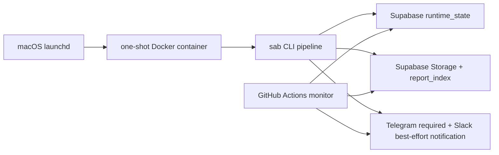

# 로컬 Docker scheduler 전환 계획

상태: Accepted (US canary code paths implemented)  •  작성일: 2026-05-28  •  구현 업데이트: 2026-05-29

2026-05-28 engineering review 결정: 이 문서는 우선 **문서/설계 보강만**
수행했습니다. 2026-05-29 `local-docker-scheduler` branch에서 US canary 기준
runtime_state 기반 scheduled runner, launchd wrapper, Docker one-shot runner,
GitHub monitor/fallback, 운영 문서를 구현했습니다. KR 활성화는 rollout decision에
따라 US canary 이후 별도 운영 전환으로 남깁니다.

이 문서는 시간 민감한 scheduled AI Brief를 GitHub Actions primary에서 로컬 Docker primary로 전환하기 위한 구현 계획입니다. 결정의 근거와 tradeoff는 [ADR-0012](adr/ADR-0012-local-docker-scheduled-runs.md)를 우선합니다.

## 1. 문제와 목표

### 문제

- GitHub Actions `schedule` 이벤트는 run 생성 자체가 지연될 수 있습니다.
- US AI Brief는 `PRE_OPEN` window 안에서만 의미가 있는데, 2026-05-28에는 `08:07 ET`로 앞당긴 schedule도 `09:34 ET`에 실행되어 skip되었습니다.
- 단일 GitHub cron을 더 앞당기는 방식은 데이터 신선도와 지연 재발 가능성 사이의 tradeoff만 옮길 뿐입니다.

### 목표

- 로컬 Docker 실행을 scheduled AI Brief primary로 둡니다.
- 같은 시장/세션 날짜에 AI Brief 리포트는 최대 1회 생성합니다.
- Telegram 알림은 delivery-first 정책으로 운영하고, sent marker 기반 중복 방지를 적용합니다.
- 로컬 실패를 놓치지 않도록 GitHub monitor/fallback과 Telegram 알림을 유지합니다.
- 기존 `sab` CLI, Supabase Storage/report_index, 알림 text builder를 재사용합니다.

### 비목표

- `scan`/`sell` schedule 전체 이전.
- GitHub Actions 제거.
- 실시간 장중 AI Brief 신설.
- Kubernetes, Redis, 별도 queue 같은 신규 운영 인프라 도입.

## 2. 목표 아키텍처



### 구성 요소

- `launchd`
  - 시장별 scheduled trigger를 담당합니다.
  - candidate role guard 통과 후 Docker daemon preflight를 수행하고, host notification env가 있으면 실패를 즉시 알립니다.
- Docker runner
  - repo root를 기준으로 Python/uv 환경을 준비합니다.
  - Supabase active holdings snapshot을 가져와 `entry`의 portfolio guard 입력으로 사용합니다.
  - `sab scan`, holdings export, `sab entry`, `sab ai-brief`를 순서대로 실행합니다.
  - 실행 후 container는 종료됩니다.
- Supabase `runtime_state`
  - 실행 lock과 성공 marker를 저장합니다.
  - 로컬 primary와 GitHub fallback이 같은 idempotency 기준을 공유합니다.
- GitHub Actions monitor/fallback
  - primary 실행 주체가 아니라, "오늘 필요한 리포트가 생성되었는지"를 확인하는 감시 역할입니다.

## 3. Scheduling 정책

### 3.0 운영 전제

- 로컬 primary는 Mac 전원/잠자기 정책을 먼저 고정한 뒤 활성화합니다.
  - AC 전원 연결.
  - 장전 실행 시간대 sleep 방지 또는 wake schedule 설정.
  - Docker Desktop 자동 시작과 daemon health 확인.
- `launchd`가 직접 container command를 실행하지 않고, host wrapper script를 실행합니다.
  - wrapper는 trigger가 전달한 candidate role과 현재 market-local time을 먼저 검증합니다.
  - role window 밖이면 env/Docker/secrets preflight나 실패 알림 없이 exit 0으로 종료합니다.
  - wrapper는 env file 존재/권한을 확인합니다.
  - wrapper는 Docker daemon preflight를 수행합니다.
  - Docker가 실행 불가하면 container에 의존하지 않고 host에서 Telegram 실패 알림을 전송합니다.
  - wrapper는 stdout/stderr log path를 고정하고, 실행 결과를 사람이 재현 가능한 command로 남깁니다.
- GitHub monitor는 local job이 아예 시작되지 않은 상태도 감지해야 합니다.
  - pipeline을 실행할 수 있는 runner는 시작 시 role-scoped `attempt` marker를 기록합니다.
  - attempt marker는 runtime_state preflight 통과 직후, completion/artifact skip 판단 전에 기록합니다.
  - attempt marker write가 실패하면 report generation으로 진행하지 않습니다.
  - `monitor-only` job과 `cutoff-alert` job은 attempt marker를 기록하지 않습니다.
  - monitor는 success marker뿐 아니라 local-primary attempt marker 부재, lock 존재, artifact 존재를 구분합니다.

### 3.1 권장 실행 시각

| 시장 | Primary | Retry | Hard cutoff | 기준 |
| --- | --- | --- | --- | --- |
| KR | 07:30 KST | 08:10 KST | 08:55 KST | 09:00 KST 개장 전 |
| US | 08:10 ET | 08:45 ET | 09:25 ET | 09:30 ET 개장 전 |

- Primary는 데이터 신선도와 처리 시간을 같이 고려한 기본 실행입니다.
- Retry는 success marker가 없을 때만 실행합니다.
- Hard cutoff 이후에는 `PRE_OPEN` AI Brief를 생성하지 않고 missing/late 알림만 보냅니다.
- host timezone은 KST로 고정합니다. US `launchd` plist는 ET 시각을 직접
  표현하지 않고 KST 기준 candidate tick만 실행합니다.
  - EDT candidate tick: 21:10, 21:45, 22:25 KST.
  - EST candidate tick: 22:10, 22:45, 23:25 KST.
  - 각 `launchd` job은 하나의 `schedule_role`만 인자로 전달합니다.
  - 같은 role의 EDT/EST 보정 tick은 한 plist에 함께 둘 수 있지만, primary/retry/cutoff처럼 role이 다른 tick은 별도 plist/job으로 분리합니다.
  - wrapper/runner는 전달받은 `schedule_role`과 `America/New_York`
    기준 현재 시각을 함께 검증해 primary/retry/cutoff 역할을 최종 판정합니다.
  - target window 밖 candidate tick은 조용히 종료합니다.
- 실제 PRE_OPEN 여부는 runner guard가 최종 판단합니다. plist 시각은 trigger 힌트이고, 거래 세션 판단의 source of truth가 아닙니다.

### 3.1.1 Candidate role guard

`launchd` wrapper와 GitHub `resolve_context`는 container 실행, Docker daemon
preflight, secret preflight, 실패 알림보다 먼저 candidate role guard를 수행합니다.
이 순서가 중요합니다. 예를 들어 EDT 기간의 EST 보정 tick은 실제로는 US 09:10
ET에 실행될 수 있는데, 이를 먼저 조용히 종료하지 않으면 Docker daemon down 같은
거짓 장애 알림을 보낼 수 있습니다.

| 시장 | Role | 허용 market-local window | 비고 |
| --- | --- | --- | --- |
| KR | `local-primary` | 07:25 <= t < 08:05 KST | 07:30 tick 지연 허용 |
| KR | `local-retry` | 08:05 <= t < 08:55 KST | cutoff 전 retry |
| KR | `cutoff-alert` | 08:55 <= t < 09:20 KST | missing/late alert only |
| US | `local-primary` | 08:05 <= t < 08:30 ET | 08:10 tick 지연 허용 |
| US | `early-monitor` | 08:30 <= t < 08:45 ET | GitHub monitor only |
| US | `local-retry` | 08:40 <= t < 08:55 ET | local retry |
| US | `github-fallback` | 08:55 <= t < 09:25 ET | lock 획득 후 1회 fallback |
| US | `cutoff-alert` | 09:25 <= t < 10:00 ET | missing/late alert only |

- Window 밖 candidate는 성공도 실패도 아닌 no-op입니다.
- Window 통과 후에도 `trading_session=true`와 `session_state=PRE_OPEN` guard를 다시 확인합니다.
- Cutoff role은 pipeline-capable role이 아니며 attempt marker를 쓰지 않습니다.
- `schedule_role`은 trigger window 분류 값이고, `runner_role`은 attempt marker 분류 값입니다.
  - 예: GitHub early monitor의 `schedule_role`은 `early-monitor`이고, `runner_role`은 `monitor-only`입니다.
  - pipeline-capable `runner_role`은 `local-primary`, `local-retry`, `github-fallback`뿐입니다.

### 3.2 세션 가드

- scheduler 시작 시점에 `trading_session=true`와 `session_state=PRE_OPEN`을 확인합니다.
- `entry` 실행 직전에도 다시 `session_state=PRE_OPEN`을 확인합니다.
- 알림 발송 직전에도 final guard를 수행합니다.
- 업로드 직전에도 final guard를 수행합니다.
- 중간에 `INTRADAY`로 넘어가면 AI Brief artifact 업로드와 schedule 알림을 중단하고 late skip 알림을 남깁니다.
- 업로드 직전과 notification claim/send 직전에 main lock ownership을 다시 확인합니다.
  - live lock row의 `ownerToken`이 현재 runner의 token과 다르거나 만료되었으면 lock을 잃은 것으로 봅니다.
  - upload 전 lock을 잃으면 AI Brief artifact를 업로드하지 않고 종료합니다.
  - upload 후 notification 전 lock을 잃으면 artifact key는 유지하고 notification reconciliation 대상이 되게 한 뒤 종료합니다.

## 4. Idempotency 설계

### 4.0 상태 저장 원칙

- `runtime_state`를 시장/세션 날짜 idempotency의 source of truth로 사용합니다.
- `report_index` 단독으로는 idempotency를 판단하지 않습니다.
  - storage key는 날짜/중복 인덱스/report type 중심이고 market을 포함하지 않습니다.
  - 같은 날짜에 KR/US `ai-brief`가 모두 존재할 수 있으므로 "date + type exists"는 false positive가 됩니다.
- success marker는 기존 `claim_runtime_state_lock` RPC로 구현하지 않습니다.
  - `claim_runtime_state_lock`은 live row가 있으면 lock held로 취급합니다.
  - success marker는 lock이 아니므로 별도 table REST upsert/read helper 또는 scheduler 전용 RPC가 필요합니다.

### 4.1 상태 키

- Lock key: `scheduled-ai-brief:lock:{market}:{session_date}`
- Artifact key: `scheduled-ai-brief:artifact:{market}:{session_date}`
- Notification claim key: `scheduled-ai-brief:notification:claim:{market}:{session_date}`
- Notification sent key: `scheduled-ai-brief:notification:sent:{market}:{session_date}`
- Completion key: `scheduled-ai-brief:success:{market}:{session_date}`
- Attempt key: `scheduled-ai-brief:attempt:{market}:{session_date}:{runner_role}:{attempt_id}`
- Late alert claim key: `scheduled-ai-brief:late-alert:claim:{market}:{session_date}:{reason}`
- Late alert sent key: `scheduled-ai-brief:late-alert:sent:{market}:{session_date}:{reason}`

예:

```text
scheduled-ai-brief:lock:US:2026-05-28
scheduled-ai-brief:artifact:US:2026-05-28
scheduled-ai-brief:notification:claim:US:2026-05-28
scheduled-ai-brief:notification:sent:US:2026-05-28
scheduled-ai-brief:success:US:2026-05-28
scheduled-ai-brief:attempt:US:2026-05-28:local-primary:0810-20260528T121000Z
scheduled-ai-brief:attempt:US:2026-05-28:github-fallback:0855-26577954659-1
scheduled-ai-brief:late-alert:claim:US:2026-05-28:local_primary_missing
scheduled-ai-brief:late-alert:sent:US:2026-05-28:local_primary_missing
```

`runner_role`은 attempt marker 분류 전용 값입니다.

- `local-primary`: 로컬 primary tick.
- `local-retry`: 로컬 retry tick.
- `github-fallback`: GitHub fallback attempt.
- `monitor-only`와 `cutoff-alert`는 attempt marker를 쓰지 않습니다.

GitHub early monitor가 "local primary did not start"를 판단할 때는 `scheduled-ai-brief:attempt:{market}:{session_date}:local-primary:*`만 조회합니다. `local-retry`나 `github-fallback` attempt가 있어도 local primary 시작 증거로 간주하지 않습니다.

`attempt_id`는 실제 프로세스 실행마다 고유해야 합니다.

- Bare schedule time(`0810`, `0855`)은 사람이 읽는 `scheduledTick` payload로만 둡니다.
- Local runner는 `scheduledTick + UTC startedAt` 또는 `scheduledTick + pid/random suffix`를 사용합니다.
- GitHub runner는 `scheduledTick + run_id + run_attempt`를 사용합니다.
- 같은 role의 수동 재시도는 새 `attempt_id`를 사용해야 하며, monitor는 role prefix wildcard로 조회합니다.

Main lock, notification claim, late alert claim은 모두 lock-like row입니다.

- claim payload에는 non-empty `ownerToken`, `attemptId`, `market`, `sessionDate`, `runnerRole`을 포함합니다.
- claim release는 해당 row의 `ownerToken`이 호출자의 token과 일치할 때만 성공합니다.
- empty/blank token은 helper와 database RPC 양쪽에서 거부합니다.
- artifact, notification sent, late alert sent, success, attempt marker는 lock release RPC로 삭제하지 않습니다.

### 4.1.1 상태 전이

```text
NO_STATE
  ├─ verified report_index/storage repair ─▶ ARTIFACT_UPLOADED
  └─ claim lock(owner_token) ─▶ RUNNING
RUNNING
  ├─ pre-upload guard fails ─▶ LATE_SKIPPED
  ├─ owner lock lost before upload ─▶ LOCK_LOST_ABORTED
  ├─ upload succeeds ────────▶ ARTIFACT_UPLOADED
  └─ failure before upload ──▶ FAILED
ARTIFACT_UPLOADED
  ├─ notification sent exists ─▶ SUCCESS
  ├─ owner lock lost before notification ─▶ WAITING_NOTIFICATION_RETRY
  ├─ claim notification lock ───▶ NOTIFICATION_CLAIMED
  └─ notification claim held ───▶ WAITING_NOTIFICATION_RETRY
NOTIFICATION_CLAIMED
  ├─ Telegram sent ───────────▶ NOTIFICATION_SENT
  └─ failure/crash ───────────▶ ARTIFACT_UPLOADED after claim TTL
NOTIFICATION_SENT
  └─ write completion marker ─▶ SUCCESS
```

- `ARTIFACT_UPLOADED`는 AI Brief upload 완료 경계입니다. 전체 scheduled 성공을 의미하지 않습니다.
- `SUCCESS`는 AI Brief artifact가 업로드되고 Telegram schedule 알림이 성공한 상태입니다.
- `verified report_index/storage repair`는 이미 업로드된 AI Brief JSON을 검증해 artifact marker만 복구하는 전이입니다. 이 경로에서는 report를 재생성하지 않습니다.
- attempt marker는 위 성공 상태 전이와 별개인 monitor용 실행 흔적입니다. role-scoped key로 기록해 local primary 시작 여부와 fallback 시작 여부를 구분합니다.
- Slack은 secret이 있을 때 best-effort로 발송하며 completion/success marker 조건에 포함하지 않습니다.
- notification은 claim key와 sent key로 분리합니다. claim key는 동시 전송을 막는 짧은 TTL lock이고, sent key는 완료 marker입니다.
- late/missing alert는 schedule notification과 별도 claim/sent key를 사용합니다. late alert sent marker는 schedule notification sent marker나 completion marker를 대체하지 않습니다.
- claim 이후 프로세스가 실패하면 claim TTL 만료 뒤 notification reconciliation을 재시도합니다.
- notification claim과 late alert claim도 main lock과 같은 non-empty owner token release 규칙을 사용합니다.
- Telegram API 성공 후 sent marker 기록 전에 프로세스가 죽는 극단적 구간은 외부 API 특성상 자동 판별이 어렵습니다.
  - 이 구간에서는 중복 발송 가능성이 있습니다.
  - 운영 정책은 exactly-once가 아니라 delivery-first + sent marker dedupe입니다.
  - reconciliation은 중복 가능성을 감수하고 required notification delivery를 우선합니다.

### 4.2 실행 순서

1. trigger가 전달한 candidate role을 market-local role window로 검증한 뒤 세션 날짜, 시장, schedule role, runner role, unique attempt id를 계산합니다.
   - host wrapper와 GitHub `resolve_context`는 이 검증을 container 실행, Docker preflight, secret preflight, 실패 알림보다 먼저 수행합니다.
   - role window 밖이면 no-op으로 종료합니다.
   - `attemptId`는 실제 실행마다 고유하게 만들고, 사람이 읽는 schedule label은 `scheduledTick`으로 별도 payload에 보존합니다.
2. runtime_state mandatory preflight를 수행합니다.
   - Supabase `runtime_state` 접근에 필요한 env를 확인합니다.
   - preflight 실패 시 report generation/upload/notification reconciliation을 시작하지 않습니다.
3. pipeline-capable runner이면 role-scoped attempt marker를 기록합니다. payload에는 `market`, `sessionDate`, `scheduleRole`, `runnerRole`, `runner`, `scheduledTick`, `attemptId`, `runUrl`, `startedAt`을 포함합니다.
   - `runnerRole`은 `local-primary`, `local-retry`, `github-fallback` 중 하나입니다.
   - `monitor-only` job과 `cutoff-alert` job은 attempt marker를 기록하지 않습니다.
4. completion key가 있으면 조용히 종료합니다.
5. artifact key가 없으면 `report_index` repair를 시도합니다.
   - `report_type=ai-brief`, `report_date=sessionDate` 후보를 조회합니다.
   - 각 후보의 Supabase Storage JSON을 다운로드하고 `schema`, `type`, `market`, `report_date`, `generated_at`을 검증합니다.
   - 검증에 성공하면 upload 경로와 같은 shape의 artifact key payload를 복구하고 6-7단계 판단으로 이동합니다.
   - repair payload에는 `storageKey`, `market`, `sessionDate`, `reportDate`, `runner`, `attemptId`, `runUrl`, `verifiedGeneratedAt`, `repairedAt`, `repairedFromReportIndex`를 포함합니다.
   - 검증 가능한 후보가 없을 때만 새 pipeline 실행을 고려합니다.
6. artifact key와 notification sent key가 모두 있으면 completion key를 복구하고 종료합니다.
7. artifact key가 있고 notification sent key가 없으면 report를 재생성하지 않고 notification reconciliation으로 이동합니다.
   - artifact key payload의 `storageKey`로 Supabase Storage JSON을 다운로드합니다.
   - 다운로드한 payload의 `schema`, `type`, `market`, `report_date`, `generated_at`을 검증합니다.
   - 검증 기준은 marker repair와 같으며, 이미 선택된 `storageKey`만 대상으로 한다는 점만 다릅니다.
   - 검증된 payload와 현재 reconciliation run URL로 Telegram text를 렌더링합니다.
   - artifact key payload에는 `originalRunner`, `originalAttemptId`, `originalRunUrl`을 가능하면 보존합니다.
   - artifact-only notification reconciliation은 main lock을 claim하지 않습니다. notification claim key와 sent marker만 사용합니다.
   - Telegram required secret preflight는 notification claim 전에 수행합니다.
8. 새 pipeline 실행이 필요한 경우 Telegram required secret preflight를 수행합니다.
   - Telegram secret이 없으면 AI Brief 생성/upload를 시작하지 않고 preflight failure로 기록합니다.
9. artifact key가 없으면 non-empty `owner_token`을 만들고 lock key를 TTL과 함께 claim합니다. claim payload에는 반드시 `ownerToken`, `attemptId`, `market`, `sessionDate`, `runner`, `runnerRole`을 포함합니다.
10. lock 획득 실패 시 다른 runner가 실행 중인 것으로 보고 조용히 종료합니다.
11. `scan -> holdings export -> entry -> ai-brief -> AI Brief upload -> notification reconciliation`을 실행합니다.
12. `entry` 실행 전 Supabase `holdings`에서 active holdings snapshot을 export합니다.
   - `quantity > 0` row만 사용합니다.
   - 필드는 current GitHub workflow와 같은 `ticker`, `quantity`, `entry_price`, `entry_currency`, `entry_date`, `strategy`, `notes`, `tags`, `stop_override`, `target_override`를 사용합니다.
   - export 결과는 scheduler 임시 `holdings.yaml`에 쓰고 `HOLDINGS_FILE` 또는 config override로 `entry`에 주입합니다.
13. scheduled AI Brief `report_date`는 container local timezone이 아니라 계산된 `sessionDate`로 고정합니다.
   - `sab ai-brief --report-date <sessionDate>` CLI 옵션을 추가합니다.
   - 내부 구현은 `run_ai_brief(..., artifact_date=sessionDate)`를 거쳐 `write_ai_brief_report(..., artifact_date=sessionDate)`로 전달합니다.
   - scheduler runner 테스트에서 `report_date == sessionDate`를 검증합니다.
14. 첫 구현에서는 `scan`/`entry` 산출물을 로컬 중간 산출물로만 사용하고 Supabase에 업로드하지 않습니다.
15. AI Brief upload 직전에 main lock key를 다시 읽어 `ownerToken`과 `expires_at`을 검증합니다.
    - 현재 runner가 더 이상 lock owner가 아니면 upload하지 않고 `LOCK_LOST_ABORTED`로 종료합니다.
    - 이 경우 lock release를 시도하지 않습니다.
16. AI Brief upload가 성공하면 artifact key를 기록합니다. payload에는 `storageKey`, `market`, `sessionDate`, `reportDate`, `runner`, `attemptId`, `runUrl`을 포함합니다.
17. notification claim 직전에 main lock key를 다시 읽어 `ownerToken`과 `expires_at`을 검증합니다.
    - upload 후 main lock ownership을 잃었으면 Telegram을 보내지 않고 artifact key만 남겨 reconciliation 대상이 되게 합니다.
18. notification sent key가 없으면 Telegram required secret preflight를 수행한 뒤 notification claim key를 짧은 TTL로 claim합니다.
    - notification claim payload에도 non-empty `ownerToken`, `attemptId`, `market`, `sessionDate`, `runnerRole`, `channel=telegram`, `notificationType=schedule`을 기록합니다.
19. notification claim을 얻은 뒤 Telegram POST 직전에 final guard를 다시 수행합니다.
    - session/cutoff guard가 실패하면 schedule notification을 보내지 않고 missing/late alert 경로로 종료합니다.
    - 새 pipeline runner는 main lock ownership도 다시 확인합니다.
    - artifact-only reconciliation runner는 main lock ownership을 요구하지 않습니다.
    - guard 실패 시 notification claim key는 claim owner token으로 즉시 release합니다. release 실패 시 TTL 만료에 맡깁니다.
    - guard 실패 시 schedule notification sent key와 completion key는 기록하지 않습니다.
    - guard 실패 알림은 late alert claim/sent key로 dedupe합니다.
20. Telegram schedule 알림을 발송합니다. Telegram 2xx 응답 후 notification sent key와 completion key를 기록합니다.
21. Slack webhook secret이 있으면 Telegram 이후 best-effort로 발송합니다. Slack 실패는 completion key를 삭제하거나 scheduled 실패로 만들지 않습니다.
22. 실패하면 `owner_token`으로 lock을 release하고 실패 알림을 보냅니다.
    - AI Brief upload와 `report_index` upsert가 성공한 뒤 artifact marker write가 실패하면 새 report를 재생성하지 않습니다.
    - 다음 retry/fallback은 `report_index` + Storage JSON repair를 먼저 시도해야 합니다.
    - artifact marker가 이미 쓰인 뒤 실패했다면 artifact key는 유지하고 notification reconciliation 대상이 되게 합니다.

### 4.3 TTL 기준

- Lock TTL: 25분.
- Lock renew: 정상 runner는 5분마다 owner-token-protected renew RPC로 `expires_at`을 연장합니다.
- Stale lock takeover: retry/fallback은 lock TTL이 만료되면 같은 lock key를 claim해 cutoff 전에 takeover할 수 있어야 합니다.
- Notification claim TTL: 10분.
- Notification sent TTL: 최소 48시간.
- Late alert claim TTL: 10분.
- Late alert sent TTL: 최소 48시간.
- Success TTL: 최소 48시간.
- Attempt TTL: 7일.

Success marker는 하루 안 중복 방지 목적이므로 영구 저장이 필요하지 않습니다. 장기 감사는 `report_index`, GitHub run history, 로컬 로그를 사용합니다.

Lock-like row의 release/renew/ownership-check RPC는 database 레벨에서도 empty owner token을 거부해야 합니다. helper 입력 검증만으로는 충분하지 않습니다.

- `p_owner_token`이 empty/blank이면 release/renew는 실패해야 합니다.
- row payload의 `ownerToken`이 empty/blank이면 release/renew 대상이 아니어야 합니다.
- ownership check는 lock row가 존재하고, `expires_at > now()`, `state_payload->>'ownerToken' = p_owner_token`일 때만 true를 반환합니다.
- wrong-token, no-token, blank-token은 모두 테스트에서 구분합니다.
- 이 규칙은 main lock뿐 아니라 notification claim과 late alert claim release에도 적용합니다.

### 4.4 GitHub/local 동시성

- GitHub fallback도 provider 호출, upload, 새 artifact 생성 전에 같은 main lock key를 claim해야 합니다.
- artifact key가 이미 있거나 repair된 notification-only 경로는 main lock을 claim하지 않고 notification claim key만 사용합니다.
- GitHub workflow concurrency는 두 계층으로 둡니다.
  - Supabase runtime_state lock이 market/session idempotency의 source of truth입니다.
  - GitHub job-level concurrency는 runner context resolve job의 output을 사용해 `market + session_date + role`을 포함합니다.
  - workflow top-level concurrency는 제거하거나 cancel 없는 coarse group으로만 둡니다. 현재처럼 workflow 전체를 `cancel-in-progress: true`로 묶으면 monitor가 fallback을 취소할 수 있습니다.
  - GitHub Actions job-level `concurrency` expression은 `needs` context를 사용할 수 있으므로, `resolve_context` job에서 `market`, `session_date`, `role`을 output으로 만들고 실행 job이 이를 참조합니다.
- monitor/alert run은 fallback run을 취소하지 않아야 합니다.
- fallback은 artifact key가 있으면 report를 재생성하지 않고 notification sent 상태만 확인합니다.
- artifact-only notification reconciliation은 artifact key의 `storageKey`로 Supabase Storage JSON을 다운로드해 검증한 뒤 알림을 렌더링합니다.

### 4.5 Artifact와 marker repair 범위

- scheduled runner의 idempotency/success 대상은 `*.ai-brief.json` Supabase upload와 Telegram schedule notification입니다.
- `scan`/`entry` 산출물은 첫 구현에서 로컬 중간 산출물입니다. buy/entry scheduled upload가 필요하면 별도 marker 설계 후 후속 작업으로 다룹니다.
- `report_index` 단독으로 marker를 복구하지 않습니다.
- marker가 없으면 `report_index`에서 `report_type=ai-brief`, `report_date=sessionDate` 후보를 모두 조회합니다.
- 각 후보의 Storage object JSON을 읽어 다음 조건을 모두 확인한 경우에만 artifact key를 복구합니다.
  - `schema`가 `sab.ai_brief.v1`입니다.
  - `type`이 `ai_brief`입니다.
  - artifact `market`이 대상 market과 같습니다.
  - artifact `report_date`가 대상 `session_date`와 같습니다.
  - artifact `generated_at`이 parse 가능하고, market-local 기준 대상 `session_date`의 scheduled window 안입니다.
    - scheduled window는 해당 시장의 primary role window 시작부터 hard cutoff 직전까지입니다.
- repair로 쓰는 artifact key payload는 upload 성공 경로와 같은 필드를 가져야 합니다.
  - 필수: `storageKey`, `market`, `sessionDate`, `reportDate`, `runner`, `attemptId`, `runUrl`.
  - repair 전용: `verifiedGeneratedAt`, `repairedAt`, `repairedFromReportIndex: true`.
  - `storageKey`는 검증한 Storage object key와 정확히 같아야 합니다.
- 위 조건을 만족하지 않는 report는 같은 날짜의 다른 시장 또는 수동 실행일 수 있으므로 repair 후보에서 제외합니다.
- 여러 후보가 모두 유효하면 `generated_at`과 `report_index` 생성 시각 기준 최신 후보 하나만 repair합니다.

### 4.6 US canary GitHub monitor schedule

US canary 기간에는 GitHub Actions schedule을 다음 UTC candidate 시각으로 둡니다. 각 run은 실제 실행 시점에 `America/New_York` 기준 role window와 PRE_OPEN/cutoff guard를 다시 확인합니다. EDT/EST를 모두 커버하기 위해 같은 role에 두 개의 UTC candidate를 둡니다. window 밖 candidate는 조용히 종료합니다.

| Role | ET | KST candidate | UTC cron candidates | 동작 |
| --- | --- | --- | --- | --- |
| `early-monitor` | 08:30 ET | 21:30 KST(EDT), 22:30 KST(EST) | `30 12 * * 1-5`, `30 13 * * 1-5` | local-primary attempt/lock/artifact 상태만 확인하고, local primary 미시작이면 알림 |
| `github-fallback` | 08:55 ET | 21:55 KST(EDT), 22:55 KST(EST) | `55 12 * * 1-5`, `55 13 * * 1-5` | artifact repair 실패 후에도 artifact key가 없고 PRE_OPEN이면 lock claim 후 1회 fallback 실행 |
| `cutoff-alert` | 09:26 ET | 22:26 KST(EDT), 23:26 KST(EST) | `26 13 * * 1-5`, `26 14 * * 1-5` | hard cutoff 이후 missing/late 알림만 발송하고 pipeline은 실행하지 않음 |

GitHub Actions workflow syntax상 `schedule` 항목은 cron 문자열을 여러 개 선언하는 방식으로 표현합니다. workflow는 `github.event.schedule`을 candidate role로 매핑한 뒤, `America/New_York` 기준 현재 시각이 해당 role window 안인지 확인합니다. role window 밖이면 runtime_state write, secret preflight, 알림 없이 조용히 종료합니다.

## 5. Secrets와 로컬 파일 정책

- secret은 git에 커밋하지 않습니다.
- 로컬 Docker runner는 `.env.scheduler.local` 같은 `.env.*` 파일을 사용합니다. 현재 `.gitignore`가 `.env.*`를 제외하므로 커밋되지 않습니다.
- 최소 필요 secret:
  - `KIS_APP_KEY`
  - `KIS_APP_SECRET`
  - `SUPABASE_URL`
  - `SUPABASE_SECRET_KEY` 또는 service-role equivalent
  - `OPENAI_API_KEY`
  - `TELEGRAM_BOT_TOKEN`
  - `TELEGRAM_CHAT_ID`
  - source provider별 API key
- Docker 로그와 Telegram 메시지에는 secret 값을 출력하지 않습니다.
- host wrapper는 role window 통과 후 env file을 읽습니다.
  - env file이 없거나 unreadable이면 container를 실행하지 않고 redacted local log를 남깁니다.
  - 이 경우 Telegram secret도 로드할 수 없으므로 host Telegram 알림은 best-effort입니다.
  - GitHub early monitor는 attempt marker 부재로 env/preflight 실패를 감지하는 보조 경로입니다.
- scheduled path에서 Telegram은 required channel입니다.
  - runtime_state/Supabase preflight는 completion/sent marker skip 판단보다 먼저 수행합니다.
  - Telegram secret preflight는 새 pipeline 생성 또는 notification reconciliation이 필요한 경우에만 수행합니다.
  - 이미 completion key가 있거나 artifact key와 notification sent key가 모두 있으면 Telegram secret이 없어도 조용히 종료하거나 completion marker만 복구할 수 있습니다.
  - Telegram secret이 없으면 새 AI Brief 생성/upload 또는 notification reconciliation을 시작하지 않고 preflight failure로 기록합니다.
  - 기존 workflow의 "secret missing이면 알림만 skip하고 성공" 동작은 scheduled path에서는 허용하지 않습니다.
  - manual/on-demand 실행은 별도 입력으로 notification을 끌 수 있지만, scheduled success marker 조건에는 영향을 주지 않습니다.

## 6. 구현 단계

### Phase 0. 계획 hardening (현재 문서 범위)

- 이 문서의 상태 키, 상태 전이, fallback cutoff, 테스트 매트릭스를 확정합니다.
- implementation PR을 다음 slice로 나눕니다.
  - Slice 1: runtime_state helper/RPC + local scheduled runner dry-run.
  - Slice 2: host wrapper + Docker compose/just entrypoint + runbook.
  - Slice 3: local primary canary.
  - Slice 4: GitHub monitor/fallback 전환.
- `docs/runbook.md` 초안은 launchd를 실제 enable하기 전에 작성합니다.
- `docs/ARCHITECTURE.md`는 primary 책임이 실제로 바뀌는 PR에서 갱신합니다.

### Phase 1. Idempotency 기반 마련

- `sab` 또는 `scripts/`에 scheduled AI Brief runner entrypoint를 추가합니다.
- runner는 시장, schedule role, runner role, scheduled tick, attempt id, dry-run 여부를 입력으로 받습니다.
- runner는 trigger가 전달한 candidate role과 current market-local time을 먼저 검증하고, window 밖에서는 no-op으로 종료합니다.
- runner의 `attempt_id`는 실제 실행마다 고유하며, schedule label은 `scheduledTick` payload로 분리합니다.
- runner는 `entry` 전에 Supabase active holdings snapshot을 export하는 helper를 포함합니다.
- runner는 `sab ai-brief --report-date <sessionDate>`로 scheduled AI Brief `report_date=sessionDate`를 강제합니다.
- Supabase `runtime_state` lock/artifact/notification claim/notification sent/success marker helper를 추가합니다.
- late/missing alert claim/sent marker helper를 추가합니다.
- lock helper는 non-empty owner token을 요구하고, wrong-token/no-token release를 실패로 처리합니다.
- lock helper는 owner-token-protected renew와 ownership check를 지원합니다.
- release/renew/ownership check RPC는 database 레벨에서 blank owner token을 reject합니다.
- notification claim과 late alert claim release도 main lock과 같은 non-empty owner token 검증을 사용합니다.
- runner는 runtime_state preflight 통과 직후 role-scoped attempt marker를 기록하고, attempt marker write 실패 시 report generation으로 진행하지 않습니다.
- monitor-only와 cutoff-alert role은 attempt marker를 기록하지 않습니다.
- scheduled runner는 AI Brief upload 직전과 notification claim/send 직전에 ownership check를 통과해야 합니다.
- scheduled runner와 GitHub fallback은 scheduled path에서 새 pipeline 또는 notification reconciliation 전에 Telegram secret preflight를 수행합니다.
- 단위 테스트:
  - success marker가 있으면 실행을 skip합니다.
  - runtime_state preflight 통과 직후 role-scoped attempt marker를 기록합니다.
  - 같은 role의 수동 재시도는 다른 `attempt_id`로 별도 attempt marker를 기록합니다.
  - monitor-only와 cutoff-alert role은 attempt marker를 기록하지 않습니다.
  - GitHub fallback attempt marker가 있어도 local primary started로 판정하지 않습니다.
  - attempt marker write 실패 시 report generation으로 진행하지 않습니다.
  - lock 획득 실패 시 실행을 skip합니다.
  - stale lock은 25분 TTL 만료 뒤 retry/fallback이 takeover할 수 있습니다.
  - wrong owner token으로 renew할 수 없습니다.
  - blank owner token으로 release/renew/ownership check를 통과할 수 없습니다.
  - lock을 잃은 runner는 AI Brief upload를 수행하지 않습니다.
  - upload 후 notification 전 lock을 잃은 runner는 Telegram을 보내지 않고 artifact-only reconciliation 대상만 남깁니다.
  - artifact marker만 있으면 report 재생성을 skip하고 notification reconciliation으로 이동합니다.
  - artifact marker가 없으면 새 pipeline 전에 report_index 후보와 Storage JSON 검증으로 marker repair를 시도합니다.
  - repaired artifact marker payload는 upload 성공 경로와 같은 필수 필드와 repair 전용 필드를 포함합니다.
  - marker repair가 성공하면 report를 재생성하지 않고 notification sent/completion 상태만 복구하거나 reconciliation합니다.
  - Storage payload `generated_at`이 대상 session date scheduled window 밖이면 marker repair를 금지합니다.
  - artifact-only reconciliation은 `storageKey`로 Storage JSON을 다운로드하고 payload 검증 후 Telegram text를 렌더링합니다.
  - artifact-only reconciliation은 main lock 없이 notification claim key만 사용합니다.
  - notification claim 이후 프로세스가 실패하면 TTL 만료 뒤 재시도합니다.
  - notification claim 이후 Telegram POST 직전에 session/cutoff guard를 다시 수행합니다.
  - post-claim guard 실패 시 schedule notification sent/completion marker를 쓰지 않고 notification claim을 release합니다.
  - post-claim guard 실패의 missing/late alert는 late alert claim/sent key로 dedupe합니다.
  - notification claim과 late alert claim은 wrong/blank owner token으로 release할 수 없습니다.
  - Telegram sent 후 sent marker 기록 전 crash 구간은 delivery-first 중복 가능성을 문서화된 동작으로 검증합니다.
  - holdings export 실패는 scheduled runner 실패로 처리하고 lock을 release합니다.
  - scheduled `report_date`는 container timezone과 무관하게 `sessionDate`와 일치합니다.
  - scheduled Telegram secret preflight 실패는 report generation/upload/reconciliation 전에 실패합니다.
  - 실패 시 lock release와 실패 알림 경로를 검증합니다.

### Phase 2. Docker runner 추가

- repo root 기준 Docker runner image 또는 `docker-compose.scheduler.yml`을 추가합니다.
- runner command는 one-shot으로 유지합니다.
- host volume은 필요한 캐시/리포트 경로만 명시적으로 mount합니다.
- `just ai-brief-scheduled-local --market US --schedule-role local-primary --runner-role local-primary --scheduled-tick 0810` 같은 로컬 실행 recipe를 추가합니다.
  - recipe는 `attempt_id`를 자동 생성하고, 명시 입력이 필요하면 `--attempt-id`를 별도 옵션으로 둡니다.
- runner는 첫 구현에서 `scan`과 `entry`를 local-only로 실행하고, 최종 `ai-brief` JSON만 Supabase에 업로드합니다.
- runner는 `entry --upload`을 사용하지 않습니다. `entry`는 local-only로 실행하고, AI Brief 입력 artifact로만 사용합니다.
- 검증:
  - dry-run으로 Supabase write 없이 세션 가드와 command assembly를 확인합니다.
  - 실제 upload는 staging 또는 작은 수동 실행으로 확인합니다.

### Phase 3. macOS launchd 등록

- `scripts/launchd/` 아래 plist template와 host wrapper, 설치/검증 스크립트를 추가합니다.
- plist는 repo absolute path, env file path, log path, 단일 `schedule_role` 인자를 명시합니다.
- plist label은 시장과 role을 포함합니다. 예: `com.mochafreddo.sab.ai-brief.us.local-primary`.
- 같은 role의 EDT/EST candidate tick은 같은 plist의 여러 `StartCalendarInterval`로 둘 수 있습니다.
- 서로 다른 role은 같은 plist에 섞지 않습니다. `launchd`는 tick별로 다른 `ProgramArguments`를 전달할 수 없기 때문입니다.
- plist target은 Docker command가 아니라 host wrapper입니다.
- 설치 스크립트는 destructive 동작 없이 template render와 `launchctl print` 확인을 안내합니다.
- 검증:
  - off-window candidate는 Docker daemon preflight와 실패 알림 없이 exit 0으로 종료합니다.
  - env file missing/unreadable이면 container를 실행하지 않고 redacted local log를 남깁니다.
  - primary/retry/cutoff role은 서로 다른 plist label과 `schedule_role` args로 렌더링됩니다.
  - manual `launchctl kickstart`로 dry-run 실행.
  - Docker daemon stopped 상태에서 Telegram env가 있으면 실패 알림을 확인합니다.

### Phase 4. GitHub Actions 역할 축소

- 기존 `ai-brief.yml` schedule은 monitor/fallback 중심으로 바꿉니다.
- workflow는 먼저 `resolve_context` job에서 market/session_date/role을 계산하고, 실행 job은 `needs.resolve_context.outputs.*`로 job-level concurrency group을 구성합니다.
- monitor는 completion key, artifact key, notification claim key, notification sent key, attempt marker를 확인합니다.
  - no local-primary attempt: local primary did not start.
  - local-primary attempt exists but no lock/artifact: local primary started and failed before lock/upload.
  - lock exists but no artifact: local primary is running or stale-lock takeover candidate.
  - artifact exists but no notification sent: notification-only reconciliation candidate.
  - github-fallback attempt does not satisfy local-primary start detection.
- artifact key는 있지만 notification sent key가 없으면 report를 재생성하지 않고 Telegram notification reconciliation만 시도합니다.
- marker가 없으면 `report_index`에서 `report_type=ai-brief`, `report_date=sessionDate` 후보를 조회하고, Storage object JSON의 market/report_date/generated_at까지 검증한 뒤 repair합니다.
- repair 이후에도 PRE_OPEN window가 남아 있고 artifact key가 없으면 GitHub fallback을 한 번 시도할 수 있습니다.
- PRE_OPEN window가 지났고 success가 없으면 missing/late 알림만 보냅니다.
- 중복 방지를 위해 GitHub도 같은 idempotency key를 사용합니다.
- monitor schedule은 `4.6 US canary GitHub monitor schedule`의 세 역할과 EDT/EST UTC candidate를 모두 선언합니다.
  - `early-monitor`: local primary 시작 여부 확인.
  - `github-fallback`: PRE_OPEN window 안에서 lock 획득 후 한 번 실행.
  - `cutoff-alert`: hard cutoff 이후 missing/late만 알림.
  - 각 candidate run은 `America/New_York` role guard 밖이면 조용히 종료합니다.

### Phase 5. 운영 문서 갱신

- `docs/ARCHITECTURE.md`
  - scheduled AI Brief primary 실행 주체를 로컬 Docker로 갱신합니다.
  - GitHub Actions는 monitor/fallback으로 표기합니다.
- `docs/runbook.md`
  - launchd 등록/해제, 로그 확인, 수동 재실행, 실패 대응 절차를 추가합니다.
- `.env.example`
  - scheduler 관련 non-secret 설정만 추가합니다.

## 7. 검증 기준

- 로컬 dry-run:
  - US/KR 각각 세션 계산과 idempotency skip이 기대대로 동작합니다.
- 로컬 실제 실행:
  - PRE_OPEN window 안에서 AI Brief artifact가 생성되고 Supabase에 업로드됩니다.
  - 정상 경로에서는 Telegram schedule 알림이 1회 발송되고 completion marker가 기록됩니다.
  - Telegram sent 후 sent marker 기록 전 crash 구간은 중복 가능성이 있는 delivery-first 경로로 기록됩니다.
  - Slack은 secret이 있을 때 best-effort로 발송되며 success 판정에 포함되지 않습니다.
- 중복 방지:
  - primary 후 retry를 실행해도 success marker 때문에 조용히 종료합니다.
  - 로컬 primary와 GitHub monitor가 동시에 실행되어도 lock 때문에 한쪽만 진행합니다.
  - upload 성공 후 notification 실패가 발생해도 fallback은 새 report를 만들지 않고 Telegram reconciliation만 수행합니다.
- late guard:
  - `INTRADAY` 시각으로 실행하면 artifact upload 없이 late skip으로 종료합니다.
  - `PRE_OPEN`에서 시작했지만 upload 직전에 `INTRADAY`로 바뀌면 artifact upload 없이 late skip으로 종료합니다.
- 실패 알림:
  - Docker daemon down, Supabase lock 실패, provider 실패, OpenAI 실패를 구분해 알림/로그에 남깁니다.
  - 실패 알림은 secret/env 값을 노출하지 않습니다.

### 7.1 테스트 매트릭스

| 영역 | 테스트 |
| --- | --- |
| runner state | success marker skip, artifact-only marker notification reconciliation, lock acquired/lost, 25m stale-lock takeover, wrong-token release/renew failure |
| runner guard | start guard, pre-entry guard, pre-upload guard, pre-notification guard |
| holdings snapshot | Supabase active holdings export, HOLDINGS_FILE/config injection, export failure releases lock |
| upload failure | Supabase object upload/index failure is fatal for scheduled runner and releases lock |
| notification | claim TTL retry after crash, delivery-first duplicate window documented, Telegram sent marker writes completion, post-claim pre-send guard, post-claim guard failure releases claim and writes no schedule sent marker, notification/late alert claim wrong-token release failure, late alert claim/sent dedupe, Slack failure remains best-effort |
| GitHub monitor | local-primary attempt absent/local did not start, github-fallback attempt does not satisfy local-primary start detection, attempt exists without lock/artifact, lock exists without artifact, marker exists skip, report_index candidate discovery, Storage payload market/report_date/generated_at scheduled-window repair, repaired artifact payload shape, artifact-only Storage download notification reconciliation, US role cron mapping, EDT/EST UTC cron candidates, off-window cron exits before alerting, missing report fallback, cutoff late alert, job-level concurrency from resolve_context outputs |
| schedule time | KR KST, US EDT/EST candidate tick role mapping, declared schedule_role window guard, scheduled report_date=sessionDate, hard cutoff boundaries |
| host wrapper | off-window candidate exits before env/Docker/secrets preflight, one schedule_role per plist/job, env missing/unreadable local log without container, Docker daemon down Telegram alert when host env is available, Docker command non-zero, log path creation |
| lock ownership | pre-upload ownership check, pre-notification ownership check, post-claim pre-send ownership check for new pipeline runners, artifact-only reconciliation does not require main lock, lock-lost runner does not upload/send, blank owner token rejected at RPC level for main/notification/late-alert claim rows |
| secrets | completion/sent skip does not require Telegram secret, scheduled Telegram preflight fails before report generation/upload/reconciliation when notification is needed, failure logs and notification text redact secret-like values |

### 7.2 권장 검증 명령

- Targeted Python tests:
  - `UV_CACHE_DIR=.uv-cache uv run python -m pytest -q tests/test_ai_brief_workflow.py tests/test_notification_text.py tests/test_report_supabase_storage.py tests/test_market_time_session.py`
  - 구현 후 scheduler 전용 테스트 파일을 추가하고 위 명령에 포함합니다.
- Full Python gate:
  - `just quality`
- Workflow 변경 시:
  - actionlint 또는 repository workflow audit command를 실행합니다.
- Docker/launchd 변경 시:
  - `docker compose config`
  - scheduler compose file이 생긴 뒤 `docker compose -f docker-compose.yml -f docker-compose.scheduler.yml config`
  - plist template render validation
  - dry-run log와 skipped/failure notification evidence 저장

## 8. Rollback 계획

1. `launchd` job을 unload 또는 disable합니다.
2. 실행 중인 scheduler container가 없는지 `docker ps`로 확인합니다.
3. GitHub Actions `ai-brief.yml` schedule을 기존 primary schedule로 되돌립니다.
4. rollback 대상 시장/세션 날짜의 `runtime_state` keys를 확인합니다.
   - lock key는 release 또는 TTL 만료를 기다립니다.
   - notification claim key는 진행 중인 알림 전송이 없으면 삭제하거나 TTL 만료를 기다립니다.
   - notification sent key는 Telegram 알림을 다시 보내야 하는 경우에만 삭제합니다.
   - late alert claim key는 진행 중인 late/missing 알림 전송이 없으면 삭제하거나 TTL 만료를 기다립니다.
   - late alert sent key는 late/missing 알림을 다시 보내야 하는 경우에만 삭제합니다.
   - artifact/success key는 GitHub primary가 해당 날짜를 다시 처리해야 하는지에 따라 유지/삭제를 결정합니다.
5. rollback 당일에는 수동 `workflow_dispatch`로 한 번 실행해 report/notification 경로를 확인합니다.
6. launchd가 다음 세션에 다시 fire하지 않도록 `launchctl print`로 비활성 상태를 확인합니다.

## 9. Rollout decision

- 2026-05-28 결정: US scheduled AI Brief를 먼저 1주일 canary로 운영한 뒤 KR로 확대합니다.
- KR은 canary 기간 동안 기존 GitHub Actions schedule을 유지합니다.

## 10. NOT in scope

- GitHub Actions를 완전히 제거하지 않습니다. CI, manual dispatch, monitor/fallback은 남깁니다.
- `scan`/`sell` scheduled run은 이번 전환의 직접 대상이 아닙니다.
- `report_index` 스키마 확장은 이번 첫 slice의 필수 조건이 아닙니다. market/session idempotency는 `runtime_state`로 해결합니다.
- buy/entry scheduled Supabase upload 정책 확장은 이번 전환에 포함하지 않습니다.
- 자동 주문, 실시간 장중 brief, 장중 fallback brief는 포함하지 않습니다.

## 11. What already exists

- `sab scan`, `sab entry`, `sab ai-brief` CLI가 pipeline의 핵심 실행 단위입니다.
- `.github/workflows/ai-brief.yml`은 workflow input resolution, session guard, upload, notification 경로를 이미 갖고 있습니다.
- `sab.report.session_state.resolve_run_session_state_map`은 시장별 session state 판단을 제공합니다.
- `sab.report.supabase_storage.upload_report_artifact`는 object upload와 `report_index` upsert를 처리하지만, market/session idempotency에는 사용하지 않습니다.
- Supabase `runtime_state` table과 lock RPC는 이미 존재하지만, success marker와 notification claim/sent marker에는 별도 helper/RPC가 필요합니다.
- `web/src/lib/supabase/runtime-state.ts`에는 TypeScript runtime_state helper가 있으나, Python scheduled runner에서 직접 재사용할 수는 없습니다.

## 12. Implementation tasks

- [x] **T1 (P1, human: ~2h / CC: ~20min)** — Runtime state — Define Python scheduler state helper/RPC contract.
  - Surfaced by: idempotency review — success marker, renew, ownership check, and blank-token rejection are not implementable safely via the existing lock RPC alone.
  - Files: `sab/`, `supabase/migrations/`, `tests/`
  - Verify: scheduler state tests for role-scoped attempt/success/artifact/notification claim/notification sent/late alert markers, owner-token lock release/renew/check, marker repair payload shape, and blank-token rejection.
- [x] **T2 (P1, human: ~2h / CC: ~25min)** — Scheduler runner — Add local scheduled runner with multi-point PRE_OPEN guard.
  - Surfaced by: test review — final guard and lock ownership check must prevent upload/notification after session flips to `INTRADAY` or the runner loses the lock.
  - Files: `sab/` or `scripts/`, `tests/`
  - Verify: fake clock/session tests for declared role window guard, unique attempt id, start, pre-entry, pre-upload, pre-notification guard, post-claim pre-send guard, lock-lost before upload, lock-lost after upload, and Telegram secret preflight.
- [x] **T3 (P1, human: ~2h / CC: ~20min)** — Host wrapper — Add launchd host wrapper before enabling plist.
  - Surfaced by: operations review — Docker daemon down cannot be reported by a container that never starts.
  - Files: `scripts/launchd/`, `docs/runbook.md`, `tests/`
  - Verify: dry-run wrapper tests for off-window candidate exit before Docker preflight, one schedule_role per plist/job render, env missing/unreadable local log without container, Docker down alert when Telegram env is available, non-zero container exit, and redacted failure alert.
- [x] **T4 (P2, human: ~2h / CC: ~25min)** — GitHub monitor — Convert workflow schedule to marker-aware monitor/fallback.
  - Surfaced by: architecture review — fallback timing, EDT/EST cron candidates, and job-level concurrency must be explicit.
  - Files: `.github/workflows/ai-brief.yml`, `tests/test_ai_brief_workflow.py`
  - Verify: workflow tests for marker skip, role-scoped attempt/lock/artifact state classification, fallback before cutoff, Storage payload repair before new pipeline with generated_at scheduled-window validation, artifact-only notification reconciliation without main lock, cutoff alert, late alert dedupe, off-window cron no-op, EDT/EST candidate cron mapping, and market/session/role job concurrency.
- [x] **T5 (P2, human: ~1h / CC: ~10min)** — Docs — Write runbook before real enablement.
  - Surfaced by: operations review — runbook after launchd registration is too late for operator safety.
  - Files: `docs/runbook.md`, `docs/ARCHITECTURE.md`
  - Verify: docs diff includes install, disable, log, manual retry, rollback, and current architecture timing.

## 13. Parallelization strategy

| Step | Modules touched | Depends on |
| --- | --- | --- |
| Runtime state helper/RPC | `sab/`, `supabase/`, `tests/` | — |
| Local runner guard | `sab/` or `scripts/`, `tests/` | Runtime state helper/RPC |
| Host wrapper/launchd | `scripts/launchd/`, `docs/`, `tests/` | — |
| GitHub monitor/fallback | `.github/workflows/`, `tests/` | Runtime state helper/RPC |
| Runbook/architecture docs | `docs/` | Host wrapper/launchd, GitHub monitor/fallback |

- Lane A: Runtime state helper/RPC -> local runner guard.
- Lane B: Host wrapper/launchd -> runbook draft.
- Lane C: GitHub monitor/fallback after runtime state contract is stable.
- Launch A and B in parallel worktrees. Merge both. Then run C against the settled state contract.
