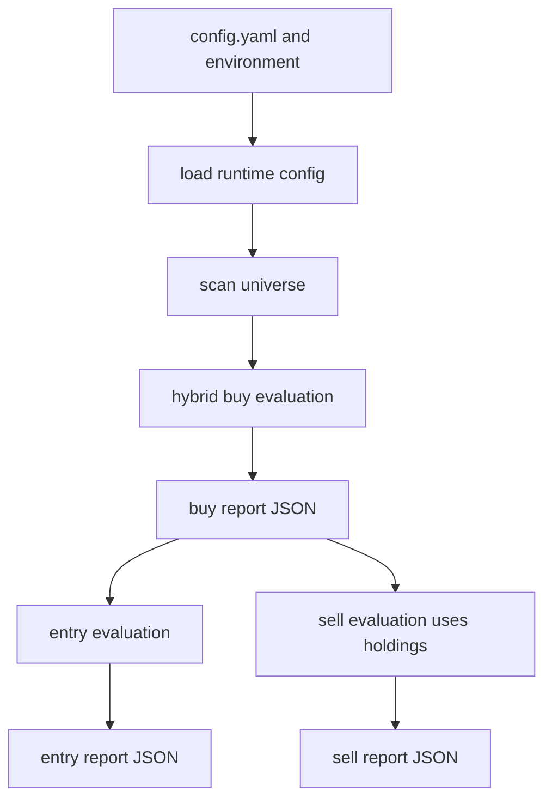

# Swing Logic Improvements Design

Status: Proposed
Date: 2026-06-06

## Problem Brief

### Context

The current scanner runs in `sma_ema_hybrid` strategy mode for buy and sell
logic. The active configuration favors a broad, liquid universe with the market
regime filter enabled:

- `strategy_mode`: `sma_ema_hybrid`
- `sell_mode`: `sma_ema_hybrid`
- `use_market_regime_filter`: `true`
- `portfolio.max_active_holdings`: `8`
- `screen_limit`: `330`
- US KIS screener value mode: top `300`
- KR minimum price: `3000`
- KR minimum dollar volume: `1,000,000,000`
- US minimum price: `20`
- US minimum dollar volume: `5,000,000`

The hybrid buy strategy uses SMA20, EMA10/21, RSI14, RSI zone `45-60`,
oversold zone `30-40`, pullback max `10%`, breakout base range `5-15` bars
with range max `10%`, max gap `5%`, SMA60 filter disabled, and KR breakout
confirmation enabled. The hybrid sell strategy uses a `5-10%` profit target,
`3%` partial profit floor, `3-5%` stop-loss band, `3%` failed-breakout band,
and `30` day time stop with `15` grace days and `3%` profit floor.

Recent reports showed two important symptoms:

- `reports/2026-06-05.entry.json` produced only `REVIEW` entries because all
  rows had `price snapshot unavailable`, giving a missing entry price ratio of
  `1.0`.
- `reports/2026-06-04.buy.json` found 10 US candidates from a 300-symbol
  universe, but several high-ranked rows had negative relative strength, such
  as `TEM`, `MRK`, `AMGN`, and `BKNG`. Some candidates also had gap guards
  around `8-10%`, which is wider than the configured `3-5%` stop-loss band.

### Problem

The scanner can identify technically interesting candidates, but the current
reporting and gating do not distinguish enough between:

- executable entries and entries blocked by missing live price data,
- strong swing candidates and weaker relative-strength candidates,
- candidates whose volatility is aligned with the sell stop model and those
  whose normal movement may exceed the configured stop band,
- intentionally permissive regime warnings and hard market-level regime blocks.

This makes a swing-trading review harder because operational issues and trade
quality issues appear in the same candidate list without enough structured
diagnostics.

### Goal

Improve the swing-trading decision surface while preserving auditability:

- fail closed for entry execution when a usable entry price is unavailable,
- add structured diagnostics for missing entry prices,
- classify hybrid buy candidates by quality state and reason codes,
- expose volatility-vs-stop alignment warnings,
- make market-regime unavailable behavior explicit and configurable,
- update strategy documentation and tests so the new behavior is reviewable.

### Non-Goals

- Do not add automated order placement.
- Do not add AI-based trade judgment to deterministic strategy routing.
- Do not remove lower-quality candidates from buy reports by default.
- Do not change sell action semantics in the first implementation pass.
- Do not enable the SMA60 medium-trend filter by default without separate
  validation.

### Constraints

- Keep changes small and compatible with existing JSON consumers where possible.
- Add fields instead of replacing current report fields.
- Preserve current selection and entry-gating behavior by default, except for
  the explicitly documented buy-report ordering change.
- Use deterministic logic for ranking, diagnostics, and gating.
- Cover runtime behavior changes with focused tests.

## Impact Note

What changes: hybrid buy reports gain structured quality/risk fields, entry
reports gain structured price diagnostic fields, and optional market-regime
unavailable policy becomes explicit.

What might break: consumers that assume exact report schemas may need to ignore
new fields; hybrid candidate order may change once quality sorting is
introduced.

Tests/docs to change: add or update tests around config parsing, market-regime
policy, hybrid buy candidate quality/risk classification, entry missing-price
diagnostics, and update `docs/STRATEGY.md` plus config reference docs.

## Design Summary

Implement the improvements in four focused slices:

1. Entry execution reliability and diagnostics.
2. Volatility/risk alignment annotations.
3. Hybrid buy candidate quality state and ordering.
4. Explicit market-regime unavailable policy.

The first pass should improve visibility and ranking more than it blocks
candidates. Entry remains the only hard fail-closed path because entering
without a usable price is operationally unsafe.

## Current Flow



The proposed changes keep this flow intact. They add deterministic annotations
inside the hybrid `BuyEval`, make `Entry` price resolution more observable, and
make market regime fail-open behavior configurable at the scan/evaluation
boundary.

## Slice 1: Entry Execution Reliability

### Behavior

Entry evaluation should continue to fail closed when no usable entry price is
available:

- If the scan runs before market open and live snapshot price is unavailable,
  the row remains `REVIEW`.
- If the scan runs after market close and a trusted daily close is available,
  daily close can be used as the deterministic after-close entry price.
- If all providers fail, the row remains `REVIEW` with explicit provider
  diagnostics.

This keeps the current conservative behavior, but makes the reason actionable.
US `AFTER_CLOSE` handling is not a new alternate provider fallback in the first
pass; it is the existing KIS daily-candle close path made explicit and
observable. If KIS after-close daily candles are unavailable, the row remains
`REVIEW` unless a later design adds another US close provider.

### Lookup Contract

Change the price lookup boundary from "return a float or `None`" to "return a
small result object". The implementation can use a dataclass or typed dict, but
the contract should carry at least:

- `price`: positive numeric price, or `null`
- `status`: `available`, `missing`, or `rejected`
- `source`: stable source code, or `null`
- `issue_codes`: stable reason-code list

Provider init issues can still be returned separately as run-level provider
issues, but ticker-level lookup failures must flow through this result object so
row fields and summary aggregations use the same source of truth.

### Report Contract

Add entry row fields:

- `entry_price_status`: `available`, `missing`, or `rejected`
- `entry_price_source`: provider/source code, or `null`
- `entry_price_issue_code`: stable reason code, or `null`
- `entry_price_issues`: list of diagnostic reason codes

Add entry summary fields:

- `missing_entry_price_ratio`
- `missing_entry_price_by_reason`
- `entry_price_sources`

Example issue codes:

- `kis_live_snapshot_missing`
- `kis_live_snapshot_no_supported_price_field`
- `kis_credentials_missing`
- `daily_close_unavailable`
- `provider_error`

### Acceptance Criteria

- Existing missing-price rows remain non-enterable.
- Missing-price summaries explain which provider path failed.
- Daily close pricing is only used for after-close runs where that source is
  explicitly supported by the existing data provider layer.
- Fatal missing-price ratio behavior continues to respect the existing
  `ENTRY_FATAL_MISSING_PRICE_RATIO` policy.

## Slice 2: Volatility and Stop-Loss Alignment

### Behavior

Add a warning layer that compares the candidate's observed volatility guard to
the configured sell stop model. The first implementation pass should only
annotate and sort; it should not change sell actions.

Risk alignment must be computed before quality state because `quality_state`
uses risk alignment as an input. If the implementation slices are split across
commits, implement risk fields first, then quality classification and ordering.

Recommended calculation:

- derive `volatility_reference_pct` from the best available candidate risk
  field, preferring `gap_guard_pct_value`, then ATR-based percentage if already
  available in the evaluation path;
- compare it with `sell.hybrid.stop_loss_pct_max`;
- if `volatility_reference_pct > sell.hybrid.stop_loss_pct_max`, mark the row
  as a tight-stop risk.

### Report Contract

Add buy candidate fields:

- `risk_alignment`: `aligned`, `tight_stop_vs_volatility`, or `unknown`
- `risk_alignment_reasons`: stable reason-code list
- `volatility_reference_pct`: numeric percentage value when available

Example reason codes:

- `gap_guard_exceeds_stop_max`
- `atr_exceeds_stop_max`
- `volatility_reference_unavailable`

### Acceptance Criteria

- Candidates with `8-10%` gap guard are flagged when stop max remains `5%`.
- Sell recommendations remain unchanged until a later, separately reviewed
  risk-sizing or stop-model design.
- Unknown volatility data does not silently become an aligned state.

## Slice 3: Hybrid Buy Candidate Quality State

### Behavior

Add deterministic quality classification to each `sma_ema_hybrid` buy candidate:

- `A`: ready candidate with non-negative relative strength and acceptable
  volatility alignment.
- `B`: ready candidate with a weakness that needs review, such as negative
  relative strength or elevated gap/volatility risk.
- `C`: watch candidate or candidate with unresolved quality issues.

The first implementation pass only classifies fields that exist on emitted
hybrid candidates. Scan-level system/data failures still produce
`system_issues`, `failures`, or `screen_outs` because no candidate is emitted;
they are not mapped into a candidate-level `data_warning` reason in this pass.

Candidates are not removed by default. In hybrid buy reports only, they are
ranked by quality first, then current score, then relative strength, then
liquidity. This preserves the candidate set while making the top of the hybrid
report better match swing-trading review priorities.

`ema_cross` report ordering keeps the existing global contract:
`score_value` desc, `rs_diff_value` desc, liquidity desc, percent change desc,
then ticker. Expanding quality ordering to `ema_cross` requires a separate
strategy-specific design because `entry_state` and the hybrid risk guide are not
part of the `ema_cross` candidate contract.

### Report Contract

Add buy candidate fields:

- `quality_state`: `A`, `B`, or `C`
- `quality_reasons`: stable reason-code list

Example reason codes:

- `relative_strength_positive`
- `relative_strength_negative`
- `relative_strength_unavailable`
- `entry_state_ready`
- `entry_state_watch`
- `risk_alignment_tight_stop`

### Acceptance Criteria

- Negative relative-strength candidates remain visible but do not outrank
  otherwise comparable strong relative-strength candidates.
- The same raw strategy score remains present for auditability.
- Quality state is deterministic and independent of report display order.
- `ema_cross` ordering does not change in this pass.

## Slice 4: Market-Regime Unavailable Policy

### Behavior

Make benchmark-unavailable behavior explicit through configuration:

```yaml
strategy:
  market_regime_unavailable_policy: warn_continue
```

Allowed values:

- `warn_continue`: current behavior; record benchmark/regime issue and continue.
- `block_market`: block candidates for the affected market when the benchmark
  needed for regime evaluation is unavailable.

Default to `warn_continue` to preserve existing production behavior. Use
`block_market` only when the operator wants strict regime validation.

### Acceptance Criteria

- Existing scans behave the same under the default policy.
- `block_market` produces explicit market-level issue codes and no candidates
  for that market when the required benchmark is unavailable.
- The report summary exposes how many symbols were skipped by this policy.

### Resolver Contract

Do not implement `block_market` by parsing human-readable `system_issues`
strings. Change market regime resolution to return structured data, such as:

- `regime_by_market`: market to resolved `MarketRegimeContext`
- `unavailable_markets`: market to stable issue code and message
- `issues`: ordered user-facing issue messages

The evaluator should use `unavailable_markets` to screen out all tickers in the
affected market when `market_regime_unavailable_policy=block_market`. The report
summary should derive skipped counts from this structured map.

## Config Surface

Keep the first pass intentionally narrow:

```yaml
strategy:
  market_regime_unavailable_policy: warn_continue
```

Do not add quality-state or risk-alignment feature flags unless tests show a
real compatibility problem. These are report annotations and deterministic sort
keys, not external side effects.

Environment behavior remains unchanged except for existing fatal missing-price
policy handling and the new market-regime policy override:

| Env | YAML path | Purpose |
| --- | --- | --- |
| `MARKET_REGIME_UNAVAILABLE_POLICY` | `strategy.market_regime_unavailable_policy` | Override benchmark-unavailable behavior for one runtime environment. |

Implementation should add this pair to the existing env/YAML conflict policy so
operators cannot define both values at once. Document the new env in
`docs/configuration.md`, `docs/config-reference.md`, and `.env.example` in the
same implementation change.

## Documentation Updates

Update `docs/STRATEGY.md` with:

- hybrid quality state definitions,
- risk alignment warning logic,
- entry price source and fail-closed behavior,
- market-regime unavailable policy.

Evaluate whether `docs/ARCHITECTURE.md` needs a small update for report-field
responsibilities. Update config reference documentation for the new
`strategy.market_regime_unavailable_policy` key.

## Test Plan

Add focused tests before implementation:

- config parsing/validation accepts `warn_continue` and `block_market`, accepts
  `MARKET_REGIME_UNAVAILABLE_POLICY` as the matching env override, rejects
  unknown values, and rejects env/YAML conflicts;
- default config preserves `warn_continue`;
- market-regime unavailable with default policy records warnings and continues;
- market-regime unavailable with `block_market` skips affected market
  candidates and records summary counts;
- hybrid buy candidate quality state marks negative relative-strength candidates as
  weaker than otherwise comparable positive relative-strength candidates;
- risk alignment flags candidates whose volatility reference exceeds
  `sell.hybrid.stop_loss_pct_max`;
- risk alignment fields are present before quality state uses them;
- entry reports include missing-price diagnostics when all price sources fail;
- after-close daily-close pricing produces `entry_price_status=available` and
  a deterministic `entry_price_source` when supported.

Likely affected test areas:

- `tests/test_config_validation_layers.py`
- `tests/test_runtime_config_contract.py`
- `tests/test_market_regime_filter.py`
- `tests/test_scan_evaluation_issue_split.py`
- `tests/test_hybrid_buy_state.py`
- `tests/test_entry_command.py`

## Options Considered

### Option A: Diagnostics Only

Pros: smallest change and very low risk.

Cons: does not improve candidate ordering or weak relative-strength prominence.

Risks: users may still act on high-ranked but lower-quality rows.

### Option B: Hard Filters

Pros: strongest protection against weak candidates.

Cons: can hide potentially useful watchlist candidates and may reduce scan
coverage too aggressively.

Risks: silent opportunity loss if thresholds are wrong for a market regime.

### Option C: Quality Ranking With Explicit Hard-Block Policy

Pros: improves report usefulness while preserving visibility and auditability.

Cons: candidate order changes and needs regression coverage.

Risks: downstream consumers relying on exact order may need to adapt.

Chosen option: Option C. It addresses the observed swing-trading issues without
turning warnings into hidden exclusions, and it reserves hard blocking for the
entry-price and opt-in market-regime paths.

## Rollout Plan

1. Add configuration parsing and validation for
   `strategy.market_regime_unavailable_policy`.
2. Add entry price lookup result contract, diagnostic fields, and missing-price
   summary aggregation.
3. Add volatility/risk alignment fields.
4. Add hybrid buy candidate quality state fields and deterministic hybrid-only
   sort order.
5. Add structured market-regime resolver output, `block_market` behavior, and
   summary counts.
6. Update strategy/config documentation.
7. Run the Python quality gate for the changed area.

## Resolved Design Questions

- US after-close close source: use the existing KIS daily-candle close path for
  `provider=kis`; do not add a new US fallback provider in this pass.
- Quality ordering scope: apply quality-first ordering only to
  `sma_ema_hybrid` buy reports in this pass; keep `ema_cross` ordering
  unchanged.
- Market-regime policy scope: keep one global policy in the first pass. Per
  market policy can be designed later if strict US and warn-only KR behavior
  becomes necessary.
