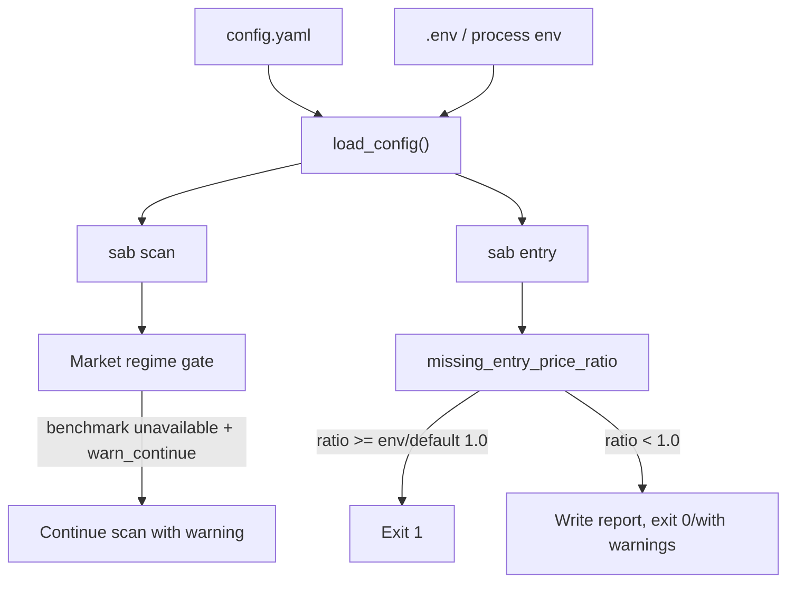
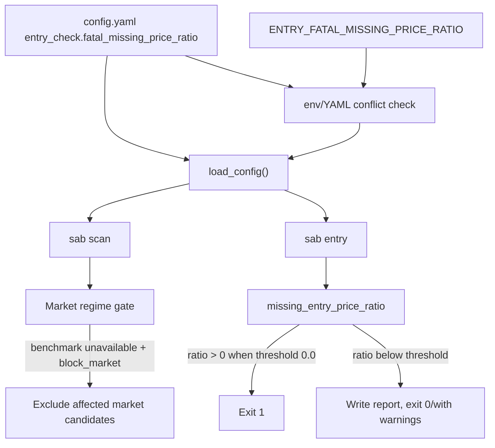

상태: Accepted

# Swing Operational Safety Defaults Design

Status: Accepted
Date: 2026-06-07

## Problem Brief

### Context

The active swing scanner is already running the newer `sma_ema_hybrid` buy and
sell logic. The prior swing-logic improvement work added structured market
regime behavior, entry price diagnostics, hybrid quality state, and
volatility/stop alignment fields.

The remaining issues found in the latest review are operational rather than
signal-formula problems:

- `strategy.market_regime_unavailable_policy` is currently `warn_continue`.
  When benchmark data is unavailable, scan continues for that market instead
  of blocking it.
- `ENTRY_FATAL_MISSING_PRICE_RATIO` now flows through config loading and
  active defaults use `0.0`. A run with any missing entry price is fatal unless
  an explicit local no-YAML env override or YAML config changes the threshold.
- KIS interval documentation/examples still mention `500ms` in places while
  active `config.yaml` uses `200ms`.

### Problem

Important safety defaults are split across committed YAML, env-only behavior,
and examples. That makes local and scheduled runs harder to reason about:

- Market regime unavailability can silently degrade from a hard market gate to
  a warning.
- Entry price availability is the final execution safety boundary, but the
  fatal threshold is not visible in committed config.
- Documentation can lead an operator to expect a different KIS request cadence
  than the active repository default.

### Goal

Make swing operational safety defaults explicit, reproducible, and tested:

- Default active market-regime unavailable behavior should be `block_market`.
- Entry missing-price fatal policy should be configurable from YAML and default
  active config should be fail-fast at `0.0`.
- Env override should remain available, but duplicate YAML/env definition must
  follow the existing fail-closed conflict policy.
- KIS interval examples and docs should match active repository defaults.

### Non-Goals

- Do not change buy/sell signal formulas.
- Do not add a new market data provider.
- Do not change report JSON schemas except for existing config snapshots if
  they already include runtime config.
- Do not remove the existing `ENTRY_FATAL_MISSING_PRICE_RATIO` env override.
- Do not change web env validation or GitHub workflow dispatch inputs/schedule
  semantics. Artifact capture and failure diagnostics may change where needed.

### Constraints

- Preserve the repository rule that the same logical config key must not be
  defined in both environment and YAML.
- Keep secrets in env only; the new entry fatal ratio is non-secret and safe in
  YAML.
- Use deterministic parsing and validation, consistent with existing
  `sab/config.py` patterns.
- Add regression tests before implementation changes.
- Update docs in the same change as behavior/config updates.

## Impact Note

What changes: active repository defaults become more conservative for market
regime unavailability and entry price missingness. Entry fatal missing-price
ratio becomes a first-class YAML config value with the existing env override.

What might break: scheduled or local `sab entry` runs that previously tolerated
partial missing price snapshots will exit non-zero when any candidate price is
missing under the active default `0.0`. Scans may return fewer candidates when
benchmark data is unavailable because affected markets are blocked.

Tests/docs to change: config validation tests, entry command tests, entry report
snapshot tests, runtime config contract tests, env/YAML conflict tests, GitHub
Actions artifact handling, scheduled runner diagnostics, config docs, strategy
docs, and configuration examples.

## Current Behavior



The market-regime behavior is already explicit in `config.yaml`, but its active
value is permissive. The entry fatal threshold is not in `config.yaml`; it is
resolved directly in `sab/entry.py` from `ENTRY_FATAL_MISSING_PRICE_RATIO`.

## Proposed Behavior



## Design

### 1. Market Regime Default

Change active `config.yaml`:

```yaml
strategy:
  market_regime_unavailable_policy: block_market
```

Rationale: if the broad market benchmark cannot be evaluated, the scanner
should not produce candidates for that market by default. This is the safer
production default because market regime is a precondition, not a scoring
bonus.

Compatibility: the existing `MARKET_REGIME_UNAVAILABLE_POLICY=warn_continue`
override remains available for exploratory no-YAML local runs. When any YAML
config is loaded, setting that safety env key directly fails by design whether
the YAML defines or omits the matching path. Operators who need a looser local
policy should set the value explicitly in a local YAML selected with
`SAB_CONFIG`.

Default contract: omitted safety keys inherit the active safety defaults.
`strategy.market_regime_unavailable_policy` defaults to `block_market` and
`entry_check.fatal_missing_price_ratio` defaults to `0.0`, even when no YAML
config is loaded. When YAML config is loaded, safety env overrides are rejected
if the YAML omits the matching key; put local experiments in YAML instead.

Operational contract: `block_market` closes the market to candidates and records
blocked-market diagnostics in the buy report. It is not a scan workflow failure
by itself; scheduled/local scans should still write and upload the buy report so
operators can see why candidates were excluded.

### 2. Entry Fatal Missing-Price Policy

Add a small config section value:

```yaml
entry_check:
  fatal_missing_price_ratio: 0.0
```

Legacy configs may still contain `entry_check.enabled`, but that key must not gate
this fatal missing-price policy. The threshold applies whenever `sab entry`
evaluates entry prices. Active examples should not show `entry_check.enabled`
because it is ignored for this behavior.

Add a matching config/env binding:

```python
("ENTRY_FATAL_MISSING_PRICE_RATIO", "entry_check.fatal_missing_price_ratio")
```

Parsing contract:

- YAML path: `entry_check.fatal_missing_price_ratio`
- Env override: `ENTRY_FATAL_MISSING_PRICE_RATIO`
- Allowed range: finite float between `0.0` and `1.0`
- Default when omitted: `0.0`
- Active repository value: `0.0`
- Conflict behavior: if any YAML config is loaded, direct env override fails
  closed whether the YAML defines or omits the threshold. Use a local YAML
  selected with `SAB_CONFIG` for local experiments.
- Invalid values: fail closed with `ConfigLoadError`; omitted values use the
  active default described above.

Behavior contract:

- If threshold is `0.0`, any missing entry price makes the entry run fatal.
- If threshold is greater than `0.0`, fatal when
  `missing_entry_price_ratio >= threshold`.
- The report is still written before exit, preserving diagnostics.
- The entry report config snapshot includes `entry_fatal_missing_price_ratio`
  so a non-zero exit can be explained from the artifact alone.
- Fatal entry runs still return non-zero. Automation must still surface the
  written entry report path/artifact before terminating the workflow.

Implementation detail: `sab.entry` should stop reading
`ENTRY_FATAL_MISSING_PRICE_RATIO` directly. `run_entry()` already loads `cfg`;
it should use `cfg.entry_fatal_missing_price_ratio` and keep any helper logic
focused on threshold comparison.

Automation detail: current fatal entry behavior writes the report before
returning `1`, but upload/artifact handling happens after that in some paths.
Implementation should make the manual AI Brief workflow capture the entry report
artifact even when `sab entry` exits non-zero, and should make the scheduled
runner include the captured entry report path in the raised failure or late
alert diagnostics.

### 3. Documentation and Examples

Update docs and examples so operators see one coherent policy:

- `.env.example`: keep `ENTRY_FATAL_MISSING_PRICE_RATIO` commented as an
  override, not the primary place to configure normal operation. The comment
  must warn that safety env overrides are only valid for no-YAML local runs.
- `docs/configuration.md`: document YAML as the default source and env as an
  override subject to conflict policy.
- `docs/config-reference.md`: add the YAML binding row.
- `docs/STRATEGY.md`: state that active defaults block markets when regime
  benchmark is unavailable and fail entry runs on any missing price.
- `config.example.yaml`: include the new entry check key and the regime policy
  example.
- KIS interval docs/examples: use `200` where describing active repository
  defaults, and reserve `500` only for sandbox/example config if explicitly
  labeled as a non-active example.

### 4. Testing Contract

Add or update focused tests:

- Config parsing:
  - YAML `entry_check.fatal_missing_price_ratio` is parsed.
  - Env override is parsed when no YAML config is loaded.
  - Invalid values in strict mode fail with `ConfigLoadError`.
  - Env/YAML duplicate key fails closed.
- Runtime repository contract:
  - repository `config.yaml` loads with
    `market_regime_unavailable_policy == "block_market"`;
  - repository `config.yaml` loads with
    `entry_fatal_missing_price_ratio == 0.0`.
- Entry behavior:
  - `run_entry()` uses config threshold rather than direct env lookup;
  - threshold `0.0` makes any missing price fatal;
  - threshold `1.0` preserves legacy all-missing fatal behavior.
  - fake `load_config()` fixtures include the new threshold attribute or use the
    real `Config` shape.
- Entry report/automation behavior:
  - entry report `config_snapshot` includes `entry_fatal_missing_price_ratio`;
  - manual AI Brief artifact upload includes the entry report after a fatal
    missing-price exit when the report was produced;
  - scheduled entry failure diagnostics include the written entry report path
    when a report was produced before the non-zero status.
- Docs contract:
  - `docs/config-reference.md` includes the new binding;
  - `.env.example` mentions the override but does not activate it;
  - config docs do not claim active KIS interval is `500ms`.

## Alternatives Considered

### A. Config-First Safety Defaults (Chosen)

Pros: safety-critical non-secret values are committed, reviewable, and covered
by config tests. Scheduled and local runs share the same visible default.

Cons: requires a small config model change and entry tests.

Risk: existing automation that relied on partial entry price availability will
start failing until provider availability is fixed or the operator explicitly
chooses a looser env/YAML value.

### B. Only Change Local Env

Pros: fastest local operational fix.

Cons: not reproducible in CI or scheduled workflows, and future runs can lose
the safety policy if env files differ.

Risk: the same issue reappears because the safety setting is not visible in
repo review.

### C. Document-Only Change

Pros: no behavior change.

Cons: leaves permissive runtime defaults in place.

Risk: warnings continue to look like successful runs even when data required
for safe entry/regime gating is missing.

## Rollout

1. Add failing config and entry tests.
2. Add config field and parsing.
3. Switch `run_entry()` to the parsed config value.
4. Change active `config.yaml` defaults.
5. Update docs/examples.
6. Run targeted tests.
7. Run `just quality` if the implementation touches shared config or entry
   behavior beyond the planned scope.

## Acceptance Criteria

- `load_config()` on repository `config.yaml` returns:
  - `market_regime_unavailable_policy == "block_market"`
  - `entry_fatal_missing_price_ratio == 0.0`
- Loaded YAML configs with omitted custom safety keys inherit the active safety
  defaults when no matching safety env overrides are set:
  - `strategy.market_regime_unavailable_policy == "block_market"`
  - `entry_fatal_missing_price_ratio == 0.0`
- Loaded YAML configs with matching safety env overrides raise `ConfigLoadError`,
  even when the YAML omits the matching safety key.
- Defining `ENTRY_FATAL_MISSING_PRICE_RATIO` while YAML also defines
  `entry_check.fatal_missing_price_ratio` raises `ConfigLoadError`.
- Defining `MARKET_REGIME_UNAVAILABLE_POLICY` while YAML also defines
  `strategy.market_regime_unavailable_policy` continues to raise
  `ConfigLoadError`.
- `sab entry` uses `cfg.entry_fatal_missing_price_ratio`.
- Missing one entry price is fatal under active defaults.
- Fatal entry reports include `entry_fatal_missing_price_ratio` in their config
  snapshot.
- Manual and scheduled automation keep the written entry report discoverable
  when missing entry prices make `sab entry` exit non-zero.
- `block_market` excludes affected market candidates but still writes scan
  diagnostics rather than turning benchmark unavailability into an immediate CLI
  failure.
- Strategy/config docs match active defaults.
- KIS interval docs no longer present `500ms` as the active default.

## Open Decisions

None. Operators can still choose more permissive behavior explicitly by changing
the YAML value in a local uncommitted config file selected with `SAB_CONFIG`, or
by using env only in no-YAML local runs.
