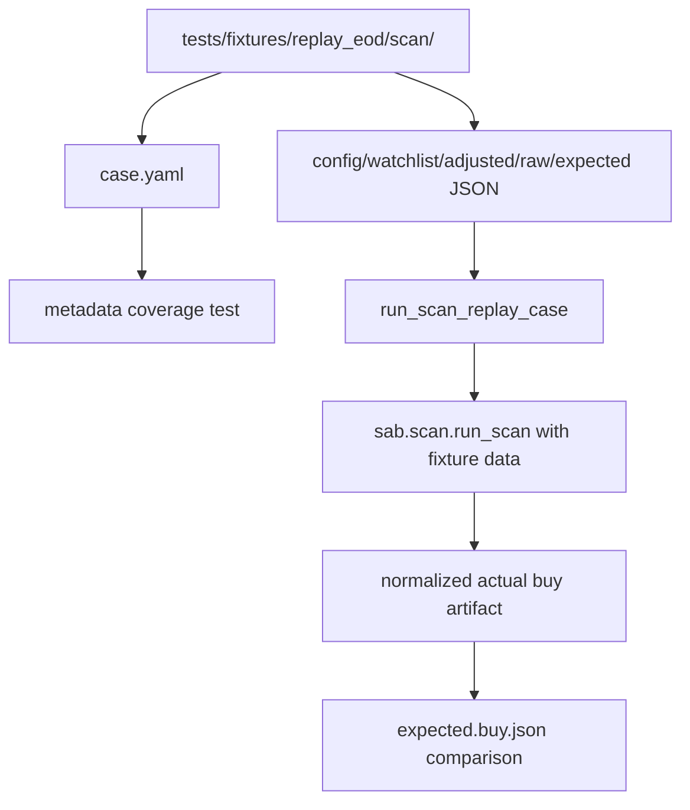

상태: Accepted

# Swing Replay Coverage Expansion Design

Status: Accepted
Date: 2026-06-22

## Problem Brief

### Context

`swing-trading-report` currently runs `sma_ema_hybrid` as the default buy
strategy. The active thresholds combine market regime, SMA20/EMA10/21, RSI
zones, consolidation windows, volume confirmation, gap limits, relative
strength, stop-alignment warnings, and sell profit/stop targets.

The replay harness already exists:

- `tests/helpers/replay_eod.py` prepares deterministic scan workspaces.
- `tests/fixtures/replay_eod/scan/*` stores static market data and expected
  buy artifacts.
- `tests/test_replay_eod_scan.py` compares generated scan artifacts with
  expected JSON after removing volatile metadata.

The problem is that current replay coverage is too small. Two scan cases cannot
justify or protect active trading thresholds across KR/US, rising/sideways/falling
regimes, high-volatility names, weak/strong relative-strength cases, gap
rejections, and pattern-specific volume semantics.

### Goal

Expand deterministic scan replay coverage so the active swing thresholds are
exercised across the important decision axes before any default threshold is
changed.

The first implementation pass verifies rule behavior and regression coverage.
It does not claim that the thresholds are profitable.

### Non-Goals

- Do not change default trading thresholds in this pass.
- Do not add automated order placement.
- Do not build a full historical performance backtest runner in this pass.
- Do not assert win rate, expected value, MFE/MAE, or stop/target hit-rate from
  synthetic replay fixtures.
- Do not rely on live market data, KIS, PyKRX, Supabase, or network access.

## Recommended Approach

Use a two-stage validation path:

1. Add an offline replay matrix first.
2. Keep historical forward-return backtesting as a follow-up design.

This is safer than mixing both in one PR. The replay matrix gives deterministic
coverage for rule semantics, while the later backtest runner can make explicit
choices about data source, period, survivorship bias, delisting behavior,
corporate actions, benchmark comparison, and transaction assumptions.

## Approaches Considered

### Approach A: Offline Replay Matrix Only

Add synthetic/static fixture cases and verify expected buy artifacts in pytest.

Tradeoff: fast, deterministic, and CI-friendly, but it only proves rule
semantics. It does not validate trading profitability.

### Approach B: Historical Backtest Runner First

Build a runner that evaluates historical candles and reports forward returns,
stop/target hits, and drawdown metrics.

Tradeoff: more directly useful for parameter research, but it needs larger
decisions around data quality, sample period, market universe, survivorship
bias, and transaction assumptions. It is too wide for the first safe change.

### Approach C: Replay Matrix First, Backtest Runner Later

First make threshold behavior observable and deterministic with replay
fixtures. Then design historical backtesting on top of a stable rule contract.

Recommendation: use Approach C. The first implementation should complete
Approach A and leave Approach B as an explicit follow-up.

## Design Summary

The implementation should extend the existing replay harness instead of adding
a separate testing system.

Each scan replay fixture should carry both:

- executable fixture files used by the current harness;
- explicit metadata describing the matrix axes the case covers.

The scan artifact comparison remains the behavioral oracle. Metadata is used to
prove that the fixture suite covers the intended risk and market regimes.

## Fixture Contract

Each scan replay case should contain:

- `case.yaml`
- `config.yaml`
- `watchlist.txt`
- `adjusted_market_data.json`
- `raw_market_data.json`
- `expected.buy.json`

`case.yaml` is new and should be required for every replay case after existing
fixtures are backfilled. It should be small and stable:

```yaml
schema: sab.replay.scan-case.v1
purpose: "strong US breakout candidate with quality A"
market: US
strategy_mode: sma_ema_hybrid
regime: rising
pattern: swing_high_breakout
relative_strength: strong
volatility: normal
expected_outcome: candidate_quality_a
threshold_axes:
  - consolidation
  - volume_confirmation
  - relative_strength
```

Allowed values should be intentionally narrow:

- `market`: `KR`, `US`, or `MIXED`
- `strategy_mode`: `ema_cross` or `sma_ema_hybrid`
- `regime`: `rising`, `sideways`, `falling`, or `not_applicable`
- `pattern`: `trend_pullback_bounce`, `swing_high_breakout`,
  `rsi_oversold_reversal`, `ema_cross`, or `none`
- `relative_strength`: `strong`, `weak`, `unavailable`, or `not_applicable`
- `volatility`: `normal`, `high`, `unknown`, or `not_applicable`
- `expected_outcome`: stable slugs such as `candidate_quality_a`,
  `candidate_quality_b`, `candidate_quality_c`, `rejected_by_gap`,
  `blocked_by_market_regime`, or `no_candidate`
- `threshold_axes`: non-empty list of stable slugs for the behavior being
  protected.

The metadata is not a substitute for `expected.buy.json`. It is a coverage map
that lets tests fail when an important axis silently disappears.

## Initial Coverage Matrix

The first replay expansion should cover at least these cases:

| Case Intent | Market | Regime | Pattern | RS | Volatility | Expected Outcome |
|---|---|---|---|---|---|---|
| strong breakout | US | rising | swing_high_breakout | strong | normal | `candidate_quality_a` |
| weak RS ready setup | KR | rising | trend_pullback_bounce | weak | normal | `candidate_quality_b` |
| high volatility tight stop | US | rising | swing_high_breakout | strong | high | `candidate_quality_b` |
| gap rejection | KR | rising | none | strong | high | `rejected_by_gap` |
| sideways consolidation pass | US | sideways | swing_high_breakout | strong | normal | `candidate_quality_a` |
| falling regime block | KR | falling | none | not_applicable | normal | `blocked_by_market_regime` |
| pullback volume confirmation | KR | rising | trend_pullback_bounce | strong | normal | `candidate_quality_a` |
| RSI oversold reversal | US | sideways | rsi_oversold_reversal | strong | normal | `candidate_quality_a` |

The existing `kr_ema_cross_baseline` and `kr_hybrid_quality_order` fixtures can
remain, but they should receive `case.yaml` metadata so the suite has one
uniform contract.

## Component Changes

### `tests/helpers/replay_eod.py`

Extend replay case validation to require `case.yaml`.

Add a loader that parses and validates case metadata using simple Python data
structures. Keep the helper dependency-free aside from existing test
dependencies. Invalid metadata should raise `ReplayScanCaseError` with a message
that includes the case path and invalid field.

Return metadata from replay discovery or expose a separate helper so
`tests/test_replay_eod_scan.py` can validate coverage without duplicating YAML
parsing.

### `tests/fixtures/replay_eod/scan/*`

Add the initial matrix cases as static fixture directories.

Each fixture should be deterministic and small enough to review. Prefer a few
representative tickers per case over large artificial universes. Keep
`expected.buy.json` focused on normalized scan artifact fields already used by
`normalize_scan_artifact()`.

### `tests/test_replay_eod_scan.py`

Keep the current parametrized artifact comparison.

Add coverage tests that assert the suite includes the required axes:

- at least one `KR` case and one `US` case;
- at least one `rising`, `sideways`, and `falling` regime case;
- at least one `high` volatility case;
- at least one `strong` and one `weak` relative-strength case;
- at least one case covering each major hybrid pattern;
- at least one case for `rejected_by_gap`;
- at least one case for `blocked_by_market_regime`;
- at least one case whose `threshold_axes` includes each of `rsi`,
  `consolidation`, `gap`, `stop_alignment`, `profit_target`, and
  `volume_confirmation`.

The coverage test should inspect metadata only. The artifact comparison test
continues to inspect actual scan behavior.

### `docs/STRATEGY.md`

Document the distinction between:

- replay coverage: deterministic rule and threshold regression coverage;
- historical backtesting: performance and parameter research.

The strategy document should not imply that synthetic replay fixtures justify
profitability. It should state that replay fixtures protect the implementation
contract for active thresholds.

### `TODOS.md`

After implementation, update the active TODO instead of deleting the broader
research concern. The completed note should say that the first replay matrix
landed, and a deferred follow-up should track the historical backtest runner if
it is still needed.

## Data Flow



## Error Handling

- Missing `case.yaml` should fail during replay case discovery or validation.
- Unknown metadata values should fail fast with `ReplayScanCaseError`.
- Empty `threshold_axes` should fail fast.
- Artifact mismatches should continue to fail with the existing expected-vs-actual
  pytest diff.
- Fixture market data should stay offline and deterministic; live provider
  failures must not affect these tests.

## Testing Strategy

Primary verification:

```bash
UV_CACHE_DIR=.uv-cache uv run python -m pytest tests/test_replay_eod_scan.py -q
```

Python quality gate for the implementation PR:

```bash
just quality
```

If `just quality` is too expensive for an intermediate checkpoint, run targeted
pytest plus `ruff` and `mypy`:

```bash
UV_CACHE_DIR=.uv-cache uv run python -m pytest tests/test_replay_eod_scan.py -q
UV_CACHE_DIR=.uv-cache uv run ruff check tests/helpers/replay_eod.py tests/test_replay_eod_scan.py
UV_CACHE_DIR=.uv-cache uv run mypy --config-file pyproject.toml
```

## Acceptance Criteria

- Replay scan fixtures all include valid `case.yaml` metadata.
- The replay suite covers KR and US markets.
- The replay suite covers rising, sideways, and falling regimes.
- The replay suite covers high-volatility and normal-volatility examples.
- The replay suite covers strong and weak relative-strength outcomes.
- The replay suite covers major hybrid pattern families.
- The replay suite includes gap rejection and market-regime block examples.
- The replay suite protects RSI, consolidation, gap, stop-alignment,
  profit-target, and volume-confirmation threshold axes.
- Existing replay artifact comparison remains deterministic.
- `docs/STRATEGY.md` clarifies replay-vs-backtest semantics.
- `TODOS.md` is updated to separate completed replay matrix work from the
  deferred historical backtest runner.

## Follow-Up: Historical Backtest Runner

A later design should cover the historical backtest runner separately. That
design should decide:

- source data and adjusted/raw policy;
- sample period and market universe;
- benchmark and regime alignment;
- survivorship and delisting assumptions;
- entry timing after EOD signal;
- stop/target intraday approximation or EOD-only approximation;
- transaction cost and slippage assumptions;
- output metrics and report format.

This follow-up is where profitability, expected value, hit-rate, MFE/MAE, and
parameter-sensitivity claims belong.

## Scope Review

This design is intentionally test and documentation focused. It builds a
stronger deterministic evidence base for current threshold behavior without
changing the trading strategy itself.
